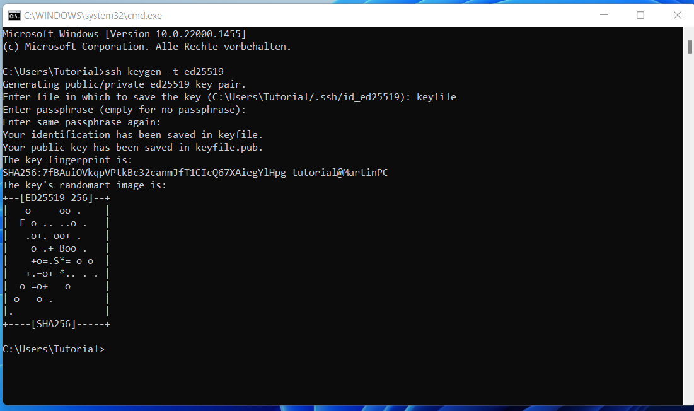
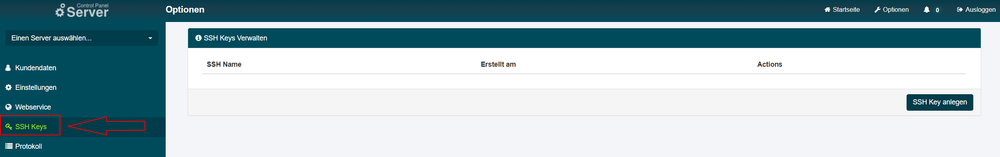
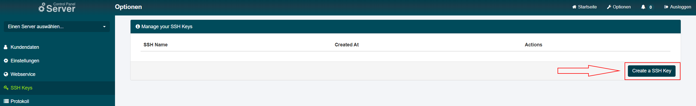
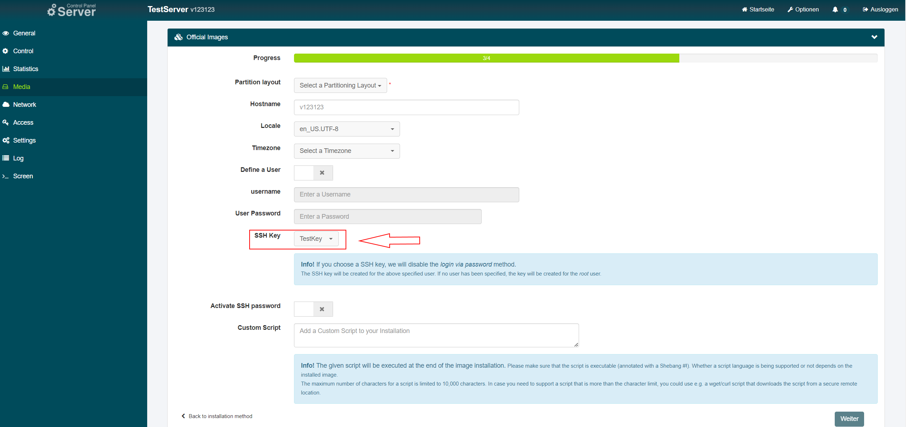

# Introduction
This tutorial describes how to generate an SSH key and store it in the SCP.
The saved SSH key can be used for future image installations.

# Requirements

* Computer running MacOS / Linux / Windows (10 or 11) 
* Server (Root or VPS)

# Step 1 - Generate the SSH key

Open a terminal.
Generate the SSH key using the following command:

```bash
ssh-keygen -t ed25519
```
Define the location of the SSH key.
The default setting is `~/.ssh/id_rsa` ( ~ points to the home folder of your current user ).
A password for the key can be entered optionally. It is recommended to protect your key with a password.



# Step 2 - Save the SSH key in the SCP

1. Go to the [SCP](https://servercontrolpanel.de).
2. Go to "Option".

3. Select "SSH Keys".

4. Click "Create a SSH Key"

5. Copy the content of the public key from the previously created SSH key and paste it into the form.


# Conclusion

The SSH key can now be used for your server installation.



You no longer need to copy the key by yourself each time you perform an image installation. 

# Licence

[MIT](https://github.com/netcup-community/community-tutorials/blob/main/LICENSE)

Copyright (c) 2022 netcup

Permission is hereby granted, free of charge, to any person obtaining a copy of this software and associated documentation files (the "Software"), to deal in the Software without restriction, including without limitation the rights to use, copy, modify, merge, publish, distribute, sublicence, and/or sell copies of the Software, and to permit persons to whom the Software is furnished to do so, subject to the following conditions:

The above copyright notice and this permission notice shall be included in all copies or substantial portions of the Software.

THE SOFTWARE IS PROVIDED "AS IS", WITHOUT WARRANTY OF ANY KIND, EXPRESS OR IMPLIED, INCLUDING BUT NOT LIMITED TO THE WARRANTIES OF MERCHANTABILITY, FITNESS FOR A PARTICULAR PURPOSE AND NONINFRINGEMENT. IN NO EVENT SHALL THE AUTHORS OR COPYRIGHT HOLDERS BE LIABLE FOR ANY CLAIM, DAMAGES OR OTHER LIABILITY, WHETHER IN AN ACTION OF CONTRACT, TORT OR OTHERWISE, ARISING FROM, OUT OF OR IN CONNECTION WITH THE SOFTWARE OR THE USE OR OTHER DEALINGS IN THE SOFTWARE.

# Contributor's Certificate of Origin
By making a contribution to this project, I certify that:

 1) The contribution was created in whole or in part by me and I have the right to submit it under the licence indicated in the file; or

 2) The contribution is based upon previous work that, to the best of my knowledge, is covered under an appropriate licence and I have the right under that licence to submit that work with modifications, whether created in whole or in part by me, under the same licence (unless I am permitted to submit under a different licence), as indicated in the file; or

 3) The contribution was provided directly to me by some other person who certified (a), (b) or (c) and I have not modified it.

 4) I understand and agree that this project and the contribution are public and that a record of the contribution (including all personal information I submit with it, including my sign-off) is maintained indefinitely and may be redistributed consistent with this project or the licence(s) involved.
