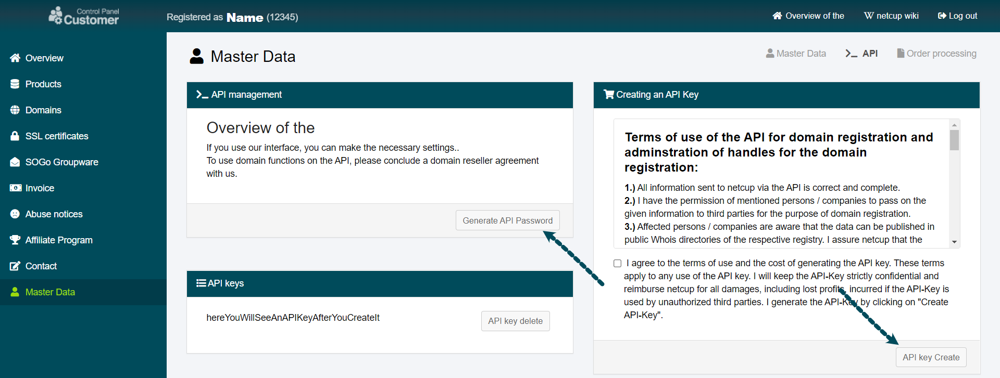
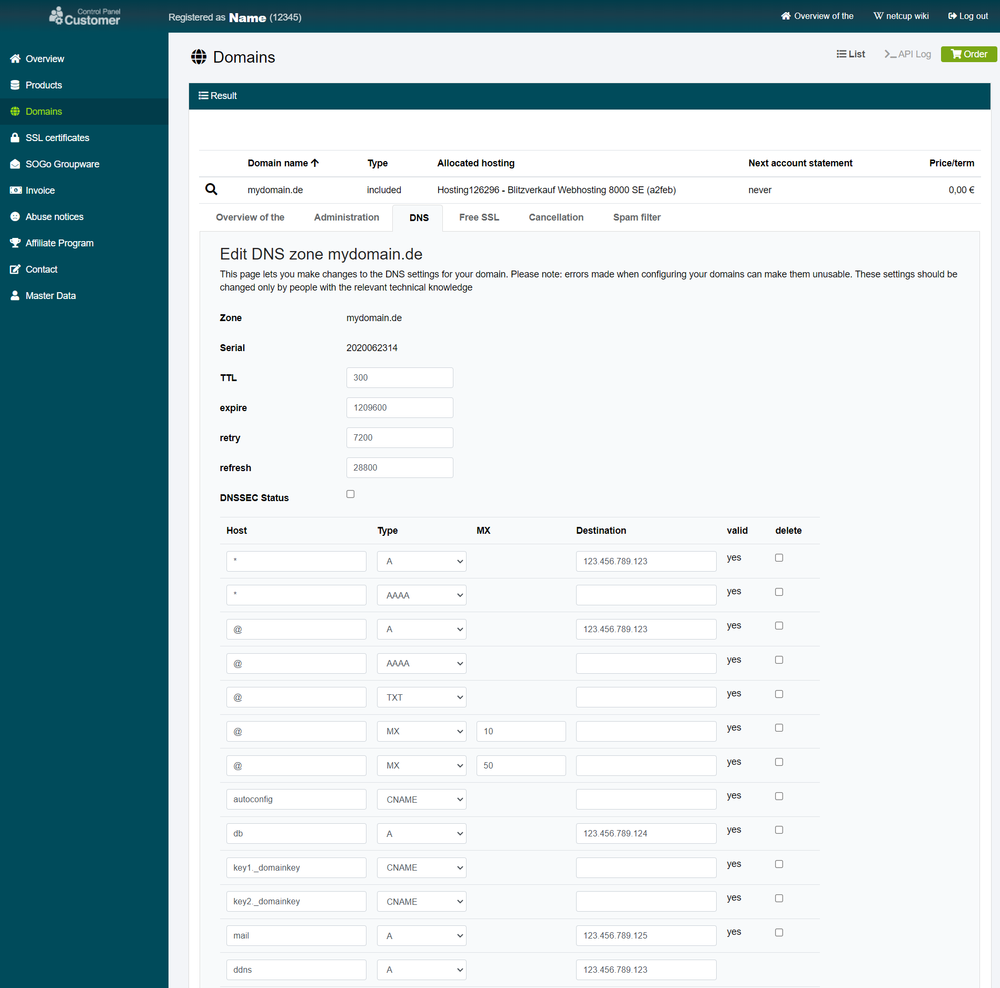
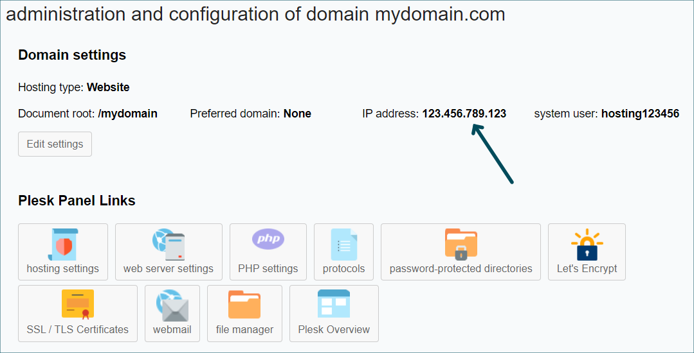
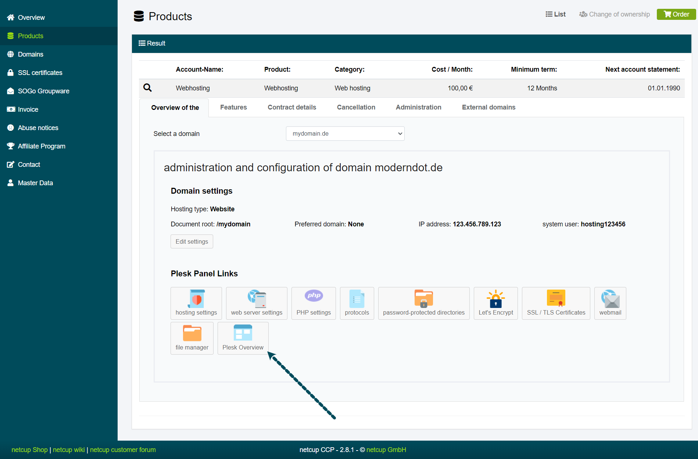
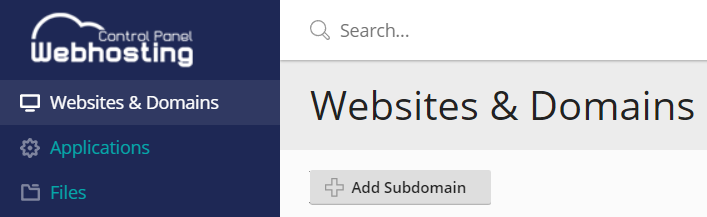
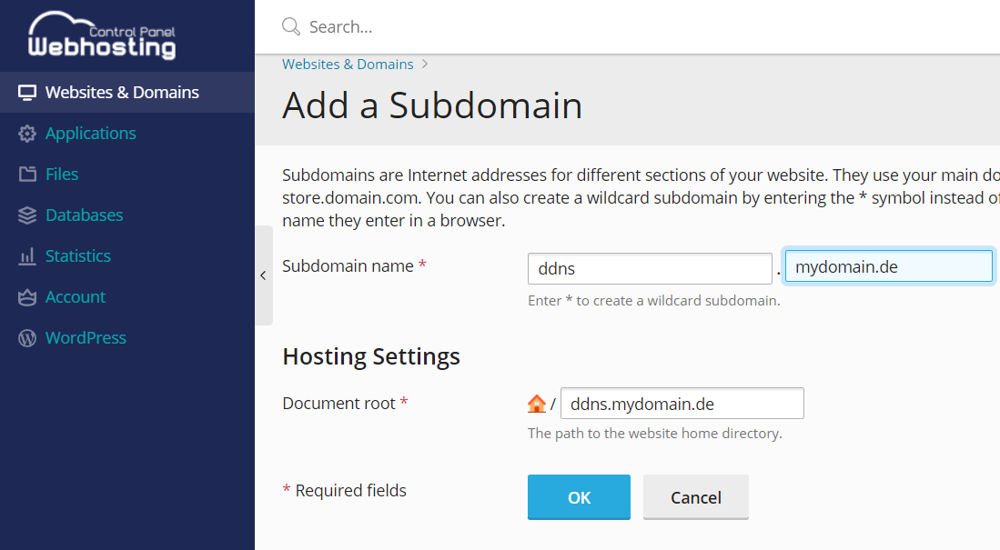
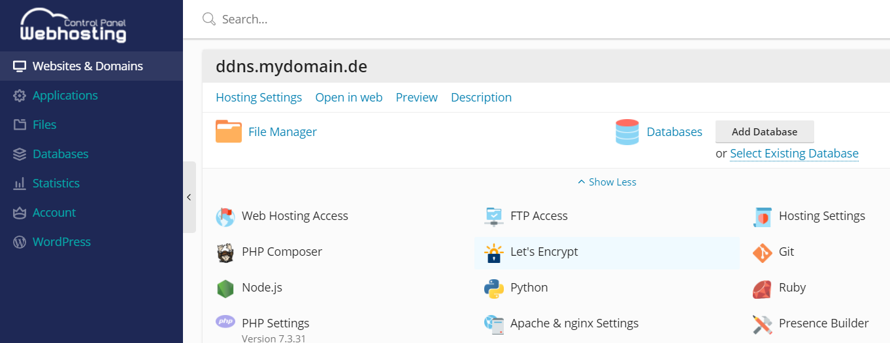
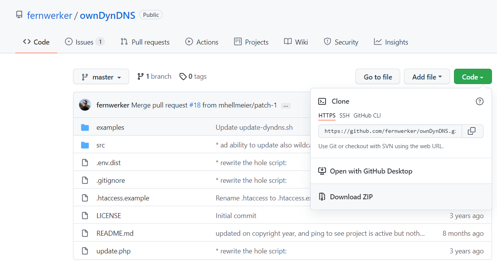
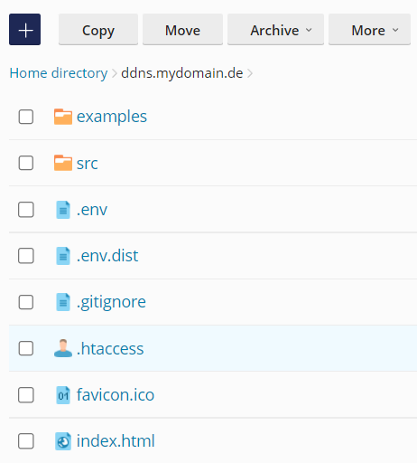
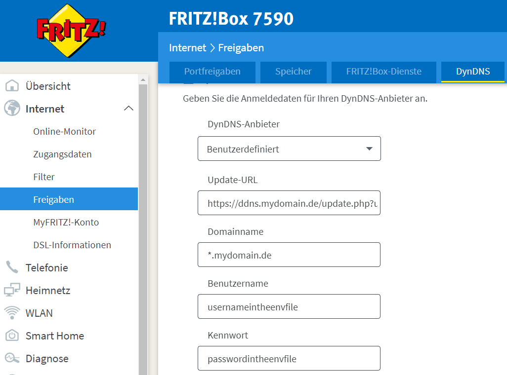

# Introduction

This tutorial will show you how to set up a DynDNS for a connected domain using a Webhosting plan from Netcup. For example, you can use this to link a domain to your home network, even if the IP address changes daily.

# Requirements

* Any webhosting plan from Netcup
* A domain connected to this Webhosting
* A device on the target network that can call a URL at regular intervals with the current IP-Adress (for example, a router such as Fritz!Box or any other device that can execute a bash script). PHP support from this device is not necessary.

# Step 1 - Activate Netcup API

After a web hosting plan with a domain is created, the API must be activated in the CCP. You will need an API key and an API password. You can generate these in "Master Data --> API".



Please store the API-Key somewhere as you are going to need it later.

# Step 2 - Add a new DNS record to the domain

The second step is to add a new DNS record to the domain, used as the update URL. In the domain settings, you choose the domain and switch to the DNS settings.

First, you could set the TTL to a smaller number like 300 to update the domain faster. Then you add a new A record with the standard destination of the Webhosting product. You can name the host however you want. In my example, I used "ddns".



It has to be the same IP address as you can see in your products menu under this domain.



# Step 3 - Test the DNS settings

At this point, you should test whether the DNS settings for the subdomain have been adopted, if the subdomain was previously routed to another IP address. This can sometimes take a few hours.

You can test it with any terminal on your device when you type in:
`ping -4 ddns.mydomain.com`

The output should be something like this:

```bash
Ping is executed for ddns.mydomain.com [123.456.789.123] with 32 bytes data:
Answer from 123.456.789.123: Bytes=32 Time=27ms TTL=59
Answer from 123.456.789.123: Bytes=32 Time=25ms TTL=59
[...]
```

# Step 4 - Create a subdomain in Plesk

When the IP address matches the one in the CCP, it is time to switch to Plesk. You can open it through the products menu.



There you can add a new subdomain.



Choose the hostname like before and the correct domain.



In the settings of the new subdomain, you can add an SSL certificate with Let's Encrypt.



If you now visit your subdomain with a web browser, you should see the default text that a website is under construction. If not, make sure the document root is the one where the default index.html is located. Also doublecheck, that it is the correct IP address in the previous step.

# Step 5 - Add script to subdomain

[Felix Kretschmer](https://github.com/fernwerker "Github Account of Fernwerker") wrote a:
>Self-hosted dynamic DNS php script to update netcup DNS API from Router like AVM FRITZ!Box

You have to [download](https://github.com/fernwerker/ownDynDNS) the script.



After unzipping, you can upload the whole direction into the subdomain's document root with the file manager. You should rename the "htaccess.example" into "htaccess". Afterwards, you must fill in the correct credentials in the ".env.dist" file and save it as ".env". You can choose anything as username and password; this is *not* your netcup username and password. Your file manager should look something like this:



Try to navigate with a web browser to ddns.mydomain.com/.env
You should see error 403 (forbidden). If you can see the environment file, you should immediately update the .htaccess file and add the .env into it:

```text
<Files .env>
    Order allow,deny
    Deny from all
</Files>
```

Now navigate with a web browser to ddns.mydomain.com/update.php
You should see an error:

```php
Fatal error: Uncaught RuntimeException: payload invalid in /var/www/vhosts/hosting123456.a2feb.netcup.net/ddns.mydomain.com/src/Handler.php:35
Stack trace:
#0 /var/www/vhosts/hosting123456.a2feb.netcup.net/ddns.mydomain.com/update.php(20): netcup\DNS\API\Handler->__construct(Array, Array)
#1 {main}
  thrown in /var/www/vhosts/hosting123456.a2feb.netcup.net/ddns.mydomain.de/src/Handler.php on line 35
```

That means everything works as expected so far.

# Step 6 - Call the URL

The last thing you have to do is to call the setup URL.

`https://ddns.mydomain.de/update.php?user=<username>&password=<pass>&ipv4=<ipaddr>&ipv6=<ip6addr>&domain=<domain>`

If you have a Fritz!Box you can fill username, password and domain into the DynDNS form:



With another device, you maybe have to use the [bash script](https://github.com/fernwerker/ownDynDNS/blob/master/examples/update-dyndns.sh). That is also a possibility to test the script. You will need a device connected to the internet, which can execute shell scripts.

Please create a new file `nano ddns-script.sh` on that device and fill in the code:

```bash
#!/usr/bin/env bash

# you can run this script from **ix bases device to update (different) Records

USER="username as in the .env"
PASS="password as in the .env"
DOMAIN="mydomain.com"
SCRIPT="https://ddns.mydomain.com/update.php"
FORCE=0
MODE="both" # can be undefined, "@", "*" or "both"

IPV4=$(curl -4 -q v4.ident.me)
IPV6=$(curl -6 -q v6.ident.me)

echo ${IPV4}
echo ${IPV6}

# PAYLOAD_IPV4="force=${FORCE}&user=${USER}&password=${PASS}&ipv4=${IPV4}&domain=${DOMAIN}&mode=${MODE}"
# curl -X POST --data "${PAYLOAD_IPV4}" ${SCRIPT}

# PAYLOAD_IPV6="force=${FORCE}&user=${USER}&password=${PASS}&ipv6=${IPV6}&domain=${DOMAIN}&mode=${MODE"}
# curl -X POST --data "${PAYLOAD_IPV6}" ${SCRIPT}

PAYLOAD_BOTH="force=${FORCE}&user=${USER}&password=${PASS}&ipv4=${IPV4}&ipv6=${IPV6}&domain=${DOMAIN}&mode=${MODE}"
curl -X POST --data "${PAYLOAD_BOTH}" ${SCRIPT}
```

After saving, you can execute the script `sh ddns-script.sh`.
The output should be:

```php
[DEBUG] api login successful
[DEBUG] IPv4 for @.example.com set to 123.456.123.456
[DEBUG] dns recordset updated
[DEBUG] api logout successful
```

In the DNS settings in the CCP, you can verify that the DNS has been updated.

# Conclusion

Running the script updates the DNS setting of the domain. The subdomain set explicitly in the DNS settings remains unchanged.

# License

MIT

# Contributor's Certificate of Origin

Contributor's Certificate of Origin By making a contribution to this project, I certify that:

 1) The contribution was created in whole or in part by me and I have the right to submit it under the license indicated in the file; or

 2) The contribution is based upon previous work that, to the best of my knowledge, is covered under an appropriate license and I have the right under that license to submit that work with modifications, whether created in whole or in part by me, under the same license (unless I am permitted to submit under a different license), as indicated in the file; or

 3) The contribution was provided directly to me by some other person who certified (a), (b) or (c) and I have not modified it.

 4) I understand and agree that this project and the contribution are public and that a record of the contribution (including all personal information I submit with it, including my sign-off) is maintained indefinitely and may be redistributed consistent with this project or the license(s) involved.

Signed-off-by: Jewgeni Lewash (j.lewash@gmail.com)