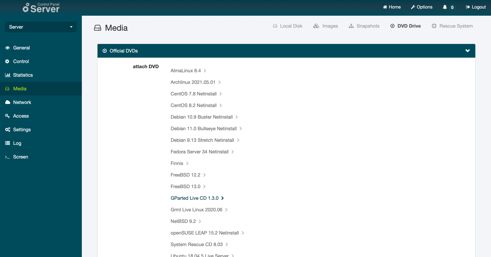
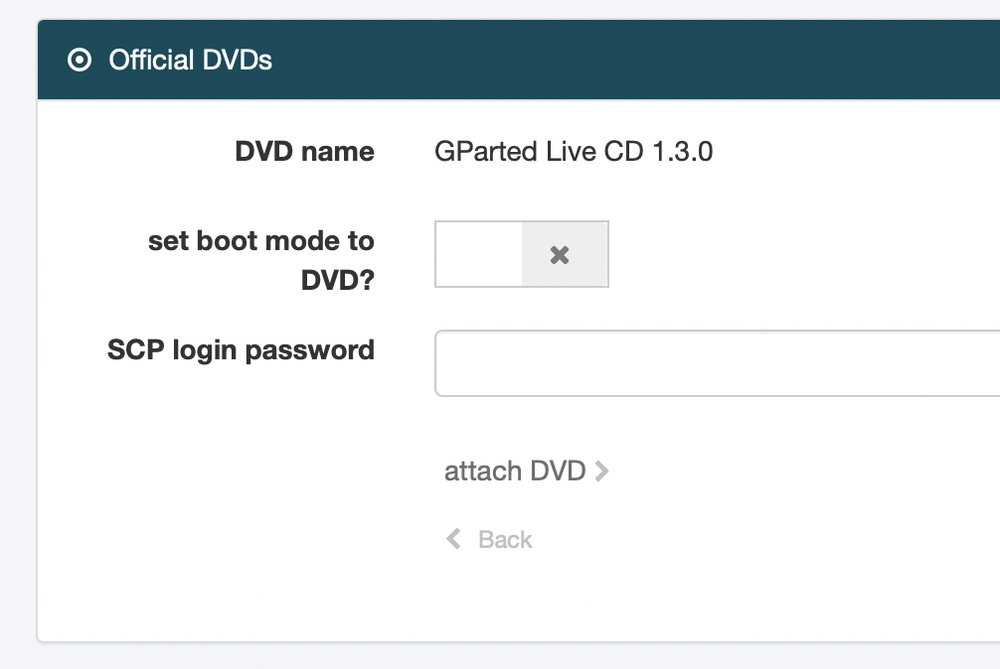
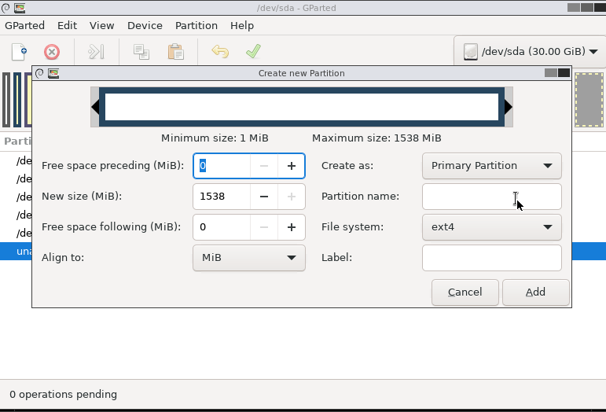

# Introduction

Upgrading a debian or ubuntu via apt can sometimes be stressful. What if a package reports an error midway and you can just not figure out what the problem is, while all your websites and services are down.

A better approach would be to use an installation medium to just add a second installation and reconfigure everything there. This is somewhat saver, but can also result in a long downtime while you reconfigure all your services in your new installation. On the upside: If something goes wrong, you can always boot to your previous installation.

There is actually a third option: **debootstrap**

With debootstrap you can install an all new system and prepare it while you're running your previous installation. In this tutorial it will be shown how to upgrade/reinstall your OS on your netcup vServer.

# Requirements

This tutorial was written for Debian 10 (Buster) as the starting system and Debian 11 (Bullseye) as the new system. But it could work for any linux that can run debootstrap. Switching between Debian and Ubuntu as the target system is also possible.

For this tutorial a terminal access, like provided in the Netcup SCP, is required. If your hoster does not offer such a feature, rescaling your boot partition is much more complicated. Please also checkout Reference 2 for rebooting your old system on failure.

## References

This tutorial was heavily influenced by:
- https://www.debian.org/releases/stretch/amd64/apds03.html.en (Ref1)
- https://gist.github.com/varqox/42e213b6b2dde2b636ef (Ref2)

## Consider LVM

In this tutorial, we will create all partitions without LVM. This again results in a setup, where it is hard to scale partitions outside of their ordering, meaning each partition can only be scaled "to the right" and free space that is not right of a partition can not be used. LVM circumvents this problem at the cost of some performance. If there is any reliable benchmark out there for LVM impact on netcup vServers please let me know.

## Consider LUKS

Like with any physical or virtual drive, an unencrypted drive can be mounted into any other system and is available just like you would have it inside your vServer, meaning all data can be read. The only countermeasure is to encrypt your harddrive with luks (or any other encrypting mechanism). This is also not part of this tutorial. If you do encrypt your partitions, you will have to have an extra partition for `/boot` outside of your encrypted area to enable grub to boot your system. There are plenty of other options out there to make this work. As long as you do not touch your original system, this tutorial is the perfect opportunity to play with encryption.

# Step 1 - (Making Space)
Since we are going to setup the new OS parallel to the existing one, we need space. If there already exists an empty partition on your system you can skip this step.

**Working with partitions can be quite dangerous. Please be careful.**

If you haven't worried too much about your vServer setup, there are good chances your layout might look something like this:

```
|start|[sda1 - grub][sda2 - swap][sda3 - ext4 - mounted as / - ]|end|
```

This setup is quite disadvantageous since we are not able to shrink an ext4 filesystem while it is mounted. With Netcup we are lucky since inside the Server Control Panel, we can boot from an iso **and** have a console with mouse support.

*For this step we will have some downtime. For my VPS 16years (with an HDD) downsizing the ext4 by around 500 GB took about 50 minutes.*

## Step 1.1 - (Shrink existing partition)


Log into your SCP, select your server, then go to Media and select DVD Drive. There we insert the GParted Live CD and set the server to boot from DVD via switch. 

You can also set the bootmode manually under Settings -> Boot Order.
Afterwards we reboot the server and open the console via the >_Screen menupoint.
After a short time you should see the gparted boot prompt. You can take the time to reconfigure the setup (e.g. if you want german keyboard) but you should be okay with the default settings (press enter 4 times). After that open gparted. Select the partition, click move/resize and resize the partition to the desired size. The free space should be at least large enough to house a new partition. 

## Step 1.2 - (Create partition for the new system)


Now create a new partition inside the new space and format it to ext4. Other formats like xfs or btrfs would be possible as well but we stick to the standard for this tutorial. 

## Step 1.3 - (Reboot into linux)
With the new partition we can now reboot into our existing system. For that first close the gparted gui and then doubleclick the red shutdown icon. Select reboot and confirm. You should then see a prompt to remove the gparted live cd.
Disable the boot to DVD from the scp and restart your machine with the [detach DVD] button.

Checkout the name of your new partition using `lsblk`. If your setup was exactly like described earlier, it should be /dev/sda4. In the following steps we will call this drive /dev/sdaX.

## Alternate option with less downtime

If your system contains a large enough swap partition (e.g. 4G), it is possible to reuse this part of the harddrive as a new system. In this case you would disable the swap partition in the running system `swapoff -a`, delete it and recreate it as an ext4 to house the new system. Make sure that your system has enough ram to run without swap. Also make sure that you remove the swap entry in your `/etc/fstab` to avoid a long waiting time while the system is looking for the swap partition at reboot. After booting to the new system consider resizing your old system and recreate a swap partition elsewhere.

# Step 2 - (Install your new base system)

Create a mountpoint for your new partition:
```
mkdir /mnt/debinst
```
Mount the newly created drive via
```
mount /dev/sdaX /mnt/debinst
```

On Debian 10, the debootstrap binary can be retrieved via 
```
apt install debootstrap
```
For other systems, download and install the binary from the debian archive (Ref1 D.3.2.). With deboostrap installed, we can launch the install with the command 

```bash
debootstrap --arch amd64 bullseye /mnt/debinst http://ftp.us.debian.org/debian
```
In this tutorial we are installing Debian 11 (Bullseye) on an amd64 machine. If you want to use a different system or architecture you can do that with debootstrap. Debootstrap will now download all necessary binaries and initialize the base system for you. This will take a couple of seconds.

Once it is installed and you are back on your prompt, it is time to configure your new system a little bit further. For this we are going to `chroot` into your new system. But before that, we want to mount some pointer of our current system to the new installation.

```bash
mount --make-rslave --rbind /proc /mnt/debinst/proc
mount --make-rslave --rbind /sys /mnt/debinst/sys
mount --make-rslave --rbind /dev /mnt/debinst/dev
mount --make-rslave --rbind /run /mnt/debinst/run

chroot /mnt/debinst /bin/bash
```

In the new system we can install everything we need the way we are used to:

```bash
apt update && apt install -y ssh
```

Hint: if you plan on accessing your new system via ssh, use the command above to install the ssh server and client. If you do not need ssh access, you can also skip step 2.3 later on.

## Step 2.1 - (Add backports and security updates to apt)

After the installation is finished we can populate the sources for apt with backports and security updates. First install lsb-release:

```bash
apt update && apt install -y lsb-release
```

Apt will occasionally remind you that it won't execute some actions because it knows that we are in a chrooted environment. After that add the sources for your distribution with the following script:

```bash
CODENAME=$(lsb_release --codename --short)
cat > /etc/apt/sources.list << HEREDOC
deb https://deb.debian.org/debian/ $CODENAME main contrib non-free
deb-src https://deb.debian.org/debian/ $CODENAME main contrib non-free

deb https://security.debian.org/debian-security $CODENAME-security main contrib non-free
deb-src https://security.debian.org/debian-security $CODENAME-security main contrib non-free

deb https://deb.debian.org/debian/ $CODENAME-updates main contrib non-free
deb-src https://deb.debian.org/debian/ $CODENAME-updates main contrib non-free
HEREDOC
```

It is a good idea to check `/etc/apt/sources.list` manually if everything worked. If everything seems fine then update your system just to be sure:

```bash
apt update && apt upgrade -y
```

Continue installing software that you require. For example:

```bash
apt update && apt install -y zip htop sudo ssh net-tools bash-completion screen iotop rsync 
```

After you have installed everything you need it is time to add the configuration files. These files can be edited from inside the chrooted system or you can 

```
exit
```

to the main system and edit the files from there. I prefer the latter option for two reasons:
1. It is possible to copy configuration files that already exist.
2. There is less danger to forget which system you are actually editing since your new system will be at `/mnt/debinst` and you avoid mistakenly editing the wrong file and messing up your backup system.

In this tutorial we will edit the files from the outside. If you do it within a chrooted environment, simply leave out the `/mnt/debinst` at the beginning.

## Step 2.2 - (Edit `/mnt/debinst/etc/fstab`)

The most important configuration is the fstab, to make our new system aware of the partitions it has to mount. While it is possible to call the new installation with `/dev/sdaX`, you should use its UUID as reference in `fstab`. You can find the UUID of a partition via
```bash
blkid
```

As a reference you can copy your previous `fstab` to the new system
```bash
cp /etc/fstab /mnt/debinst/etc/fstab
```
**Make sure that you at lease change the root partition**

Example:
```
# /etc/fstab: static file system information.
#
# Use 'blkid' to print the universally unique identifier for a
# device; this may be used with UUID= as a more robust way to name devices
# that works even if disks are added and removed. See fstab(5).
#
# systemd generates mount units based on this file, see systemd.mount(5).
# Please run 'systemctl daemon-reload' after making changes here.
#
# <file system> <mount point>   <type>  <options>       <dump>  <pass>

# Change this UUID here to the UUID of /dev/sdaX
UUID="1cdd87e4-37c7-4156-a3f3-9772b12c4769"	/	ext4	errors=remount-ro 0       1

# swap was on /dev/sda2 during installation
UUID=99c1b9f9-dfc9-44a1-a9fd-69801759c8a9 none            swap    sw              0       0

# cdrom
/dev/sr0        /media/cdrom0   udf,iso9660 user,noauto     0       0

```

In this case we would swap out the UUID 1cdd87e4-37c7-4156-a3f3-9772b12c4769 with the UUID that was assigned to /dev/sdaX and we found with the `blkid` command.

If you deleted your swap, make sure that you delete (or comment) the line for the swap partition as well.

If you used encryption make sure that `/etc/crypttab` is in place and updated.

## Step 2.3 - (Copy SSH information)

Since you likely use SSH to connect to your machine, you would want to be able to root into it again. Also if your machine is allowed to SSH into other servers, you would like to retain that possibility.

```bash
cp -a /root/.ssh/ /mnt/debinst/root/
```

Also make sure that your SSH configuration is present for the SSH server
```bash
cp -a /etc/ssh/sshd_conf.d/* /mnt/debinst/etc/ssh/sshd_conf.d/
```
This only works if you have already put your configuration into the sshd_conf.d directory. If it still resides in the `sshd_conf` file, you might either extract the information (recommended) or copy that file.

To avoid problems regarding the host_key identification, we backup the host keys which where generated when we installed ssh and copy the host keys from the old system to the new system.
```bash
# Install zip if it is not yet installed on your system
apt install -y zip

# Backup the generated hostkeys
zip -r /mnt/debinst/root/old_hostkeys_bak.zip /mnt/debinst/etc/ssh/ssh_host*

# Remove the generated hostkeys
rm /mnt/debinst/etc/ssh/ssh_host*

# Replace with the hostkeys in your system
cp -a /etc/ssh/ssh_host* /mnt/debinst/etc/ssh/
```

## Step 2.4 - (Copy network information)

Like with the SSH configuration, we update the network configuration as well.
```bash
cp -a /etc/network/interfaces.d/* /mnt/debinst/etc/network/interfaces.d/
```
Again if your configuration resides in /etc/network/interfaces, you might consider migrating.

**Be aware that [Debian changed its network interface names from version 10 to 11](https://wiki.debian.org/NetworkInterfaceNames)** and therefore you might run into serious trouble. 

An approach to avoid this is to use the network-manager on first boot and only after then edit the interface definition, once you know the correct naming:
```bash
apt install network-manager
```

## Step 2.5 - (Set hostname)
```bash
cp /etc/hostname /mnt/debinst/etc/hostname
```
Or choose a new hostname if you want to

## Step 2.6 - (Mount/Copy other directories)

For any other directory (e.g. /home) you might want to consider a copy or a mount inside (/etc/fstab) from a different partition.
Also copy all required config files and data for other services that run on your machine like apache or mysql.

# Step 3 - (Finalize your setup)

With all config files in place it is time to finalize the installation. If you're not inside your new system chroot to it again:

```bash
chroot /mnt/debinst /bin/bash
```

The next steps are pretty much the same as for a normal Debian setup

## Step 3.1 - (Set timezone)
```bash
dpkg-reconfigure tzdata
```

## Step 3.2 - (Set local)
```bash
apt install -y locales
dpkg-reconfigure locales
```

## Step 3.3 - (Set keyboard layout)
```bash
apt install -y console-setup console-setup-linux
dpkg-reconfigure locales
```

## Step 3.4 - (Set root password)
```bash
passwd
```

## Step 3.5 - (Install kernel and bootloader)

Now let's make it bootable. This step does not (yet) modify your current setup:
```bash
apt install -y linux-image-amd64 firmware-linux grub2
```

With a full functioning grub lets check if it finds our new Linux. This step does also not alter your existing bootloader:
```bash
update-grub
```

The output should look something like:
```
Generating grub configuration file ...
Found linux image: /boot/vmlinuz-5.10.0-9-amd64
Found initrd image: /boot/initrd.img-5.10.0-9-amd64
Found Debian 10 on /dev/sda3
done
```
Carefully read if grub was able to detect your new system and your old one (in case something goes wrong).
The example output indicates, that grub has detected our new system as well as the old system on /dev/sda3, which we can boot to in case our new system fails.

If everything is correct, you can finally write your bootloader to the beginning of the disk.

```bash
# This will override your boot sector! Make sure everything is okay before you do!
grub-install --root-directory / /dev/sda
```

### Annotation
I recommend the safety measures in Ref2 Timeout to boot back into old system, if your hoster does not provide you with a terminal to your server. With the Netcup SCP we are  on the save side and if something goes wrong when booting your new system, you can select the old system in the grub prompt.

# Step 4 - (Reboot to your new system)
Finally
```bash
reboot
```
and you will find yourself in your new Debian.

If anything goes wrong or your system does not boot after all, you can restart your machine with an open console in the Netcup SCP and in the grub bootloader (text on the blue screen) select your old system to boot to. From there figure out where the problems originated.

# Conclusion
With your Linux server it is just like with your desktop. From time to time it feels good to get rid of all the bulk accumulated over the years with a fresh new install. With these easy steps a new system can be prepared without interrupting existing services too much. Especially when your data is already out on another partition, generating a new system can be done within minutes.

# License
MIT

# Contributor's Certificate of Origin
Contributor's Certificate of Origin By making a contribution to this project, I certify that:

 1) The contribution was created in whole or in part by me and I have the right to submit it under the license indicated in the file; or

 2) The contribution is based upon previous work that, to the best of my knowledge, is covered under an appropriate license and I have the right under that license to submit that work with modifications, whether created in whole or in part by me, under the same license (unless I am permitted to submit under a different license), as indicated in the file; or

 3) The contribution was provided directly to me by some other person who certified (a), (b) or (c) and I have not modified it.

 4) I understand and agree that this project and the contribution are public and that a record of the contribution (including all personal information I submit with it, including my sign-off) is maintained indefinitely and may be redistributed consistent with this project or the license(s) involved.

Signed-off-by: Florian Bieringer <info@bytist.de>
