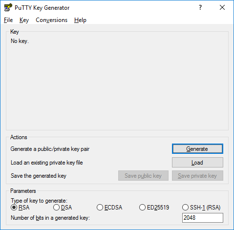
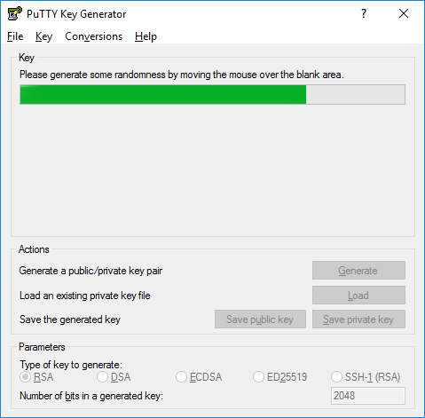
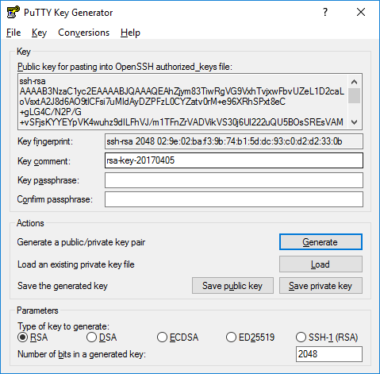

# Introduction

Since your server is always accessible via the internet by default, you should take some measures to protect it from the most common malicious attempts to gain access to your server and data.

For example, your server could be used

- to send spam and phishing emails to other people
- as part of a botnet to attack other targets in large numbers (such as a [DDoS attack](https://en.wikipedia.org/wiki/Denial-of-service_attack))
- to act as a proxy to disguise someones identity for further attacks.

<div style="background-color:rgba(0, 0, 0, 0.0470588); text-align:left; vertical-align: middle; padding:20px 20px;">
<span style="font-weight: bold;">Please note</span>: The following methods are explained for use on a Linux-based server, however most of them can be applied in a similar way on any other Unix- or Windows-based server as well since they are known as best practices.
</div>

# Requirements

- root / sudo access to the running system

# Step 1 - Keep your system up-to-date

A great first step is to always keep your system up-to-date using your package manager. This package manager manages all installed software and checks for any available updates.

Some distributions also have packages for automated updates.

- Debian-based Systems (Debian, Ubuntu, Mint)

  ```bash
  sudo apt update
  sudo apt dist-upgrade
  ```

    <div style="background-color:rgba(0, 0, 0, 0.0470588); text-align:left; vertical-align: middle; padding:20px 20px;">For automated installs of important updates see the package <a href='https://wiki.debian.org/UnattendedUpgrades'>unattended-upgrades</a>.
    </div>

- Red-Hat based Systems (CentOS, Fedora)

  ```bash
  sudo yum update yum
  sudo yum update
  ```

  or on newer systems

  ```bash
  sudo dnf upgrade
  ```

    <div style="background-color:rgba(0, 0, 0, 0.0470588); text-align:left; vertical-align: middle; padding:20px 20px;">For automated installs of important updates see the package <a href='https://fedoraproject.org/wiki/AutoUpdates'>dnf-automatic</a>.
    </div>

- SuSE-based Systems (openSUSE)
  ```bash
  sudo zypper update
  ```
- Arch-based Systems (Manjaro)
  ```bash
  sudo pacman -Syu
  ```

# Step 2 - Create a normal user account

It is recommended to always use a user account for logging in and normal use instead of doing everything as root (the system administrator account).

## Step 2.1 - Use the `adduser` command to add a new user to your system.

Be sure to replace _yourusername_ with the user that you want to create.
`bash adduser <username> `

- Set and confirm the new user's password at the prompt. A strong password is highly recommended!

  ```
  Set password prompts:
  Enter new UNIX password:
  Retype new UNIX password:
  passwd: password updated successfully
  ```

- Follow the prompts to set the new user's information. It is fine to accept the defaults to leave all of this information blank.
  ```
  User information prompts:
  Changing the user information for username
  Enter the new value, or press ENTER for the default
      Full Name []:
      Room Number []:
      Work Phone []:
      Home Phone []:
      Other []:
  Is the information correct? [Y/n]
  ```

## Step 2.2 - Use the `usermod` command to add the user to the sudo group

`bash usermod -aG sudo <username> `
By default members of the sudo group have sudo privileges.

## Step 2.3 - Test sudo access on new user account

- Use the `su` command to switch to the new user account.

  ```bash
  su - <username>
  ```

- As the new user, verify that you can use sudo by prepending `sudo` to the command that you want to run with superuser privileges.

  ```bash
  sudo command_to_run
  ```

- For example, you can list the contents of the /root directory, which is normally only accessible to the root user.

  ```bash
  sudo ls -la /root
  ```

- Next time you log in to your server you can use your new user: `<username>@<host>`

# Step 3 - Secure the SSH server

SSH is the most commonly used protocol for secure/encrypted access to a remote system nowadays. For this reason, there are bots that check every IP on the internet to see if its default SSH port (port 22) is accessible and how it is protected.

## Step 3.1 - Setup a public key authentication

To secure access, we will move to authentication with a key pair. This means that we will no longer use a password, but a key pair in text form that behaves like a keyhole (called public key) and a matching key (called private key).

<div style="background-color:rgba(0, 0, 0, 0.0470588); text-align:left; vertical-align: middle; padding:20px 20px;">
<span style="font-weight: bold;">Please note</span>: After generating this key pair, we only share our public key, because the private key should always be kept secret like a password!
</div>

If you want more informations about the public key authentication you can read the[ official documentation](https://www.ssh.com/academy/ssh/public-key-authentication).

### Step 3.1.1a - Generate a key pair using command line (on Linux)

Windows users see [Step 3.1.1b](#step-31b---generate-a-key-pair-using-puttygen-on-windows).

- To create a new key pair with the key type **ed25519** (recommended) use the following command. If you want to authenticate to older systems use **rsa** instead.

  ```bash
  ssh-keygen -t ed25519
  ```

- At the following prompt accept the default file path or enter your own where you want to save the key pair:

  ```
  Generating public/private ed25519 key pair.
  Enter file in which to save the key (/home/username/.ssh/id_ed25519):
  ```

- At the following prompt, confirm your passphrase selection and press Enter:
  ```
  Enter passphrase (empty for no passphrase):
  ```
  This example is a sample of the system response:
  ```
  Your identification has been saved in /home/username/.ssh/id_ed25519
  Your public key has been saved in /home/username/.ssh/id_ed25519.pub
  The key fingerprint is:
  SHA256:4G2TLkzXlS2BSN1zlbgJpZK3TEg/Lmgk3AYofxjyJEU username@hostname
  The key's randomart image is:
  +--[ED25519 256]--+
  |  oE.. ..+ oo...o|
  | + +. o o *.+=.. |
  |  B oo.+ + *=o+  |
  |   + o+o.o*.o+   |
  |    . ooS..+     |
  |     o.+ ..      |
  |      o .        |
  |       .         |
  |                 |
  +----[SHA256]-----+
  ```
- Validate that the keys were generated:

  ```
  cd $HOME/.ssh
  ls -l
  cat id_ed25519
  ```

- Copy the content of your public key to your remote server [as described here](#step-32---use-the-key-pair).

### Step 3.1.1b - Generate a key pair using PuTTYgen (on Windows)

To generate such a key pair we use [PuTTYgen](https://www.ssh.com/academy/ssh/putty/windows/puttygen) which is part of the PuTTY package that you can [download here](https://www.chiark.greenend.org.uk/~sgtatham/putty/latest.html).

After installation you can find PuTTYgen at

`Start menu → All Programs → PuTTY → PuTTYgen`.



To create a new key pair, select the type of key to generate from the bottom of the screen (using ed25519 is good for most people; another good well-known alternative is ECDSA or SSH-2 RSA with 2048 bit key size on older systems).

Then click **Generate**, and start moving the mouse within the window. Putty uses mouse movements to collect randomness. The exact way you are going to move your mouse cannot be predicted by an external attacker. You may need to move the mouse for some time, depending on the size of your key. As you move it, the green progress bar should advance.

Once the progress bar becomes full, the actual key generation computation takes place. This may take from several seconds to several minutes. When complete, the public key should appear in the window. You can now specify a [passphrase](https://www.ssh.com/academy/ssh/passphrase) for the key.

You should save at least the private key by clicking **Save private key**. It may be advisable to also save the public key, though it can be later regenerated by loading the private key (by clicking **Load**).



We strongly recommended using a passphrase for private key files intended for interactive use. If keys are needed for automation (e.g., with [WinSCP](https://www.ssh.com/ssh/winscp/), then they may be left without a passphrase.



## Step 3.2 - Use the key pair

### Step 3.2.1 - Add the public key

Login to your remote server as your normal user ([see Step 2](#step-2---create-a-normal-user-account)) and add the public key to `~/.ssh/authorized_keys` so you can login to the SSH server with your private key.

First check if the _.ssh_ directory exists:

```bash
ls -l ~/.ssh
```

If it doesn't, you need to create it and the file `authorized_keys`, which will contain the shared public keys. Also change the permissions so only you can access them:

```bash
cd ~
mkdir .ssh
touch .ssh/authorized_keys
chmod 700 .ssh
chmod 600 .ssh/authorized_keys
```

Now open the file called `authorized_keys`, for example with the command line text editor _nano_:

```bash
nano ~/.ssh/authorized_keys
```

1. Add the public key (starting with `ssh-ed25519 AAAA...` if you used ed25519) in a new line in the file
2. Then save and close it by pressing `Ctrl + x` and `y` when it prompts "Save modified buffer?" on the bottom of the screen. Press `Enter` to save the file.

### Step 3.2.2 - Add the private key

Then configure your SSH client to use your private key.

- If you connect to the remote server from the command line, the private keys in your home directory `~/.ssh` are automatically used.
- With PuTTY first create a new session in the `Session` tab:

  - In the upper field `Host Name` enter `<username>@<host>`

    `<host>` can be either an IP address or the domain name of your remote server.

  - Port is `22` for now (default)
  - In the field below `Saved Sessions` enter a name for your new session
  - Set your private key at `Connection -> SSH -> Auth -> "Private key file for authentication"`
  - Save your session by pressing `Save` in the `Session` tab.

## Step 3.3 - Test the connection

With the key pair now set up on the newly created user account we can now test if the passwordless SSH connection works:

- With PuTTY select your session and press the `Open` button at the bottom or double-click it.
- With the command line enter the following:
  `bash ssh <username>@<host> `
  `<host>` can be either an IP address or the domain name of your remote server.

If the SSH connection was possible we can continue with [Step 3.4](#step-34---configure-the-ssh-server).

## Step 3.4 - Configure the SSH server

- Backup your configuration first

  It is always a good idea to make a copy of your configuration files before you change them. Otherwise, it can be difficult to find the previous settings if something doesn't work afterwards.

  ```bash
  sudo cp /etc/ssh/sshd_config /etc/ssh/sshd_config.bak
  ```

- Open the sshd configuration file

  ```bash
  sudo nano /etc/ssh/sshd_config
  ```

- **Disable Password Authentication**

  As we now have a working key pair authentication we can disable the password authentication.
  Inside the configuration file find the following lines:

  Uncomment this line:

  ```diff
  - #PubkeyAuthentication yes
  + PubkeyAuthentication yes
  ```

  Change the `yes` to `no`:

  ```diff
  - PasswordAuthentication yes
  + PasswordAuthentication no
  ```

- **Disable SSH root login**

  Direct root login is always a bad idea and we want only user accounts to be able to login.

  Find this line and change the `no` to `yes`:

  ```diff
  - PermitRootLogin no
  + PermitRootLogin yes
  ```

- **Change the SSH Port** (optional)

  To prevent bots from constantly checking our SSH port, we can also change it. Since we have switched to key pair authentication, this is no longer strictly necessary, but can still increase security.

  Find this line, uncomment it and change the number to anything higher than 1024:

  ```diff
  - #Port 22
  + Port 2233
  ```

     <div style="background-color:rgba(0, 0, 0, 0.0470588); text-align:left; vertical-align: middle; padding:20px 20px;">
     <span style="font-weight: bold;">Please note</span>: With this change you also need to change the port in your SSH client to the new number after your restarted the SSH server since the default port (port 22) is no longer listening for any SSH connections!
     </div>

- Save and close the file by pressing `Ctrl + x` and `y` when it prompts "Save modified buffer?" at the bottom of the screen. Press `Enter` to save the file.

- Restart the SSH server
  ```bash
  sudo systemctl restart sshd
  ```
  or
  ```bash
  sudo service sshd restart
  ```

# Step 4 - Close your firewall

Best practice for firewalls is to close as much ports as possible and open only those that are really needed.

A simple and great tool for such tasks is called `ufw` (Uncomplicated Firewall) which is available on most big distributions.

## Step 4.1 - Install UFW

- Debian-based systems (Ubuntu, Mint)

  ```bash
  sudo apt update
  sudo apt install ufw -y
  ```

- Red-Hat based systems (CentOS, Fedora)

  ```bash
  sudo yum install epel-release -y
  sudo yum install --enablerepo="epel" ufw -y
  ```

- SuSE-based systems (openSUSE)

  ```bash
  sudo zypper install ufw -y
  ```

- Arch-based systems (Manjaro)
  ```bash
  sudo pacman -Sy ufw
  ```

## Step 4.2 - Set up UFW

After installing, set it up with the following commands:

```bash
sudo ufw default deny  # Close all ports by default, then open only those that are needed
sudo ufw allow ssh  # We open the port for SSH. If you changed the SSH port to something else than 22, replace `ssh` with your port number and /tcp i.e.: sudo ufw allow 2233/tcp
sudo ufw limit ssh  # Adds a rate limit of 6 attempted connections per 30 seconds to this port to prevent brute force attacks. Same as before, change ssh to your port/tcp if you don't use the default; limits can be changed in the ufw config.
sudo ufw enable  # Enable the UFW service
sudo systemctl enable ufw
sudo ufw status  # Check ufw settings afterwards
```

You can also use ufw to allow only specific IP addresses or ranges.
If you do this on a server outside of your local network make sure your public IP address doesn't change after a while, otherwise you will be unable to log in.

Example for an IP range in your LAN

```bash
ufw allow from 192.168.0.0/24  # Allow a private IP range from 192.168.0.0 to 192.168.0.254
```

# Conclusion

With these few steps you already have a much more secure server and will be an unpopular target for hackers. If you are interested in more Linux hardening topics you can also check out fail2ban, VPNs like Wireguard and OpenVPN, Two-Factor Authentification for Applications and even SSH.

# Sources

- [ssh.com](https://www.ssh.com/) for images of the Putty package applications and parts of the documentation of them.

# License

Permission is hereby granted, free of charge, to any person obtaining a copy
of this software and associated documentation files (the "Software"), to deal
in the Software without restriction, including without limitation the rights
to use, copy, modify, merge, publish, distribute, sublicence, and/or sell
copies of the Software, and to permit persons to whom the Software is
furnished to do so, subject to the following conditions:

The above copyright notice and this permission notice shall be included in all
copies or substantial portions of the Software.

THE SOFTWARE IS PROVIDED "AS IS", WITHOUT WARRANTY OF ANY KIND, EXPRESS OR
IMPLIED, INCLUDING BUT NOT LIMITED TO THE WARRANTIES OF MERCHANTABILITY,
FITNESS FOR A PARTICULAR PURPOSE AND NONINFRINGEMENT. IN NO EVENT SHALL THE
AUTHORS OR COPYRIGHT HOLDERS BE LIABLE FOR ANY CLAIM, DAMAGES OR OTHER
LIABILITY, WHETHER IN AN ACTION OF CONTRACT, TORT OR OTHERWISE, ARISING FROM,
OUT OF OR IN CONNECTION WITH THE SOFTWARE OR THE USE OR OTHER DEALINGS IN THE
SOFTWARE.

# Contributor's Certificate of Origin

By making a contribution to this project, I certify that:

1.  The contribution was created in whole or in part by me and I have the right to submit it under the license indicated in the file; or

2.  The contribution is based upon previous work that, to the best of my knowledge, is covered under an appropriate license and I have the right under that license to submit that work with modifications, whether created in whole or in part by me, under the same license (unless I am permitted to submit under a different license), as indicated in the file; or

3.  The contribution was provided directly to me by some other person who certified (a), (b) or (c) and I have not modified it.

4.  I understand and agree that this project and the contribution are public and that a record of the contribution (including all personal information I submit with it, including my sign-off) is maintained indefinitely and may be redistributed consistent with this project or the license(s) involved.

Signed-off-by: Kim Oliver Drechsel (kim@drechsel.xyz)
