# Introduction

In this tutorial, you'll learn how to install and configure **Coolify**, a self-hosted platform for deploying applications, on a **Netcup VPS**. This guide will also walk you through setting up a custom domain via **cPanel** or other DNS managers.

Estimated reading time: 10 minutes.

Estimated implementation time: 30 minutes.

---

## Step 1: Install Ubuntu on Netcup

1. Log into your Netcup account: [https://servercontrolpanel.de/SCP/Home](https://servercontrolpanel.de/SCP/Home).
2. Select your server and go to the **Media** section in the side menu.

   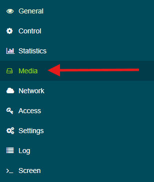

3. In the **Images** tab, choose **Ubuntu 24.04** (or the latest version).

   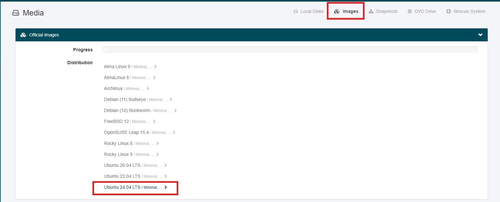

4. Select `Minimal/ minimal system with ssh preinstalled`.

   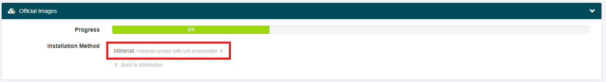

5. For **Partition Layout**, select `one big partition with OS as root partition`.
6. Leave the **SSH** settings as default and enable **Activate SSH Password**.
7. Begin the installation and monitor progress via the **Screen** tab.

   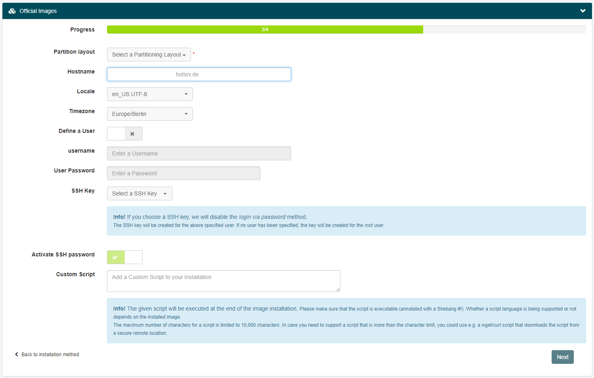

8. Once complete, turn off the server via the **Control > Shutdown (ACPI)** option.

   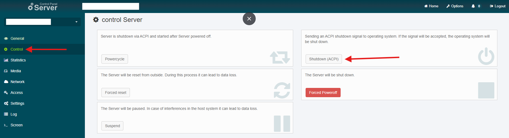

9. Go to **Access** in the side menu, request a new root password, and save it for later SSH login.

   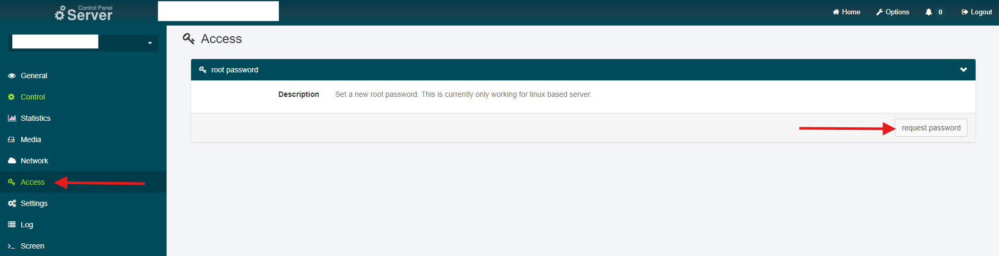

10. Start again your server.

---

## Step 2: Installing Coolify

1. Use the following command to install Coolify via SSH:

   ```bash
   curl -fsSL https://cdn.coollabs.io/coolify/install.sh | bash
   ```

2. After installation, Coolify will display your **server IP** and **port (8000)**. Example:

   ```txt
   127.0.0.1:8000
   ```

3. Access the panel at `http://<your-server-ip>:8000` and create your first admin user.

   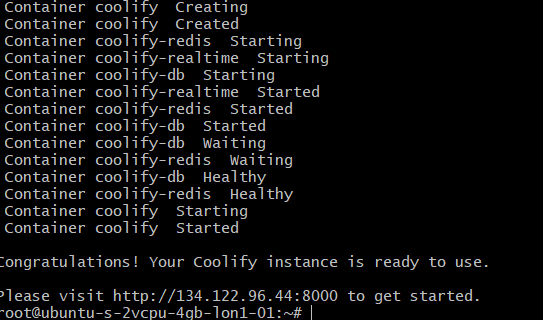

---

## Step 3: Initial Coolify Setup

1. Log into the Coolify panel at `http://<your-server-ip>:8000`.

   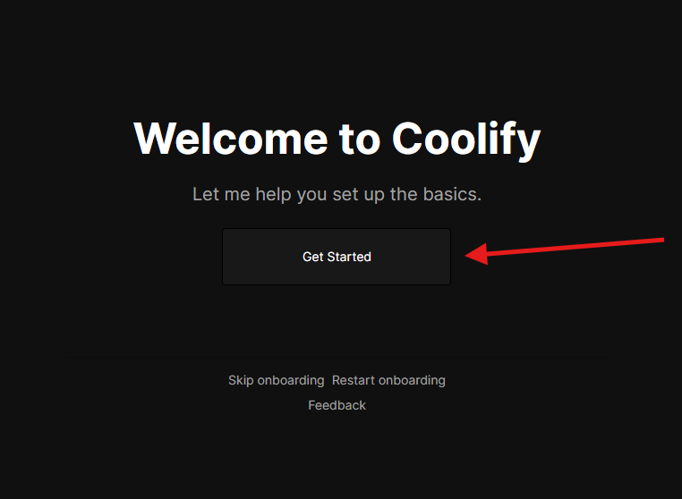

2. Follow the setup wizard and select **Localhost** when prompted for a server.

   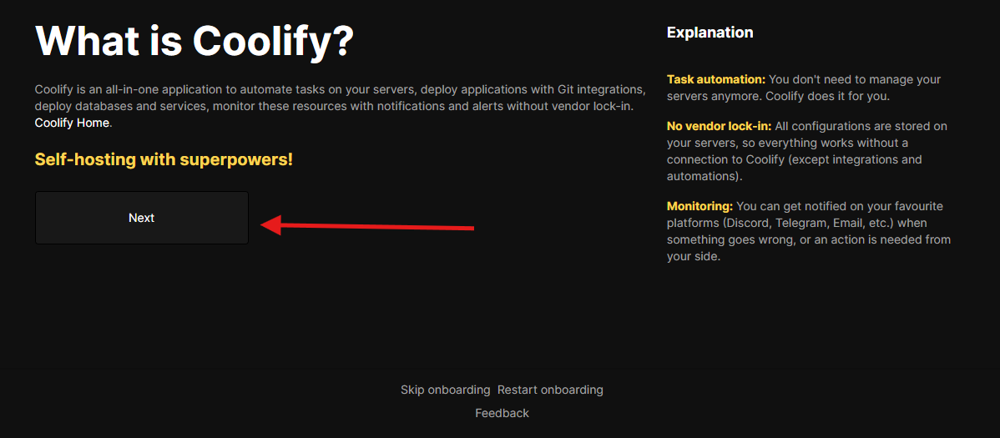
   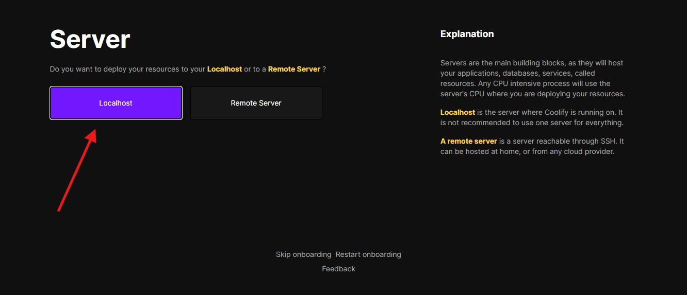
   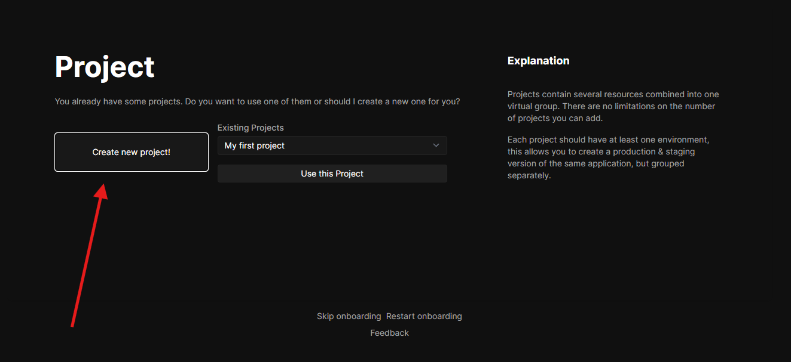

3. Once complete, Coolify is ready to use!

---

## Step 4: Configuring a Custom Domain

1. Go to your DNS manager (e.g., cPanel) and create an **A record** pointing to your server's IPv4 address.
2. Set up a **wildcard subdomain** for advanced use cases. A wildcard subdomain allows any subdomain (e.g., `app.example.com`, `test.example.com`) to resolve to your server's IP.

   - **Wildcard Format**: `*.example.com`
   - **Example A Record**: Replace `127.0.0.1` with your server's IP.

   | **Type** | **Name**       | **Value** |
   | -------- | -------------- | --------- |
   | A        | @              | 127.0.0.1 |
   | A        | \*.example.com | 127.0.0.1 |

> **What is a wildcard?**  
> A wildcard is a DNS record that resolves all subdomains (e.g., `api.example.com`, `app.example.com`) to the same IP address. This is useful for dynamic apps hosted on Coolify.

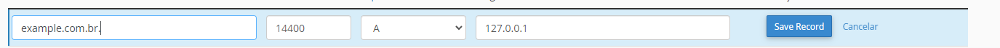
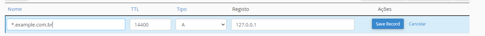

---

## Step 5: Configuring Coolify with Your Domain

1. In the Coolify panel, navigate to **Settings**.
2. Set the **Instance's Domain** to `https://example.com` (use your domain).
3. Update **DNS Validation**:

   ```txt
   1.1.1.1,<your-server-ip>
   ```

   Replace `<your-server-ip>` with your server's IPv4.

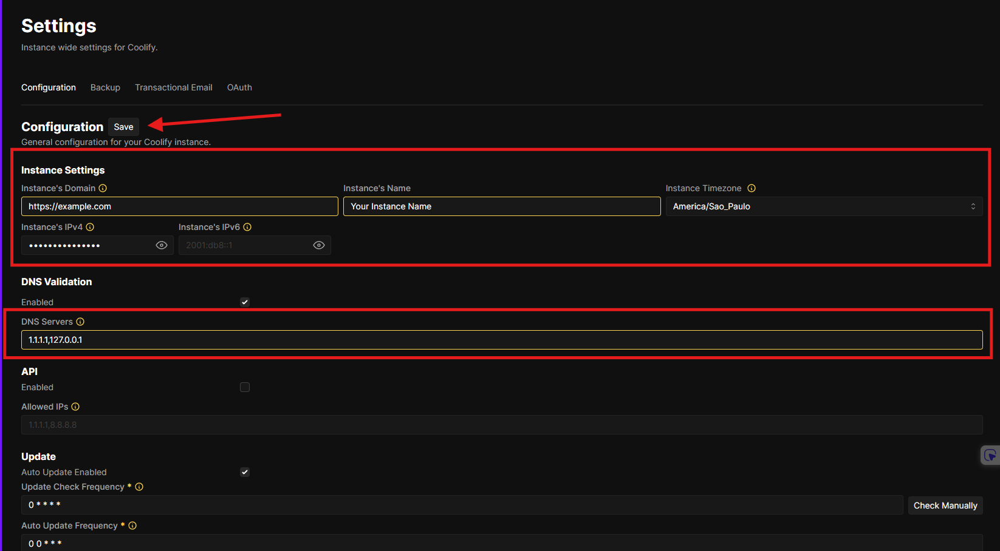

---

## Step 6: Adding Sensitive Information to Proxy Configuration

1. Go to the **Customer Control Panel**: [https://www.customercontrolpanel.de](https://www.customercontrolpanel.de).
2. Log in using your credentials (you should have received these via email).
3. Save your **Customer Number** for later.
4. In the left menu, navigate to **Master Data > API**.
5. Under **API Management**, generate an **API Password** by clicking **Generate API Password**. Save it securely.
6. To create an API key:

   - Agree to the terms of use.
   - Click **API Key Create**.
   - Save the key displayed in the same section.

   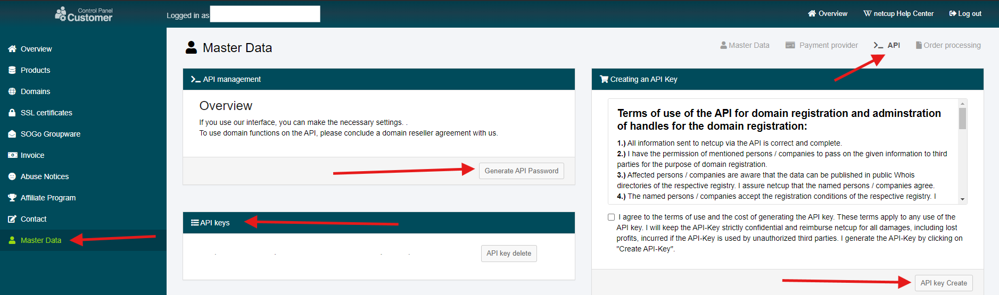

> **Note**: These credentials are highly sensitive and should not be shared with anyone.

---

## Step 7: Configuring the Coolify Proxy

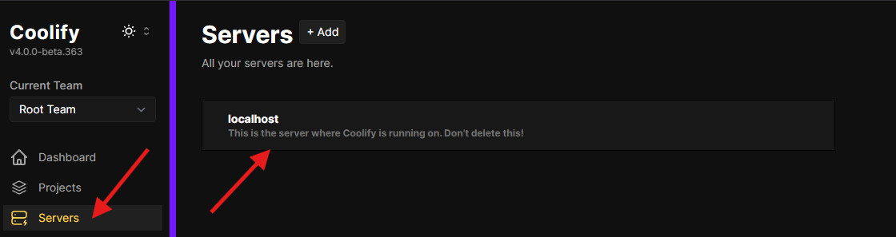

1. Navigate to **Servers > Localhost > Proxy > Configuration File** in Coolify.
2. Configuration template

   - You can find the template file in [Template File](proxy-template/coolify-proxy-netcup-config-example.yaml)

3. Replace `<your-customer-number>`, `<your-api-key>`, and `<your-api-password>` with the actual values you saved earlier for the Proxy Template (file and example above) for integration with Netcup:

   - Look at the template file or the example above, and edit only the information highlighted below:

   ```yml
   environment:
     - NETCUP_CUSTOMER_NUMBER=<your-customer-number>
     - NETCUP_API_KEY=<your-api-key>
     - NETCUP_API_PASSWORD=<your-api-password>

   labels:
     - traefik.http.routers.traefik.tls.domains[0].main=example.com
     - traefik.http.routers.traefik.tls.domains[0].sans=*.example.com
   ```

   > **Tip**: Ensure the wildcard domain (`*.example.com`) matches the DNS configuration from Step 4.

4. Restart the proxy and test your configuration by accessing your domain.

   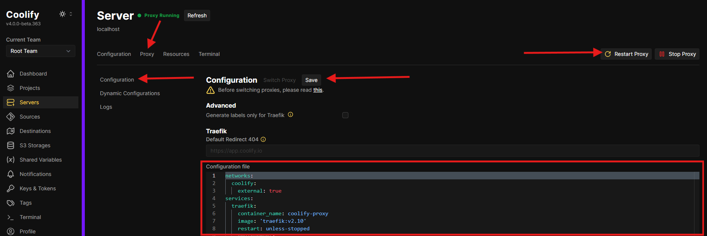

---

## Step 8: Setting Up Your First Project

1. Go to **Projects** and click **Add Project**.
2. Select your application type (e.g., GitHub deployment, N8N automation).
3. Wait for SSL certificates to be provisioned (1–15 minutes).
4. Access your project via the generated URL or your custom domain.

   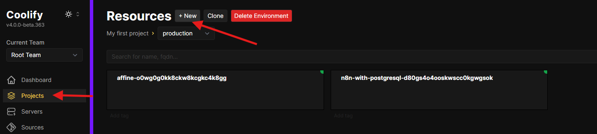

---

## Step 9: Deploy Your First Project

1. In the Coolify panel, navigate to **Projects**.
2. Click **Add Project** and select the type of resource you want to deploy (e.g., a GitHub repository or N8N automation).
3. Wait for the SSL certificates to propagate (this can take between 1 and 15 minutes).
4. Once deployed, you can access the resource using the domain or custom URL generated in the panel.

---

## Step 10: Conclusion

You’ve successfully installed and configured Coolify on Netcup with a custom domain. You can now deploy projects directly from GitHub or run automation tools seamlessly.

---

## Licence

[MIT](https://github.com/netcup-community/community-tutorials/blob/main/LICENSE)
