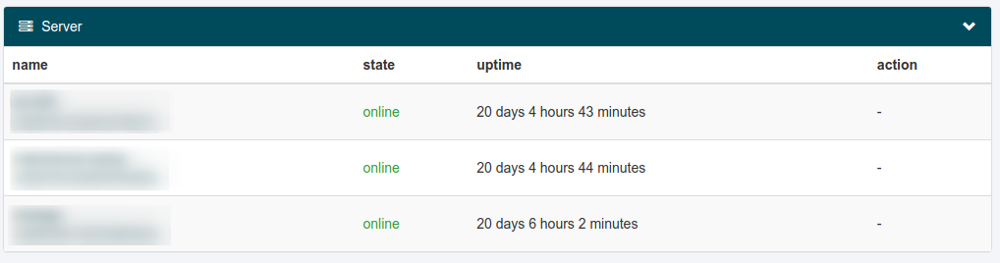
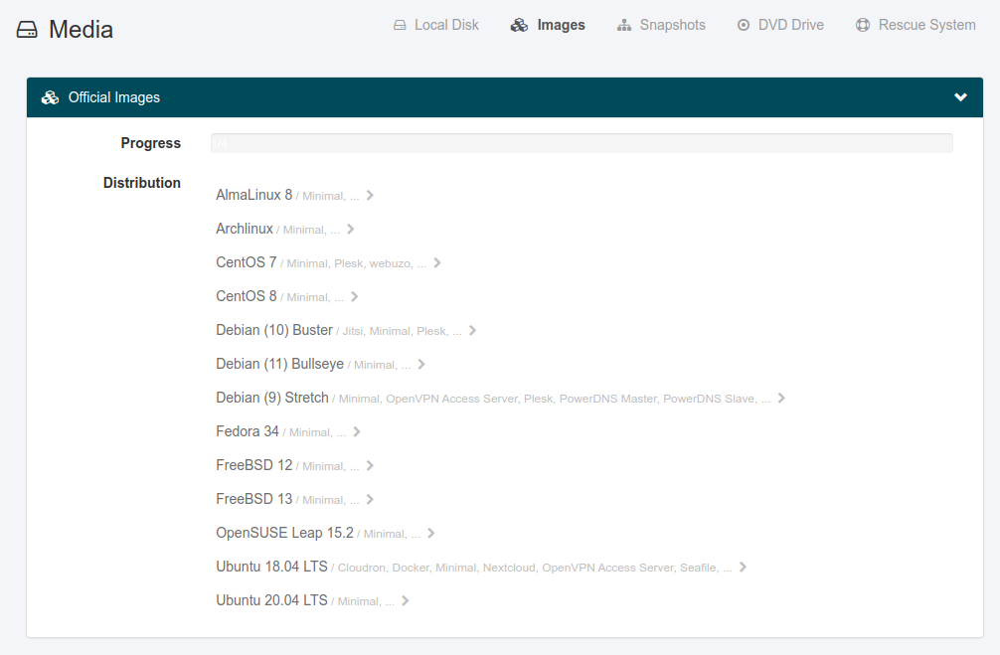
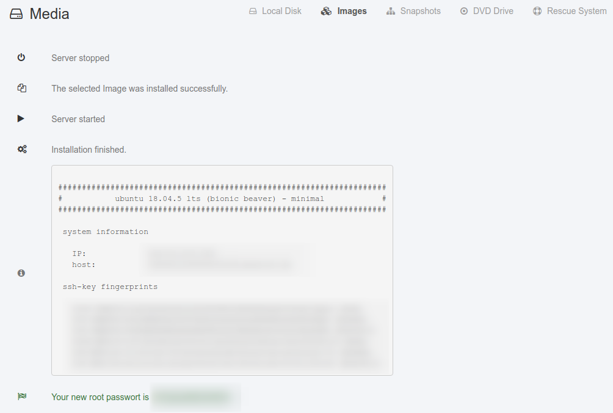
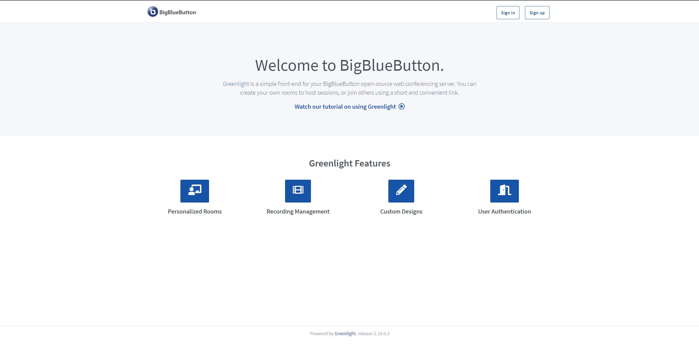

# Introduction

This tutorial explains how to install BigBlueButton 2.3 on your netcup virtual machine. At the end you will have a production-ready installation with [Greenlight](https://github.com/bigbluebutton/greenlight) as user frontend (including a valid [Let's Encrypt](https://letsencrypt.org/) certificate). Be sure that your server has enough resources, since BigBlueButton needs (according to the [docs](https://docs.bigbluebutton.org/2.3/install.html#minimum-server-requirements)) 8 cores, 16 GB memory and at least 50 GB storage. For a production server and larger or parallel meetings, I recommend a [RS 2000 G9.5](https://www.netcup.de/bestellen/produkt.php?produkt=2894).

# Requirements

- You need a server that is powerful enough to run BigBlueButton (see Introduction). Because we need to install Ubuntu 18.04, you need user credentials to the [netcup server control panel](https://www.servercontrolpanel.de/SCP/Login).
- You need a (sub) domain to run the BigBlueButton with. The (sub) domain must be configured as A record to the IP address of the server. If you don't have a subdomain, just use the hostname provided by netcup (e.g. `v112233445566778899.bestsrv.de`).

# Step 1 - Install Ubuntu 18.04 on your server

At first, we need to install Ubuntu 18.04, since BigBlueButton 2.3 requires Ubuntu 18.04. **WARNING: This will delete all existing data on the server!**

Open the [netcup server control panel](https://www.servercontrolpanel.de/SCP/Login) and log in with the credentials you received by netcup.



Click the server you want to use for BigBlueButton, then click on `Media` on the left side. Click on the link `Images` on in the upper right area of the screen. Now you will see a list of images that you can install on the netcup server:



Click on `Ubuntu 18.04 LTS`, `Minimal`, `one big partition with os as root partition. Installation may take longer to finish.` and confirm the reinstallation process with your server control panel login password. The installation starts and will take some minutes. When the process is done, you will see the auto-generated root password of the server:



Copy this password and store it in a safe place.

# Step 2 - Pre-installation checks

The image provided by netcup meets all [requirements for the BigBlueButton installation](https://docs.bigbluebutton.org/2.3/install.html#pre-installation-checks). Therefore, there are no special steps to take before running the setup script provided by BigBlueButton.

# Step 3 - Install BigBlueButton

Connect to the server with SSH (e.g. on any Linux system with the following command):

```
ssh root@333.333.333.333
```

If you don't use Linux, you can use any SSH client (e.g. [PuTTY](https://www.putty.org/)).

When you are connected, run the following command (**be sure, that you replaced the placeholders!**):

- `[HOST]`: Your (sub) domain. If you don't have a custom domain, you can use the hostname provided by netcup, e.g. `v112233445566778899.bestsrv.de`.
- `[MAIL]`: Your email address for the Let's Encrypt account.

```
wget -qO- https://ubuntu.bigbluebutton.org/bbb-install.sh | bash -s -- -v bionic-23 -s [HOST] -e [MAIL] -w -g
```

The parameters used mean the following:

- `-v bionic-23`: Installs the latest version of BigBlueButton 2.3
- `-s [HOST]`: Sets the server's hostname to the given host
- `-e [MAIL]`: Use the given email address for the Let's Encrypt account (you will get notifications when the cert expires)
- `-w`: Installs and configures ufw firewall (opens 22/tcp, 80/tcp and 443/tcp as well as 16384-32768/udp).
- `-g`: Installs [greenlight](https://github.com/bigbluebutton/greenlight) (frontend to use with BigBlueButton)

After running this command, the installation process starts. It will take some minutes and finishes with the following lines:

```
# Potential problems described below
.............
```

# Step 4 - Check your installation and create an admin account

Now you can access the installed BigBlueButton. Just open the configured (sub) domain in your webbrowser. You will see the welcome page of BigBlueButton Greenlight.



You can create an admin account by entering the following command:

```
docker exec greenlight-v2 bundle exec rake admin:create
```

You can now log in with the following credentials:

> Email: admin@example.com
>
> Password: administrator

You should immediately change these credentials!

# Conclusion

Now you have a production-ready BigBlueButton installation. Check the following guides to customize and configure your installation:

## Greenlight

- [Customize your installation](https://docs.bigbluebutton.org/greenlight/gl-customize.html)
- [Configure your installation](https://docs.bigbluebutton.org/greenlight/gl-config.html)

## BigBlueButton

- [Customize your installation](https://docs.bigbluebutton.org/admin/customize.html)

# License

Permission is hereby granted, free of charge, to any person obtaining a copy
of this software and associated documentation files (the "Software"), to deal
in the Software without restriction, including without limitation the rights
to use, copy, modify, merge, publish, distribute, sublicence, and/or sell
copies of the Software, and to permit persons to whom the Software is
furnished to do so, subject to the following conditions:

The above copyright notice and this permission notice shall be included in all
copies or substantial portions of the Software.

THE SOFTWARE IS PROVIDED "AS IS", WITHOUT WARRANTY OF ANY KIND, EXPRESS OR
IMPLIED, INCLUDING BUT NOT LIMITED TO THE WARRANTIES OF MERCHANTABILITY,
FITNESS FOR A PARTICULAR PURPOSE AND NONINFRINGEMENT. IN NO EVENT SHALL THE
AUTHORS OR COPYRIGHT HOLDERS BE LIABLE FOR ANY CLAIM, DAMAGES OR OTHER
LIABILITY, WHETHER IN AN ACTION OF CONTRACT, TORT OR OTHERWISE, ARISING FROM,
OUT OF OR IN CONNECTION WITH THE SOFTWARE OR THE USE OR OTHER DEALINGS IN THE
SOFTWARE.

# Contributor's Certificate of Origin

By making a contribution to this project, I certify that:

1. The contribution was created in whole or in part by me and I have the right to submit it under the license indicated in the file; or

2. The contribution is based upon previous work that, to the best of my knowledge, is covered under an appropriate license and I have the right under that license to submit that work with modifications, whether created in whole or in part by me, under the same license (unless I am permitted to submit under a different license), as indicated in the file; or

3. The contribution was provided directly to me by some other person who certified (a), (b) or (c) and I have not modified it.

4. I understand and agree that this project and the contribution are public and that a record of the contribution (including all personal information I submit with it, including my sign-off) is maintained indefinitely and may be redistributed consistent with this project or the license(s) involved.

Signed off by: Tobias Dillig (mail@tobias-dillig.de)
