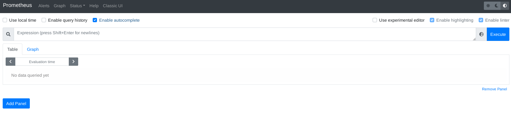
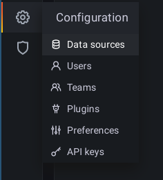
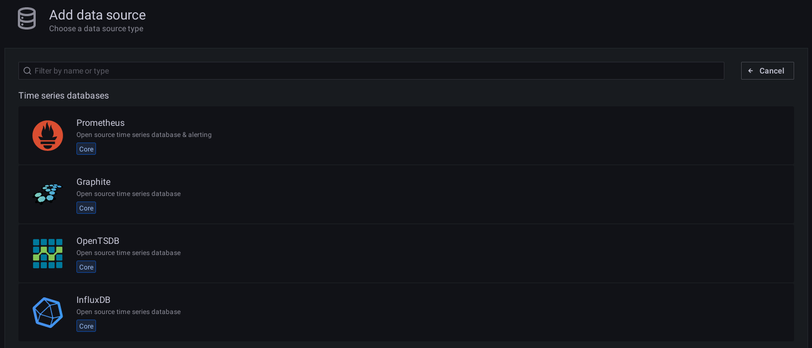
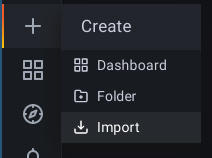

# Introduction
In this tutorial you will learn how to install prometheus and grafana to gather data from your servers with node exporter.

# Requirements
- 2 debian based (e.g. ubuntu works too) servers with root / sudo access

# Step 1 - Install node-exporter on both servers

The node-exporter collects the system data and provides it in a format that prometheus can read. There are two ways to install the node-exporter:

1. Through the package manager:

This will much likely not install the latest available version of the node-exporter but should be good enough for most setups.

```
$ sudo apt-get update
$ sudo apt-get install -y prometheus-node-exporter
```

2. Through binary download (newest version):

This way you can install any version you want, including the latest version with the latest features and bugfixes.  
All available versions can be found on the release page: https://github.com/prometheus/node_exporter/releases

```console
$ wget https://github.com/prometheus/node_exporter/releases/download/v1.2.2/node_exporter-1.2.2.linux-amd64.tar.gz
$ tar xf node_exporter-1.2.2.linux-amd64.tar.gz
$ cd node_exporter-1.2.2.linux-amd64
$ ./node_exporter &
```

# Step 2 - Setup Prometheus on the "metrics" server

Prometheus will request the metrics from the node-exporter and stores the data in its database.

```
$ sudo apt-get install -y prometheus
```

You can now check if prometheus was successfully installed by opening the server IP followed by port 9090 in your browser.




Afterwards the node exporter targets must be configured in the prometheus server. The configuration is stored in /etc/prometheus/prometheus.yml.
Add the following "job_name" to your "scrape_configs" and replace "ip-of-other-server" with the IP address of your second server:

```yml
scrape_configs:
  - job_name: 'node_exporter'
    metrics_path: "/metrics"
    static_configs:
      - targets:
        - 'localhost:9100'
        - 'ip-of-other-server:9100'
```

To apply the configuration changes the prometheus service needs to be restarted.

```
$ sudo systemctl restart prometheus
```

Prometheus now automatically scrapes node-exporter endpoints on both servers.

# Step 3 - Install Grafana on the "metrics" server

Grafana can be used to visualize the metrics collected and stored by the prometheus service.

At first you need to add the external grafana apt repository:

```
$ sudo apt-get install -y apt-transport-https
$ sudo apt-get install -y software-properties-common wget
$ wget -q -O - https://packages.grafana.com/gpg.key | sudo apt-key add -
$ echo "deb https://packages.grafana.com/oss/deb stable main" | sudo tee -a /etc/apt/sources.list.d/grafana.list
```

Then you can install grafana itself:

```
$ sudo apt-get update
$ sudo apt-get install -y grafana
```

# Step 4 - Configure Prometheus as datasource in Grafana

Grafana can easily be configured through a web interface. It is reachable on port 3000 with the following default credentials:

Username: admin  
Password: admin

After the first login you are forced to change the password. Make sure to pick a secure one.

To configure prometheus as a metrics datasource click on the settings on the left and select "Data sources".



Then select "Prometheus" as "Time series databases"



Now you can enter "http://localhost:9090" as URL and save the datasource.

# Step 5 - Add a dashboard in Grafana

The community publishes a lot of dashboards on grafana.com: https://grafana.com/grafana/dashboards/?search=node+exporter&dataSource=prometheus

Pick for example the [Node Exporter Full](https://grafana.com/grafana/dashboards/1860) dashboard and copy the ID on the left.
To import the dasboard switch back to your grafana installation and select "Import" after hovering on the "+" on the left.



Paste the ID you just copied, click the "Load" button and then finally import your dashboard.

The dashboards get successfully imported and display the metrics stored in your prometheus database.

# Conclusion
After following this tutorial you have now installed the Prometheus Node Exporter on two servers which provide metrics that are collected by the Prometheus installation.
Grafana visualizes the collected data from your two servers. If you need more data from different applications you can expanded this setup with new exporters and dashboards in the future.

# License
MIT

# Contributor's Certificate of Origin
Contributor's Certificate of Origin By making a contribution to this project, I certify that:

 1) The contribution was created in whole or in part by me and I have the right to submit it under the license indicated in the file; or

 2) The contribution is based upon previous work that, to the best of my knowledge, is covered under an appropriate license and I have the right under that license to submit that work with modifications, whether created in whole or in part by me, under the same license (unless I am permitted to submit under a different license), as indicated in the file; or

 3) The contribution was provided directly to me by some other person who certified (a), (b) or (c) and I have not modified it.

 4) I understand and agree that this project and the contribution are public and that a record of the contribution (including all personal information I submit with it, including my sign-off) is maintained indefinitely and may be redistributed consistent with this project or the license(s) involved.

Signed-off-by: Peter Matthei (bgtuuqme@anonaddy.me)
