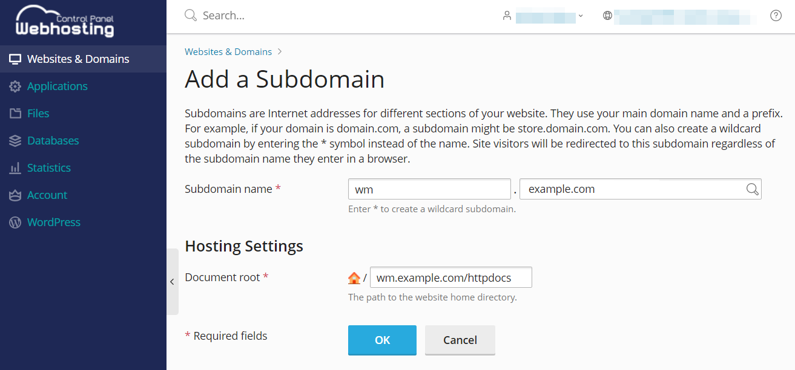
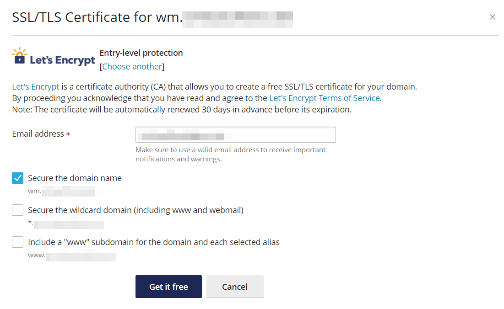
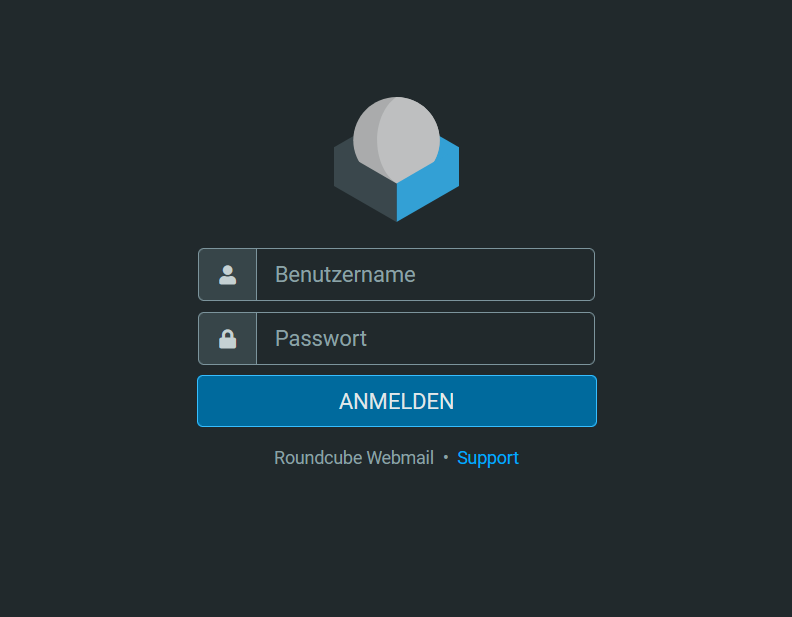

# Introduction
This tutorial describes how to set up [Roundcube](https://roundcube.net/) as a webmail frontend for your emails using an SQLite file backend with the netcup IMAP and SMTP server.

netcup is already providing at least one Roundcube webmail instance [https://webmail01.netcup.net/] for each domain. If the domain is example.com, the DNS A record would be `webmail.example.com`.

However, in case you want to use a newer Roundcube version or customize your installation, it might be better to install the software directly on your own webhosting instance, which also allows you to set up a Let's Encrypt certificate. Another benefit is the use of the dark mode, which is only available since Roundcube version 1.5.0.

The reading time of this tutorial is about five minutes. The implementation will take approximately 20 minutes.

The most important requirements for following this tutorial are a basic understanding of SSH and the Unix command line and a netcup webhosting package.

The tutorial uses the example domain `example.com`. This hostname needs to be replaced with the name of your own domain when you perform the steps described in this tutorial.

# Requirements
The installation can be performed on any VPS but this tutorial focuses on a default webhosting setup:

* Webhosting 1000 or better
* a (sub) domain

# Step 1 - Add the subdomain and get the document root
Adding a subdomain is easy using the WCP [Add Subdomain] button in the webhosting interface "Websites & Domains".



We use the following subdomain: wm.example.com

At first we collect some information about the webhosting that we will need later during the configuration.

Navigate to the WCP "PHP Settings" of the new subdomain and note down the current value of the {DOCROOT} e.g.

`/var/www/vhosts/hosting123456.a1b2c.netcup.net/wm.example.com/httpdocs`

In the "SSL/TLS Certificates" settings of the new subdomain, you can add a recommended SSL certificate with Let's Encrypt.




# Step 2 - Download Roundcube and mime.types via SSH

Download the Roundcube release from the Roundcube download page: [https://roundcube.net/download/]

We use the stable release '1.5.2' complete package for this tutorial and we connect to the webhosting instance using SSH.

Connect to your webhosting instance via SSH using the details in the "Web Hosting Access" section of the subdomain.

Navigate to the document root:
`cd wm.example.com/httpdocs/`

Delete the favicon.ico and index.html which were created during Step 1:
`rm favicon.ico index.html`

Download the complete package in tar.gz format:
`wget https://github.com/roundcube/roundcubemail/releases/download/1.5.2/roundcubemail-1.5.2-complete.tar.gz`

Extract the tar.gz package stripping the subdirectory 'roundcubemail-1.5.2':
`tar xzvfs roundcubemail-1.5.2-complete.tar.gz --strip-components=1`

Download a mime.types definition from the Apache project:
`wget http://svn.apache.org/repos/asf/httpd/httpd/trunk/docs/conf/mime.types`


# Step 3 - Configure the Roundcube installation with a few fixed settings
Typically a configuration is created based on the provided sample file and extended with some additional changes.

If you feel unsure about editing the files with an editor, go directly to the next Step or modify the files locally and transfer them to the webhosting instance, e.g. via FTP.

Copy the sample files configuration:
`cp config/config.inc.php.sample config/config.inc.php`

Configure the installation by editing the config.inc.php file using your favorite editor. We will be using nano.
`nano config/config.inc.php`

You may replace any settings depending on your needs, but at minimum you will have to modify the following ones:
- db_dsnw
- default_host
- des_key
- language
- mime_types
- smtp_conn_options
- smtp_server


The following is a full sample configuration that could be used after replacing the document roots in db_dsnw, mime_types and filling a new 24 character long des_key: (the command `openssl rand -hex 12` can be used on a machine with openssl to create a unique des_key directly)
```
<?php

/* Local configuration for Roundcube Webmail using netcup SMTP and IMAP server*/

// Database connection string (DSN) for read+write operations
// Currently supported db_providers: mysql, pgsql, sqlite, mssql, sqlsrv, oracle
// NOTE: for SQLite use absolute path (Linux): 'sqlite:////full/path/to/sqlite.db?mode=0646'
$config['db_dsnw'] = 'sqlite:////var/www/vhosts/hosting123456.a1b2c.netcup.net/wm.example.com/httpdocs/config/sqllite.db?mode=0646';

// The netcup IMAP host chosen to perform the log-in.
$config['default_host'] = 'mail.example.com';

// Setup the default IMAP Port for SSL
$config['default_port'] = 993;

// workaround for netcup IMAP server requiring SSL
// but the certificate does not match the server name mail.example.com
$config['imap_conn_options'] = [
  'ssl' =>
  [
    'verify_peer' => false,
    'verify_peer_name' => false,
    'allow_self_signed' => false,
    'verify_depth' => 3,
    'cafile' => '/etc/openssl/certs/ca.crt',
  ],
];

// netcup SMTP server host (for sending mails) using STARTTLS
$config['smtp_server'] = 'tls://mail.example.com';

// workaround for netcup SMTP server requiring STARTTLS
// but the certificate not match the server name mail.example.com
$config['smtp_conn_options'] = [
  'ssl' =>
  [
     'verify_peer' => false,
     'verify_peer_name' => false,
     'allow_self_signed' => false,
     'verify_depth' => 3,
     'cafile' => '/etc/openssl/certs/ca.crt',
  ],
];

// provide a URL where a user can get support for this Roundcube installation
// (not linking to the Roundcube site itself and instead giving the webmaster address)
$config['support_url'] = 'mailto:webmaster@example.com';

// This key is used to encrypt the users imap password which is stored
// in the session record. For the default cipher method it must be
// exactly 24 characters long.
// YOUR KEY MUST BE DIFFERENT THAN THE SAMPLE VALUE FOR SECURITY REASONS
$config['des_key'] = 'rcmail-!24ByteDESkey*Str';

// Specifying the username_domain allows to login with username
// without having to specify the domain
$config['username_domain'] = 'example.com';

// the mime type definition
$config['mime_types'] = '/var/www/vhosts/hosting123456.a1b2c.netcup.net/wm.example.com/httpdocs/mime.types';

// List of active plugins in plugins/ directory (copied from netcup instance adding markasjunk and zipdownload)
$config['plugins'] = ['filesystem_attachments', 'jqueryui', 'managesieve', 'markasjunk', 'zipdownload'];

// default language is set to German (Germany)
$config['language'] = 'de_DE';

// enable the spellchecker
$config['enable_spellcheck'] = true;

// in case you want to use the installer again uncomment this
$config['enable_installer'] = true;

```


To correctly use the managesieve plugin, we need to create one more configuration.

Copy the ManageSieve plugin sample configuration file:
`cp plugins/managesieve/config.inc.php.dist plugins/managesieve/config.inc.php`

Configure the ManageSieve plugin by editing the config.inc.php file using your favorite editor. We will be using nano.
`nano plugins/managesieve/config.inc.php`

```
// managesieve server port. When empty the port will be determined automatically
// using getservbyname() function, with 4190 as a fallback.
$config['managesieve_port'] = '';

// managesieve server address, default is localhost but we use the IMAP hostname, which is variable %h
// %h - user's IMAP hostname
$config['managesieve_host'] = '%h';

// use TLS for managesieve server connection, because we did not use the tls:// prefix in managesieve_host
$config['managesieve_usetls'] = true;

```


# Step 4 - Run setup in browser
After the configuration the web installer can be accessed to make additional settings and verify that the installation works.
Here you can also ensure that the configuration is properly reformatted and that the random keys are properly set, e.g. for des_key.

Just open the installer URL in a browser of your choice by going to: https://wm.example.com/installer/index.php

## Check environment

The first step, "Check environment" should not need any intervention as everything is already set up in the netcup webhosting environment.

Click [NEXT] and continue to "Create config".

## Create config

If you want, you can configure the `support_url` with an email address like `webmaster@example.com`.

You can enable a spell checker from Google by setting `enable_spellcheck` to `Google`.

Enter the Database settings beginning with `Database type` `SQLite` and remove all other entries except for the Database name where we add the absolute URL SQLite database file in:

`/var/www/vhosts/hosting123456.a1b2c.netcup.net/wm.example.com/httpdocs/config/sqllite.db`

Set the `default_host` to the netcup IMAP Host of your webhosting to `ssl://mail.example.com`.

If you want, the `username_domain` can be specified to be added to the username automatically.

Next, set the `smtp_server` to `tls://mail.example.com`.

Configure the language to your language, in my case German, by setting `language` to `de_DE` or your language.

This completes the configuration.

Click [NEXT] and continue to "Test config" by clicking on [CONTINUE].

## Test config

Here the [Send test mail] and [Check login] can be used to test the IMAP login and SMTP mail sending.

# Step 5 - Finish and secure the installation
Disable the installer by commenting or deleting the following line from `config/config.inc.php`:
`$config['enable_installer'] = true;`

Remove the installer folder from the webspace by executing the following command:
`rm -rf installer`

If you do not want to keep the release tar.gz, delete it by running:
`rm roundcubemail-1.5.2-complete.tar.gz`

If you have put the SQLite database file in a different folder that is not protected by the `.htaccess` file of the Roundcube installation, make sure to add it to the `.htaccess` file to protect it from being downloaded.


# Step 6 - Login and test
To access the webmail instance, go to `https://wm.example.com` and log in. If this does not work, please look through the previous steps as it is likely that there has been a mistake.


# Step 7 - Enhancements and updates
Other plugins can be activated by adding them to the `$config['plugins']` item in the `config/config.inc.php` file.

If you want to use your own Roundcube installation for different mail hosts, just remove the config option for `username_domain` and change the options for `default_host` and `smtp_server` like this:

```
$config['default_host'] = [
    'ssl://mail.example.com' => 'netcup (example.com)',
    'ssl://imap.gmail.com' => 'Gmail',
    'ssl://imap.web.de' => 'WEB.DE',
    'ssl://imap.gmx.net' => 'GMX',
    'ssl://mx.freenet.de' => 'freenet.de',
    'ssl://outlook.office365.com' => 'Outlook.com',
    'ssl://imap.mail.me.com' => 'iCloud',
    'ssl://secureimap.t-online.de' => 't-online.de',
    'ssl://imap.mail.yahoo.com' => 'Yahoo!',
    'ssl://imap.mail.de' => 'mail.de',
];

$config['smtp_server'] = [
    'mail.example.com' => 'tls://mail.example.com',
    'imap.gmail.com' => 'tls://smtp.gmail.com',
    'imap.web.de' => 'tls://smtp.web.de',
    'imap.gmx.net' => 'tls://mail.gmx.net',
    'mx.freenet.de' => 'tls://mx.freenet.de',
    'outlook.office365.com' => 'tls://smtp-mail.outlook.com',
    'imap.mail.me.com' => 'tls://smtp.mail.me.com',
    'secureimap.t-online.de' => 'tls://securesmtp.t-online.de',
    'imap.mail.yahoo.com' => 'tls://smtp.mail.yahoo.com',
    'imap.mail.de' => 'tls://smtp.mail.de',
];
```


# Conclusion
The webmail instance can now be used. It is recommended to perform some tests before productive use.

The default theme using dark mode looks like this: 




# License

Permission is hereby granted, free of charge, to any person obtaining a copy
of this software and associated documentation files (the "Software"), to deal
in the Software without restriction, including without limitation the rights
to use, copy, modify, merge, publish, distribute, sublicence, and/or sell
copies of the Software, and to permit persons to whom the Software is
furnished to do so, subject to the following conditions:

The above copyright notice and this permission notice shall be included in all
copies or substantial portions of the Software.

THE SOFTWARE IS PROVIDED "AS IS", WITHOUT WARRANTY OF ANY KIND, EXPRESS OR
IMPLIED, INCLUDING BUT NOT LIMITED TO THE WARRANTIES OF MERCHANTABILITY,
FITNESS FOR A PARTICULAR PURPOSE AND NONINFRINGEMENT. IN NO EVENT SHALL THE
AUTHORS OR COPYRIGHT HOLDERS BE LIABLE FOR ANY CLAIM, DAMAGES OR OTHER
LIABILITY, WHETHER IN AN ACTION OF CONTRACT, TORT OR OTHERWISE, ARISING FROM,
OUT OF OR IN CONNECTION WITH THE SOFTWARE OR THE USE OR OTHER DEALINGS IN THE
SOFTWARE.

# Contributor's Certificate of Origin
By making a contribution to this project, I certify that:

 1) The contribution was created in whole or in part by me and I have the right to submit it under the license indicated in the file; or

 2) The contribution is based upon previous work that, to the best of my knowledge, is covered under an appropriate license and I have the right under that license to submit that work with modifications, whether created in whole or in part by me, under the same license (unless I am permitted to submit under a different license), as indicated in the file; or

 3) The contribution was provided directly to me by some other person who certified (a), (b) or (c) and I have not modified it.

 4) I understand and agree that this project and the contribution are public and that a record of the contribution (including all personal information I submit with it, including my sign-off) is maintained indefinitely and may be redistributed consistent with this project or the license(s) involved.
