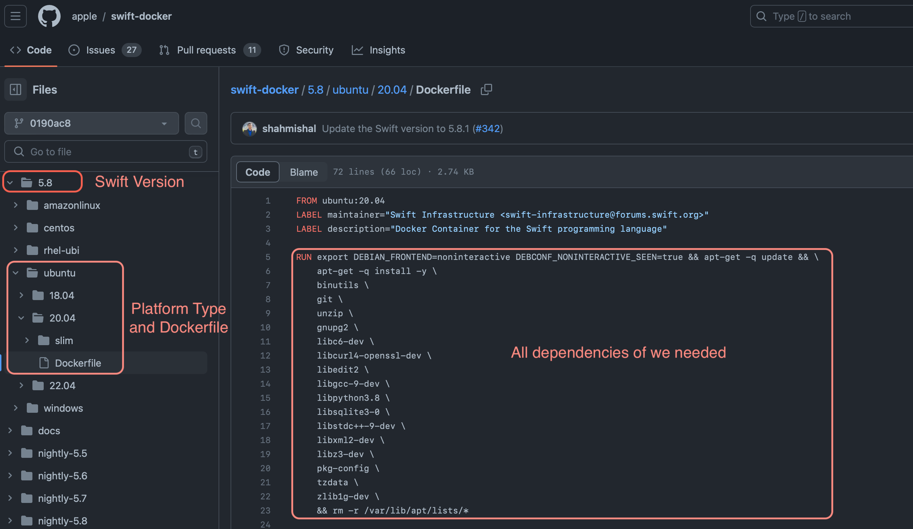

# Introduction

This tutorial explains how to install Swift 5.8 or later on a netcup Server running Ubuntu 20.04.


# Requirements

The minimum requirements for deploying Swift and compiling a small project are as follows:

* 2GM RAM +
* 4 Core CPU +
* An installation of Ubuntu 20.04

Hard disk capacity is not a major factor for this tutorial, all netcup Servers can accommodate this.


# Step 1 - Ordering the netcup Server

At the time of writing (Aug 2023), the recommended product for this tutorial is [RS 2000 G9.5](https://www.netcup.com/de/server/root-server/rs-2000-g9.5-a1-12m). 

Existing customers can add the product easily and quickly.

# Step 2 - Defining Swift-related environments

As part of this tutorial, we are using Swift 5.8. If you are using a newer version or another Linux distribution such as Debian 11, please adjust the following commands.

Execute the following commands in order:

```
export SWIFT_VERSION=5.8
export SWIFT_VERSION_NAME=swift-$SWIFT_VERSION
export UBUNTU_VERSION=ubuntu20.04
export UBUNTU_VERSION_SHORT=ubuntu2004
export SWIFT_DOWNLOAD_URL="https://download.swift.org/${SWIFT_VERSION_NAME}-release/${UBUNTU_VERSION_SHORT}/${SWIFT_VERSION_NAME}-RELEASE/${SWIFT_VERSION_NAME}-RELEASE-${UBUNTU_VERSION}.tar.gz"
```

Once that's done, let's make sure it's taken effect:

`echo $SWIFT_DOWNLOAD_URL`

If the following or something similar is output, the environment variable configuration has taken effect:

`https://download.swift.org/swift-5.8-release/ubuntu2004/swift-5.8-RELEASE/swift-5.8-RELEASE-ubuntu20.04.tar.gz` 

# Step 3 - Installation of dependencies

We are using the Swift 5.8 dependencies. So if you're not using the same version as I am, read below (Step 3.1) for how to find the dependencies. Once you have found the right dependencies for your version, install them in this manner:

```
/bin/sh -c export DEBIAN_FRONTEND=noninteractive DEBCONF_NONINTERACTIVE_SEEN=true && apt-get -q update && \
    apt-get -q install -y \
    binutils \
    git \
    unzip \
    gnupg2 \
    libc6-dev \
    libcurl4-openssl-dev \
    libedit2 \
    libgcc-9-dev \
    libpython3.8 \
    libsqlite3-0 \
    libstdc++-9-dev \
    libxml2-dev \
    libz3-dev \
    pkg-config \
    tzdata \
    zlib1g-dev \
    && rm -r /var/lib/apt/lists/*
```

### Step 3.1 - How to find dependencies

Swift dependencies are provided as part of a dockerfiler here: [Swift Dockerfile Content](https://github.com/apple/swift-docker/blob/0190ac8d812bfcfab0ee39d600116ab5e3243f48/5.8/ubuntu/20.04/Dockerfile)

We will extract the dependencies from said dockerfile:



Since this is what Docker needs, we need to make a small modification:

Replace `RUN export` with `/bin/sh -c export` and keep the rest.

Now you know where and how to find the necessary dependencies if your version differs from 5.8.

# Step 4 - Install Swift

Once the dependencies have been installed, we can begin with the Swift installation by executing the following command:

```
wget -O swift.tar.gz $SWIFT_DOWNLOAD_URL \
    && tar -xzf swift.tar.gz --directory / --strip-components=1 \
    && chmod -R o+r /usr/lib/swift \
    && rm swift.tar.gz
```

This downloads the Swift archive from $SWIFT_DOWNLOAD_URL and extracts it to the current directory.

Then, the command adds executable permissions to the Swift executable file, after which the downloaded tarball, `swift.tar.gz`, is removed to free up disk space.

Let's confirm that the installation was successful by running:

`swift --version`

If your output is similar to the following, we have successfully installed Swift:

```
Swift version 5.8 (swift-5.8-RELEASE)
Target: x86_64-unknown-linux-gnu
```

# Step 5 - Quick installation

You can also install Swift in one simple step by copying the following and saving it as an sh file.

What needs to be adjusted depending on your situation?

* `SWIFT_VERSION` must be the version you want to install.

* `/bin/sh -c export` changes to the corresponding version of the dependency library, see `Step 3.1 - How to find dependencies`.

Now, save the following as `install-swift.sh` with the needed adjustments, make the script executable by running `chmod +x install-swift.sh` and run `bash install-swift.sh` to install Swift in a single step.

```bash
#!/bin/bash

set -e

SWIFT_VERSION=5.8

if which swift > /dev/null; then
    if swift --version | grep -q "$SWIFT_VERSION"; then
        echo "Swift version $SWIFT_VERSION is installed."
        exit 0
    else
        read -p "Swift is installed, but it is not $SWIFT_VERSION, should upgrade? [y/n]" upgrade
        
        case $upgrade in
            "y")
                echo "upgrade to $SWIFT_VERSION"
                ;;
            "n")
                echo "keep version"
                exit 0
                ;;
            *)
                echo "keep version"
                exit 0
                ;;
        esac
    fi
fi

cd ~

SWIFT_VERSION_NAME=swift-$SWIFT_VERSION
UBUNTU_VERSION=ubuntu20.04
UBUNTU_VERSION_SHORT=ubuntu2004
SWIFT_DOWNLOAD_URL="https://download.swift.org/${SWIFT_VERSION_NAME}-release/${UBUNTU_VERSION_SHORT}/${SWIFT_VERSION_NAME}-RELEASE/${SWIFT_VERSION_NAME}-RELEASE-${UBUNTU_VERSION}.tar.gz"

/bin/sh -c export DEBIAN_FRONTEND=noninteractive DEBCONF_NONINTERACTIVE_SEEN=true && apt-get -q update && \
    apt-get -q install -y \
    binutils \
    git \
    unzip \
    gnupg2 \
    libc6-dev \
    libcurl4-openssl-dev \
    libedit2 \
    libgcc-9-dev \
    libpython3.8 \
    libsqlite3-0 \
    libstdc++-9-dev \
    libxml2-dev \
    libz3-dev \
    pkg-config \
    tzdata \
    zlib1g-dev \
    && rm -r /var/lib/apt/lists/*

wget -O swift.tar.gz $SWIFT_DOWNLOAD_URL \
    && tar -xzf swift.tar.gz --directory / --strip-components=1 \
    && chmod -R o+r /usr/lib/swift \
    && rm swift.tar.gz

swift --version
```

# License

[MIT](https://github.com/netcup-community/community-tutorials/blob/main/LICENSE)

Copyright (c) 2021 netcup

Permission is hereby granted, free of charge, to any person obtaining a copy of this software and associated documentation files (the "Software"), to deal in the Software without restriction, including without limitation the rights to use, copy, modify, merge, publish, distribute, sublicense, and/or sell copies of the Software, and to permit persons to whom the Software is furnished to do so, subject to the following conditions:

The above copyright notice and this permission notice shall be included in all copies or substantial portions of the Software.

THE SOFTWARE IS PROVIDED "AS IS", WITHOUT WARRANTY OF ANY KIND, EXPRESS OR IMPLIED, INCLUDING BUT NOT LIMITED TO THE WARRANTIES OF MERCHANTABILITY, FITNESS FOR A PARTICULAR PURPOSE AND NONINFRINGEMENT. IN NO EVENT SHALL THE AUTHORS OR COPYRIGHT HOLDERS BE LIABLE FOR ANY CLAIM, DAMAGES OR OTHER LIABILITY, WHETHER IN AN ACTION OF CONTRACT, TORT OR OTHERWISE, ARISING FROM, OUT OF OR IN CONNECTION WITH THE SOFTWARE OR THE USE OR OTHER DEALINGS IN THE SOFTWARE.

# Contributor's Certificate of Origin
By making a contribution to this project, I certify that:

 1) The contribution was created in whole or in part by me and I have the right to submit it under the license indicated in the file; or

 2) The contribution is based upon previous work that, to the best of my knowledge, is covered under an appropriate license and I have the right under that license to submit that work with modifications, whether created in whole or in part by me, under the same license (unless I am permitted to submit under a different license), as indicated in the file; or

 3) The contribution was provided directly to me by some other person who certified (a), (b) or (c) and I have not modified it.

 4) I understand and agree that this project and the contribution are public and that a record of the contribution (including all personal information I submit with it, including my sign-off) is maintained indefinitely and may be redistributed consistent with this project or the license(s) involved.
