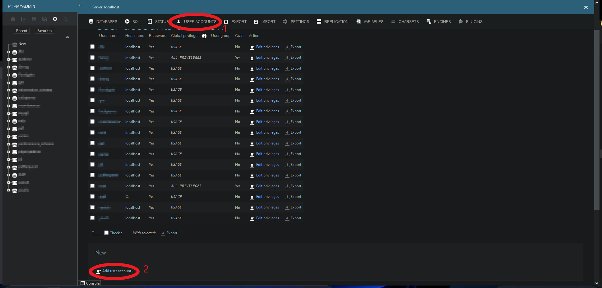

# Introduction

In this tutorial you will learn how to install an Apache web server and MariaDB (MySQL) on Debian servers. In addition, we'll explain how to install a number of programs and web services on the servers, such as:

- PHP
- Certbot
- phpMyAdmin

I am doing this on a Debian 11 server (RS 2000) but the installations should also work on other Debian versions.<br>
This tutorial contains content of these documents: https://github.com/SanCraftDev/Debian-Setup/blob/main/README.md and https://github.com/louislam/uptime-kuma.

# Requirements

You need a Debian server with an internet connection. The server should be reachable from the internet via a static IP on port 80 and 443.<br>
You also need root permissions on your server.

# Step 1 - Apache2

## Step 1.1 - Installing snapd and Certbot

First we need to install snapd and Certbot to obtain SSL certificates:

```sh
apt update && apt upgrade -y && apt autoremove -y
apt install curl sudo wget apache2-utils nano git snapd cron zip unzip tar screen openssl -y
snap install core; snap refresh core
sudo snap install --classic certbot
sudo ln -s /snap/bin/certbot /usr/bin/certbot
{ crontab -l 2>/dev/null; echo "$(( $RANDOM % 60 )) $(( $RANDOM % 3 + 3 )) * * * sudo certbot renew --dry-run" ; } | crontab -
```

## Step 1.2 - Installing Apache2

Now we are going to install Apache2 and configure it:

```sh
apt install apache2 libapache2-mod-php brotli -y
a2enmod rewrite headers env dir mime proxy proxy_http proxy_wstunnel headers ssl http2 expires filter brotli
a2disconf other-vhosts-access-log
{ crontab -l 2>/dev/null; echo "* * * * * chown -R www-data:www-data /var/www" ; } | crontab -
cd /etc/apache2
nano apache2.conf
```

Press <kbd>CTRL + W</kbd> to search for `<Directory /var/www/>`.<br>
Go down a few lines to `AllowOverride None` and replace it with `AllowOverride All`. <br>

```diff
- AllowOverride None
+ AllowOverride All
```

Now add somewhere inside the file in a new line:
```
Protocols h2 h2c http/1.1
SetOutputFilter BROTLI_COMPRESS
SetEnvIfNoCase Request_URI \.(?:gif|jpe?g|png)$ no-brotli

<IfModule mod_headers.c>
    # Serve brotli compressed CSS files if they exist
    # and the client accepts brotli.
    RewriteCond "%{HTTP:Accept-encoding}" "br"
    RewriteCond "%{REQUEST_FILENAME}\.br" "-s"
    RewriteRule "^(.*)\.css"              "$1\.css\.br" [QSA]

    # Serve brotli compressed JS files if they exist
    # and the client accepts brotli.
    RewriteCond "%{HTTP:Accept-encoding}" "br"
    RewriteCond "%{REQUEST_FILENAME}\.br" "-s"
    RewriteRule "^(.*)\.js"               "$1\.js\.br" [QSA]
    
    Header set Vary *

    # Serve correct content types, and prevent double compression.
    RewriteRule "\.css\.br$" "-" [T=text/css,E=no-brotli:1]
    RewriteRule "\.js\.br$"  "-" [T=text/javascript,E=no-brotli:1]


    <FilesMatch "(\.js\.br|\.css\.br)$">
      # Serve correct encoding type.
      Header append Content-Encoding br

      # Force proxies to cache brotli &
      # non-brotli css/js files separately.
      Header append Vary Accept-Encoding
    </FilesMatch>
</IfModule>
```

Save your edit by pressing <kbd>CTRL + X</kbd>, then press <kbd>y</kbd>.<br>

Now we generate a self signed certificate for not defined apache2 hosts
```sh
openssl req  -nodes -new -x509 -subj '/CN=localhost' -sha256 -subj '/CN=' -keyout /etc/ssl/privkey.pem -out /etc/ssl/fullchain.pem -days 365000
```

Now we redirect every HTTP request to HTTPS and delete the Apache2 default configs because we don't need them:

```sh
rm sites-enabled/000-default.conf
rm sites-enabled/000-default-le-ssl.conf
rm sites-enabled/default-ssl.conf
rm -r /var/www/html                       # run this only if you know that you do not have anything saved inside this folder
nano sites-enabled/0-http.conf
```

Paste these lines into the file:

```
<VirtualHost *:80>
    RewriteEngine on
    RewriteCond %{HTTPS} off
    RewriteRule ^/?(.*) https://%{HTTP_HOST}/$1 [R=301,L]

    ErrorLog ${APACHE_LOG_DIR}/http-error.log
</VirtualHost>

<VirtualHost *:443>
    ErrorLog /var/log/apache2/http-error.log
    SSLCertificateFile /etc/ssl/fullchain.pem
    SSLCertificateKeyFile /etc/ssl/privkey.pem
</VirtualHost>
```

Save your changes by first pressing <kbd>CTRL + X</kbd>, then <kbd>y</kbd> and by finally hitting <kbd>ENTER</kbd>.

## Step 1.3 Installing PHP

```sh
wget -O /etc/apt/trusted.gpg.d/php.gpg https://packages.sury.org/php/apt.gpg
sh -c 'echo "deb https://packages.sury.org/php/ $(lsb_release -sc) main" > /etc/apt/sources.list.d/php.list'
apt update
apt install zip unzip redis-server libapache2-mod-php8.0 libapache2-mod-fcgid libmagickcore-6.q16-6-extra php-dompdf php-pear php8.0 php8.0-{cli,gd,mysql,pdo,mbstring,tokenizer,bcmath,xml,fpm,curl,zip,common,intl,redis,opcache,readline,xsl,bz2,imagick,bcmath,gmp,sqlite3,apcu} -y
nano /etc/php/8.0/apache2/php.ini
```

Now we have to configure PHP:

- Add `apc.enable_cli = 1` to the first empty line. This is sometimes required by Nextcloud as it enables the use of APCu from the CLI. <br>
- Press <kbd>CTRL + W</kbd> and <kbd>ENTER</kbd>: `memory_limit = 128M`.
  - Replace this line with `memory_limit = 1024M` or use more/less RAM (M = megabytes of RAM).<br>
- Press <kbd>CTRL + W</kbd> and <kbd>ENTER</kbd>: `post_max_size = 8M`.
  - Replace this line with `post_max_size = 10G`. This defines the maximum file size for uploading. You can set this value lower if you don't plan to upload 10-gigabyte files (for example, 100M for maximum 100 megabtye files). <br>
- Press <kbd>CTRL + W</kbd> and <kbd>ENTER</kbd>: `upload_max_filesize = 2M`.
  - Replace this line with `upload_max_filesize = 10G`. This defines the maximum file size for uploading. You can set this value lower if you don't plan to upload 10-gigabyte files (for example, 100M for a maximum of 100-megabtye files). <br>
- Press <kbd>CTRL + W</kbd> and <kbd>ENTER</kbd>: `;date.timezone =`.
  - Replace this line with `date.timezone = Europe/Berlin` (or change it to your time zone). <br>

```sh
a2enmod proxy_fcgi setenvif
a2enconf php8.0-fpm
cp /etc/php/8.0/apache2/php.ini /etc/php/8.0/cli/php.ini
cp /etc/php/8.0/apache2/php.ini /etc/php/8.0/fpm/php.ini
a2dismod php*
a2dismod mpm_prefork
a2enmod mpm_event
service apache2 restart
service php8.0-fpm restart
curl -sS https://getcomposer.org/installer | sudo php -- --install-dir=/usr/local/bin --filename=composer
{ crontab -l 2>/dev/null; echo "$(( $RANDOM % 60 )) $(( $RANDOM % 3 + 3 )) * * * curl -sS https://getcomposer.org/installer | sudo php -- --install-dir=/usr/local/bin --filename=composer" ; } | crontab -
```

## Step 1.4 Installing MariaDB

```sh
apt install mariadb-server mariadb-client -y
```

## Step 1.4.1 Securing MariaDB

```sh
mysql_secure_installation
```

Press <kbd>Enter</kbd> <br>
Press <kbd>y</kbd> <br>
Press <kbd>y</kbd> <br>
Set a secure password <br>
Press <kbd>y</kbd> <br>
Press <kbd>y</kbd> <br>
Press <kbd>y</kbd> <br>
Press <kbd>y</kbd> <br>

## Step 1.4.2 Creating a user with root permissions on MariaDB

```sh
mysql -u root -p
```

- Enter the password from Step 1.4.1.<br>
- Run the following command after replacing "USERNAME" with a username (do not use `root` as username) and "PASSWORD" with a secure password:

```sh
CREATE USER 'USERNAME'@'localhost' IDENTIFIED BY 'PASSWORD';
GRANT ALL PRIVILEGES ON *.* TO 'Username'@'localhost' WITH GRANT OPTION;
FLUSH PRIVILEGES;
exit;
```

## Step 1.5 Installing a configuration for the web server

First make sure your domain or subdomain is linked to your server in its **DNS settings**. <br>

In the following commands, replace every `DOMAIN` with your domain or subdomain:<br/>

- Generate an SSL certificate with `certbot certonly --apache -d DOMAIN`.<br/>
- Run `nano /etc/apache2/sites-enabled/DOMAIN.conf`. <br/>
- Paste these lines into the file:

```
<VirtualHost *:443>
    ServerName DOMAIN

    DocumentRoot /var/www/FOLDER

    ErrorLog ${APACHE_LOG_DIR}/DOMAIN-error.log

    SSLCertificateFile /etc/letsencrypt/live/DOMAIN/fullchain.pem
    SSLCertificateKeyFile /etc/letsencrypt/live/DOMAIN/privkey.pem
</VirtualHost>
```

- Replace every `DOMAIN` with your domain and set a folder path under "DocumentRoot". All files in this folder will be available on your DOMAIN in the web.<br/>
- Save your changes by pressing <kbd>CTRL + X</kbd>, then <kbd>y</kbd> and finally by hitting <kbd>ENTER</kbd>. <br/>
- Now create this folder with `mkdir /var/www/FOLDER`. <br>
- Restart Apache2 with `service apache2 restart`. <br>

**Note:**
If you are doing this directly on a domain and NOT on a subdomain or you want to make the site available on more sites, I recommend adding a Server Alias to the Configuration like you see below. (If you want to make this site aviable on every Subdomain which looks the following `abc` you can also add as Server Alias `abc.*`.)
For this you need to regenerate the SSL certificate with `certbot certonly --apache -d DOMAIN,www.DOMAIN,web.DOMAIN,sub.DOMAIN`.<br/>

```diff
<VirtualHost *:443>
    ServerName DOMAIN
+   ServerAlias www.DOMAIN web.DOMAIN

    DocumentRoot /var/www/FOLDER

    ErrorLog ${APACHE_LOG_DIR}/DOMAIN-error.log

    SSLCertificateFile /etc/letsencrypt/live/DOMAIN/fullchain.pem
    SSLCertificateKeyFile /etc/letsencrypt/live/DOMAIN/privkey.pem
</VirtualHost>
```

## Step 1.6 - Installing PHPMyAdmin (optional)
Download and Configure PHPMyAdmin
```sh
curl -L https://www.phpmyadmin.net/downloads/phpMyAdmin-latest-all-languages.zip -o phpmyadmin.zip
unzip phpmyadmin.zip
rm phpmyadmin.zip
mv phpMyAdmin-*-all-languages pma
mv pma /var/www
nano /var/www/pma/config.inc.php
```

Add the following lines and change `x1rfsRmlidz69R3vKvxpDVl6lbOReX0Emc3sVD0ZkpXh4ek12zMZCWJJi722Se36M0fiRdRDPk05ePcO4W0l8bP8vJMcMhoLVSs` to make it unique. This will make the cookies used by phpMyAdmin more secure.

```
<?php
declare(strict_types=1);
$cfg['blowfish_secret'] = 'x1rfsRmlidz69R3vKvxpDVl6lbOReX0Emc3sVD0ZkpXh4ek12zMZCWJJi722Se36M0fiRdRDPk05ePcO4W0l8bP8vJMcMhoLVSs';
$i = 0;
$i++;
$cfg['Servers'][$i]['auth_type'] = 'cookie';
$cfg['Servers'][$i]['host'] = 'localhost';
$cfg['Servers'][$i]['compress'] = false;
$cfg['Servers'][$i]['AllowNoPassword'] = false;
$cfg['UploadDir'] = '';
$cfg['SaveDir'] = '';
```
Save your changes by pressing <kbd>CTRL + X</kbd>, then <kbd>y</kbd> and finally by hitting <kbd>ENTER</kbd>. <br/> <br/>

**Now you have two Options:**
- Create a new configuration for a new domain/subdomain (see Step 1.5) in which you want to use PHPMyAdmin (set `DocumentRoot /var/www/FOLDER` to `DocumentRoot /var/www/pma`). Then you can open PHPMyAdmin over this domain/subdomain. You are now finished with the Installation of PHPMyAdmin. <br>
- Or you open an existing configuration of an existing domain/subdomain (from Step 1.5) in which you want to use PHPMyAdmin (replace FILE.conf with the name of the configuration file of your domain/subdomain) - see below.

```sh
nano /etc/apache2/sites-enabled/FILE.conf
```

Now add a new line with the following content: <br>
`Alias /pma /var/www/pma` <br>
You only need to add this one line to the existing file. <br>
So it should look in the example below. The green line must be added (but without the + before the line): <br>

```diff
<VirtualHost *:443>
    ServerName DOMAIN

+   Alias /pma /var/www/pma
    DocumentRoot /var/www/FOLDER

    ErrorLog ${APACHE_LOG_DIR}/DOMAIN-error.log

    SSLCertificateFile /etc/letsencrypt/live/DOMAIN/fullchain.pem
    SSLCertificateKeyFile /etc/letsencrypt/live/DOMAIN/privkey.pem
</VirtualHost>
```

Restart Apache2 with `service apache2 restart`. <br>
You can open phpMyAdmin via https://DOMAIN/pma and log in with your data from Step 1.4.2.

## Step 1.7 - Creating a database (optional)

### Step 1.7.1 phpMyAdmin

If you have phpMyAdmin from Step 1.6 installed, open phpMyAdmin and enter your username and password from Step 1.4.2. <br>

- Go to "User Accounts" at the top and click "Add user account" under "New" (see screenshots below). <br>
- Enter a username (for example `wordpress` if you want to use the database for a WordPress site). <br>
- Set the hostname to "localhost" and define a secure password or generate one.
- Select the checkbox "Create database with same name and grant all privileges." <br>
- Click "Go" at the bottom of the page. Your user is now created and you can connect to the database via localhost with the username and password. The name of the database is the same as the username.



### Step 1.7.2 Over SSH

```sh
mysql -u root -p
```

- Enter the password from Step 1.4.1 <br>
- Run the following command and replace "USERNAME" with a username (for example `wordpress` if you want to use the database for a WordPress site) and replace "PASSWORD" with a secure password:

```sh
CREATE USER 'USERNAME'@'localhost' IDENTIFIED BY 'PASSWORD';
CREATE DATABASE USERNAME;
GRANT ALL PRIVILEGES ON USERNAME.* TO 'USERNAME'@'localhost';
FLUSH PRIVILEGES;
exit;
```

Now your user is created and you can connect to the database via localhost.

# Step 2 - Install Webservices
This is splitted into the following Tutorials:

- [Nextcloud](https://github.com/netcup-community/community-tutorials/blob/main/community-tutorials/install-nextcloud/01-en.md) - Create your own private cloud!
- [YOURLS](https://github.com/netcup-community/community-tutorials/blob/main/community-tutorials/install-yourls/01-en.md) - Your own URL Shorter!
- [Wordpress](https://github.com/netcup-community/community-tutorials/blob/main/community-tutorials/install-wordpress/01-en.md) - Create Blogs and Websites
- [Uptime Kuma](https://github.com/netcup-community/community-tutorials/blob/main/community-tutorials/install-uptimekuma/01-en.md) - Monitor Webservices and more
- [Pufferpanel](https://github.com/netcup-community/community-tutorials/blob/main/community-tutorials/pufferpanel/01-en.md) - Gameserver Webservice

# Conclusion

You installed a web server with PHP and a mysql/mariadb database server and probably installed wordpress/nextcloud/yourls/uptime-kuma. <br>
This tutorial contains content of https://github.com/SanCraftDev/Debian-Setup/blob/main/README.md and https://github.com/louislam/uptime-kuma.

# License

MIT

# Contributor's Certificate of Origin

By making a contribution to this project, I certify that:

1.  The contribution was created in whole or in part by me and I have the right to submit it under the license indicated in the file; or

2.  The contribution is based upon previous work that, to the best of my knowledge, is covered under an appropriate license and I have the right under that license to submit that work with modifications, whether created in whole or in part by me, under the same license (unless I am permitted to submit under a different license), as indicated in the file; or

3.  The contribution was provided directly to me by some other person who certified (a), (b) or (c) and I have not modified it.

4.  I understand and agree that this project and the contribution are public and that a record of the contribution (including all personal information I submit with it, including my sign-off) is maintained indefinitely and may be redistributed consistent with this project or the license(s) involved.

Signed off by: Jonas Löchner | [admin@san0j.de](mailto:admin@san0j.de)
