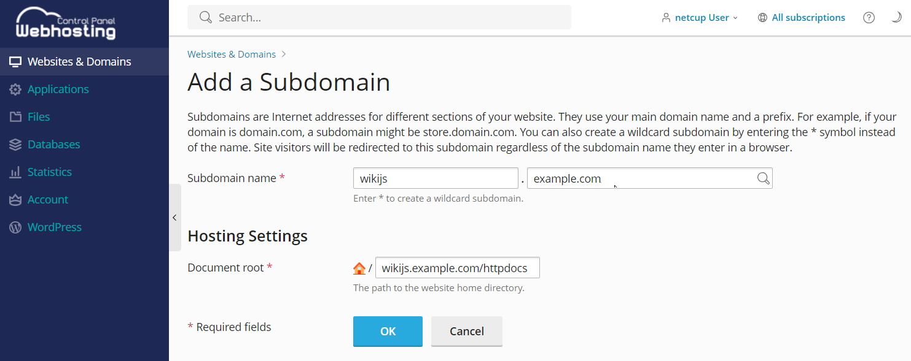
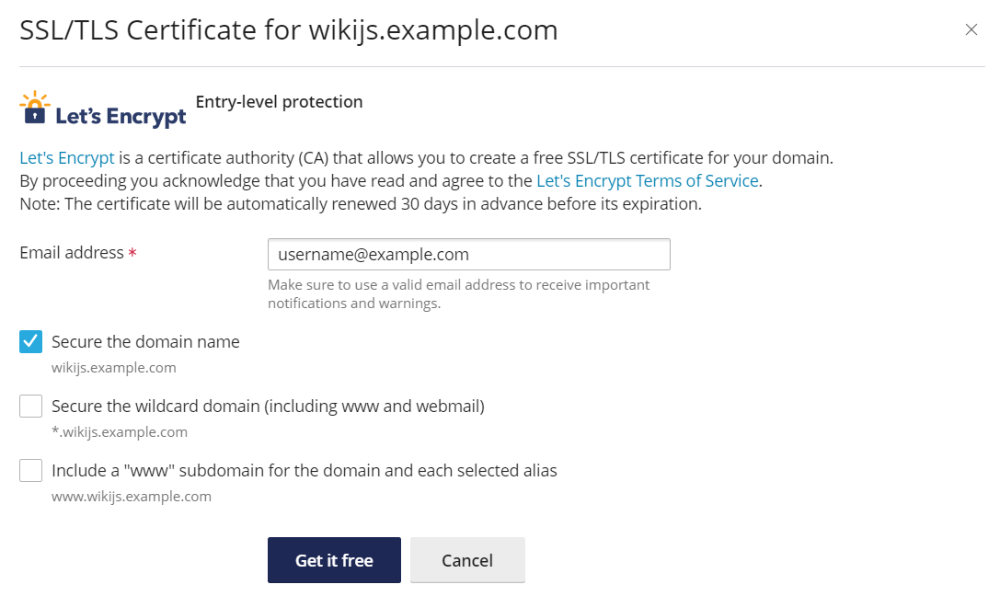
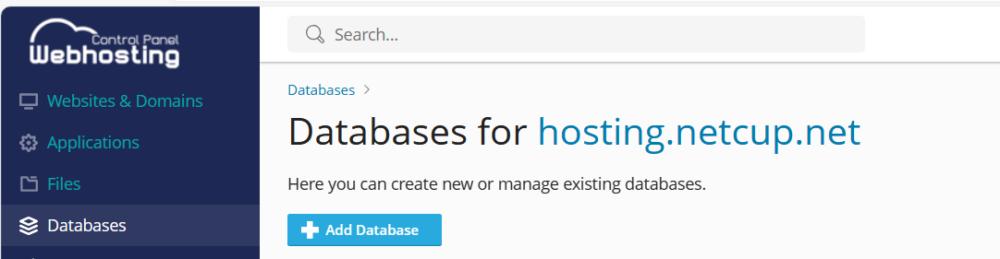
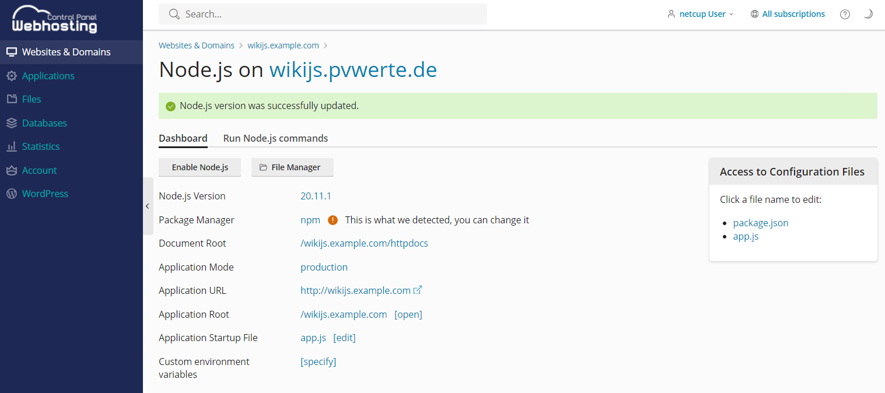
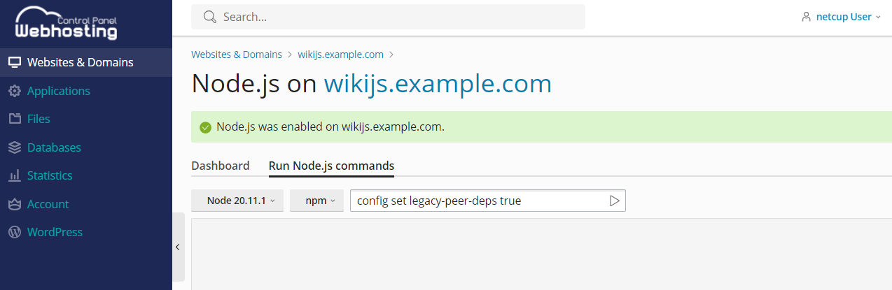
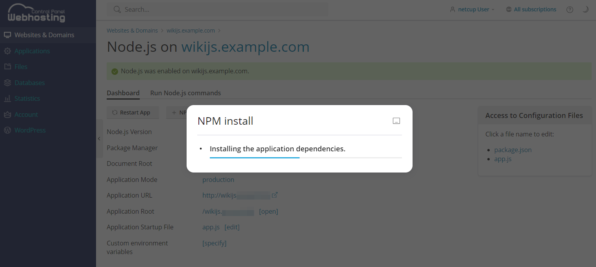

# Introduction
This tutorial describes how to set up [Wiki.js](https://js.wiki/) as a free wiki software using MySQL as the database backend.

The latest version of Wiki.js that does not yet require a PostgreSQL database backend is 2.x and we can install this using a MySQL database backend that is available in all netcup Webhosting packages.

netcup is already offering Node.js support beginning with the Webhosting 4000 but a better Webhosting 8000 package also works.

The reading time of this tutorial is about five minutes. The implementation will take approximately 45 minutes.

The most important requirements for following this tutorial are a basic understanding of SSH, the Unix command line, and a netcup webhosting package with Node.js support.

The tutorial uses the example sub-domain `wikijs.example.com`. This hostname needs to be replaced with the name of your own domain or subdomain when you perform the steps described in this tutorial.

# Requirements
The installation can be performed on any VPS but this tutorial focuses on a default webhosting setup:

* Webhosting 4000 or better with Node.js support
* a (sub) domain

# Step 1 - Add the subdomain and get the document root
Adding a subdomain is easy using the WCP [Add Subdomain] button in the webhosting interface "Websites & Domains".



We use the following subdomain: `wikijs.example.com`

Note down the "Document root" under "Hosting Settings" that we will need later during the configuration.

In this tutorial we use the default document root suggested by WCP when adding the subdomain: 

`/wikijs.example.com/httpdocs`


# Step 2 - Secure domain / subdomain with SSL certificate
In the "SSL/TLS Certificates" settings of the new subdomain, you can add a recommended SSL certificate with Let's Encrypt.




# Step 3 - Create MySQL database
Now we create a new MySQL database for WikiJS usage using the WCP [Add Database] button in the webhosting interface "Databases" navigation entry.



Create a new database `k123456_wikijs` with the database user `k123456_wikijs_db_user` and password `Secret123` and note down the IP address of the webhosting MySQL server and the other values for the database.

The following values should be written down:
```
Database name: k123456_wikijs 
Database server: 10.11.12.13 (the port is the default MySQL port 3306)
Database user name: k123456_wikijs_db_user 
Password: Secret123 
```


# Step 4 - Download WikiJS 2.x package via SSH and extract the archive
Download the WikiJS release from the download page: [https://js.wiki/get-started]

We use the latest stable release '2.x' tar.gz package for this tutorial and we connect to the webhosting instance using SSH.

Connect to your webhosting instance via SSH using the details in the "Web Hosting Access" section of the subdomain.

Navigate to the document root:
`cd wikijs.example.com/httpdocs/`

Delete the favicon.ico and index.html which were created during Step 1:
`rm favicon.ico index.html`

Navigate back to the domain root:
`cd ..`

Download the complete package in tar.gz format:
`wget https://github.com/Requarks/wiki/releases/latest/download/wiki-js.tar.gz`

Extract the tar.gz package:
`tar xzvfs wiki-js.tar.gz`

Symlink the Wiki.JS server Node.js file to app.js:
`ln -s server/index.js app.js`


## Step 4.1 - Configure the database connection in config.yml
Copy the sample configuration:
`cp config.sample.yml config.yml`

Then change the database connection settings using nano editor:
`nano config.yml`

The following values should be set in the Database section:
```
db:
  type: mysql

  # MySQL netcup webhosting details here from step 3:
  host: 10.11.12.13
  port: 3306
  user: k123456_wikijs_db_user
  pass: Secret123
  db: k123456_wikijs
  ssl: false
```


# Step 5 - Setup the Node.js Plesk support
Activate the Node.js support in Plesk for the domain / subdomain using the [Node.js] button in WCP.



Change the Node.js Version to an even version like e.g. `20.11.1` and select [Enable Node.js]

Run npm command in the tab "Run Node.js commands": 
`config set legacy-peer-deps true`



Run [+ NPM install]




# Step 6 - Setup the WikiJS installation using the web installer
Open the domain / subdomain in a web browser of your choice: https://wikijs.example.com

Fill in the administrator e-mail, password and website URL without trailing slashes and confirm.

You will be redirected to the login page of the installed WikiJS installation and login is possible with the previously defined administrator e-mail and password.


# Conclusion
The Wiki.js instance can now be used. It is recommended to perform some tests before productive use.

If all tests are positive switch the Application Mode in the Node.js WCP configuration from development to production.


# License

Permission is hereby granted, free of charge, to any person obtaining a copy
of this software and associated documentation files (the "Software"), to deal
in the Software without restriction, including without limitation the rights
to use, copy, modify, merge, publish, distribute, sublicence, and/or sell
copies of the Software, and to permit persons to whom the Software is
furnished to do so, subject to the following conditions:

The above copyright notice and this permission notice shall be included in all
copies or substantial portions of the Software.

THE SOFTWARE IS PROVIDED "AS IS", WITHOUT WARRANTY OF ANY KIND, EXPRESS OR
IMPLIED, INCLUDING BUT NOT LIMITED TO THE WARRANTIES OF MERCHANTABILITY,
FITNESS FOR A PARTICULAR PURPOSE AND NONINFRINGEMENT. IN NO EVENT SHALL THE
AUTHORS OR COPYRIGHT HOLDERS BE LIABLE FOR ANY CLAIM, DAMAGES OR OTHER
LIABILITY, WHETHER IN AN ACTION OF CONTRACT, TORT OR OTHERWISE, ARISING FROM,
OUT OF OR IN CONNECTION WITH THE SOFTWARE OR THE USE OR OTHER DEALINGS IN THE
SOFTWARE.

# Contributor's Certificate of Origin
By making a contribution to this project, I certify that:

 1) The contribution was created in whole or in part by me and I have the right to submit it under the license indicated in the file; or

 2) The contribution is based upon previous work that, to the best of my knowledge, is covered under an appropriate license and I have the right under that license to submit that work with modifications, whether created in whole or in part by me, under the same license (unless I am permitted to submit under a different license), as indicated in the file; or

 3) The contribution was provided directly to me by some other person who certified (a), (b) or (c) and I have not modified it.

 4) I understand and agree that this project and the contribution are public and that a record of the contribution (including all personal information I submit with it, including my sign-off) is maintained indefinitely and may be redistributed consistent with this project or the license(s) involved.
