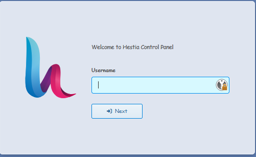
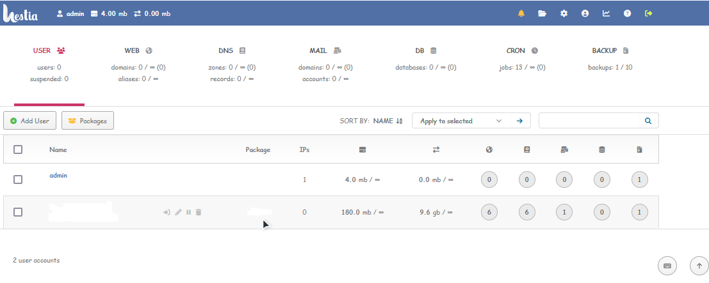
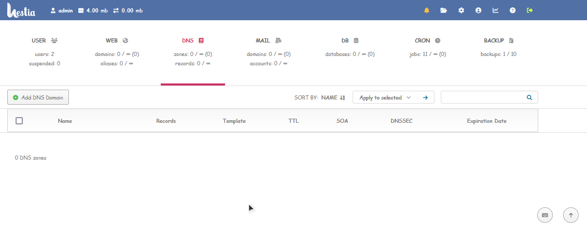
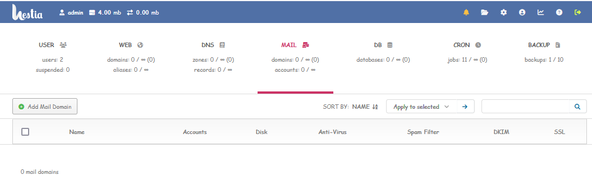
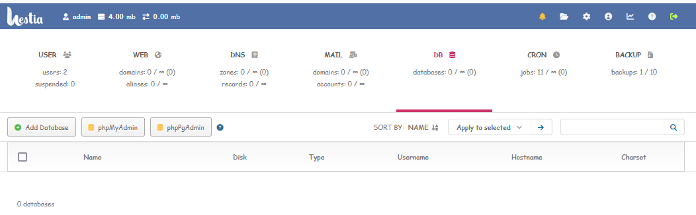
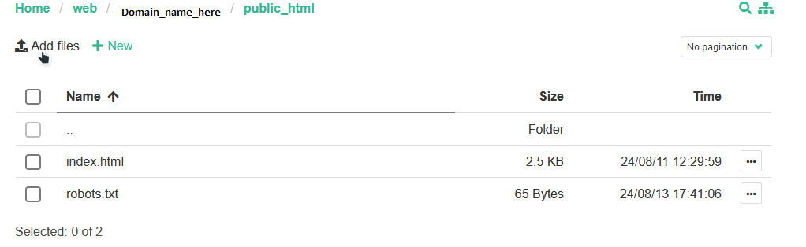

# Introduction

In this tutorial, we will guide you through the process of setting up a netcup root web server for hosting using Hestia Control Panel. Hestia Control Panel is a popular open source web server control panel that simplifies the management of your website, email accounts, databases, and other hosting-related tasks. This tutorial is compatible with both VPS and Root Server offerings by netcup.

The reading time of this tutorial is about 15 minutes; implementation will take approximately 45 minutes.

# Prerequisites

- A root server from netcup with latest Ubuntu 20.04/22.04/LTS; Debian 10/11/12/LTS or later installed (see the below URL) - use minimal mode of installation, also called clean installation.
```
https://hestiacp.com/docs/introduction/getting-started.html#requirements
```

- Please note latest Hestia Control Panel only supports the latest versions of the above OS. To know more visit:
```
https://hestiacp.com/docs/introduction/getting-started.html#supported-operating-systems
```
- A registered domain name (optional)
- Root access to your server

# Step 1: Update your system

Before we begin, it's essential to ensure that your system is up-to-date. Log in to your server via SSH as the root user and run the following command:

For Ubuntu/Debian:

```
apt update && apt upgrade -y
```

# Step 2: Install Hestia Control Panel

To install Hestia Control Panel, you'll first need to install the installation script. Run the following commands to download and to execute the installation script:

```
sudo cd /home && wget https://raw.githubusercontent.com/hestiacp/hestiacp/release/install/hst-install.sh && bash hst-install.sh
```

Notes: If the download fails due to an SSL validation error, please be sure you've installed the ca-certificate package on your system - you can do this with the following command:

```
apt-get update && apt-get install ca-certificates
```

Note: To install with custom commands, use the script generator:

```
https://hub.io/hestiacp-scriptline-generator/
```

Options to use in command are:
```
-a, --apache Install Apache [yes | no] default: yes
-w, --phpfpm Install PHP-FPM [yes | no] default: yes
-o, --multiphp Install MultiPHP [yes | no] default: no
-v, --vsftpd Install VSFTPD [yes | no] default: yes
-j, --proftpd Install ProFTPD [yes | no] default: no
-k, --named Install BIND [yes | no] default: yes
-m, --mysql Install MariaDB [yes | no] default: yes
-M, --mysql8 Install Mysql8 [yes | no] default: no
-g, --postgresql Install PostgreSQL [yes | no] default: no
-x, --exim Install Exim [yes | no] default: yes
-z, --dovecot Install Dovecot [yes | no] default: yes
-Z, --sieve Install Sieve [yes | no] default: no
-c, --clamav Install ClamAV [yes | no] default: yes
-t, --spamassassin Install SpamAssassin [yes | no] default: yes
-i, --iptables Install Iptables [yes | no] default: yes
-b, --fail2ban Install Fail2ban [yes | no] default: yes
-q, --quota Filesystem Quota [yes | no] default: no
-d, --api Activate API [yes | no] default: yes
-r, --port Change Backend Port default: 8083
-l, --lang Default language default: en
-y, --interactive Interactive install [yes | no] default: yes
-s, --hostname Set hostname
-e, --email Set admin email
-p, --password Set admin password
-D, --with-debs Path to Hestia debs
-f, --force Force installation
-h, --help Print this help
```

Example updated command to run the script:
```
sudo cd /home && wget https://raw.githubusercontent.com/hestiacp/hestiacp/release/install/hst-install.sh && bash hst-install.sh --apache yes --phpfpm yes --multiphp yes --vsftpd yes --port '8083' --hostname 'DOMAIN-HERE' --email 'EMAIL-HERE' --password 'PASSWORD-HERE' --lang 'en' --force
```

Follow the on-screen instructions to complete the installation. The installation process may take some time. Once it's complete, the Hestia Control Panel will be installed on your system.

# Step 3: Configure Hestia Control Panel

After the installation is complete, you can access the WHM (WebHost Manager) interface via your browser. Open your browser and navigate to:

```
https://your_server_ip:8083
```



Replace "your_server_ip" with the IP address of your server. You'll encounter a security warning since the SSL certificate is self-signed. Proceed to the website and log in with your root username and password you selected during the scrip installation.

Upon logging in, you'll be presented with the dashboard where you can view and configure the panel as per your needs.



# Step 4: Create a new user (regular)

On the dashboard, click the Add User button; fill out the fields; click the Save button in the top right.

To switch to the new user Hover over the user you want to login as; click the login as icon [ ->] ]' on the right of the user’s name and email; you are now logged in as the user. As such, any action you perform will be done as this user.

Note: Never run a web or mail domain with the admin user -> By default, the admin user has elevated privileges. This can pose a security threat to your server!

# Step 5: Set up your domain

Navigate to "Web tab" > "Click the + Add Web Domain button" and enter your domain information.
Example: `exampledomain.com`

After creating a new account, you'll need to update your domain's nameservers to point to your server. This process varies depending on your domain registrar, so consult their documentation for instructions.

# Step 6: Create DNS Zone, eMail accounts & Databases

Click on the box labeled DNS & fill up the required details. A minimum of 2 name servers are necessary to avoid redundancy.



With your domain set up, you can now create email accounts and databases for your website. To create an email account, click on box labeled MAIL.



To create a database click on box labeled DB.



# Step 6: Upload your website files

To upload your website files, you can use the File Manager in Panel or an FTP client such as FileZilla. If using File Manager click on the File Manager icon on right top side and upload your files to the "public_html" directory under WEB > domain_name_folder > public_html.



If using an FTP client, you'll need to create an FTP account in Panel first. Click on "WEB icon" > "domain name (edit domain)" > "Advanced Options" > click "Additional FTP account(s)" > fill in username, password and the default path & click "Save" to create a new account, then use the provided credentials to connect and upload your files.

# Conclusion

Awesome!!! You've successfully set up a web server for hosting using Hestia COntrol Panel on netcup. You can now manage your website, email, and databases through the userfriendly cPanel interface. Remember to keep your server and Panel updated to ensure consistent security and performance.

# Licence

[MIT](https://github.com/netcup-community/community-tutorials/blob/main/LICENSE)

Copyright (c) 2024 netcup

Permission is hereby granted, free of charge, to any person obtaining a copy of this software and associated documentation files (the "Software"), to deal in the Software without restriction, including without limitation the rights to use, copy, modify, merge, publish, distribute, sublicence, and/or sell copies of the Software, and to permit persons to whom the Software is furnished to do so, subject to the following conditions:

The above copyright notice and this permission notice shall be included in all copies or substantial portions of the Software.

THE SOFTWARE IS PROVIDED "AS IS", WITHOUT WARRANTY OF ANY KIND, EXPRESS OR IMPLIED, INCLUDING BUT NOT LIMITED TO THE WARRANTIES OF MERCHANTABILITY, FITNESS FOR A PARTICULAR PURPOSE AND NONINFRINGEMENT. IN NO EVENT SHALL THE AUTHORS OR COPYRIGHT HOLDERS BE LIABLE FOR ANY CLAIM, DAMAGES OR OTHER LIABILITY, WHETHER IN AN ACTION OF CONTRACT, TORT OR OTHERWISE, ARISING FROM, OUT OF OR IN CONNECTION WITH THE SOFTWARE OR THE USE OR OTHER DEALINGS IN THE SOFTWARE.

# Contributor's Certificate of Origin
By making a contribution to this project, I certify that:

 1) The contribution was created in whole or in part by me and I have the right to submit it under the licence indicated in the file; or

 2) The contribution is based upon previous work that, to the best of my knowledge, is covered under an appropriate licence and I have the right under that licence to submit that work with modifications, whether created in whole or in part by me, under the same licence (unless I am permitted to submit under a different licence), as indicated in the file; or

 3) The contribution was provided directly to me by some other person who certified (a), (b) or (c) and I have not modified it.

 4) I understand and agree that this project and the contribution are public and that a record of the contribution (including all personal information I submit with it, including my sign-off) is maintained indefinitely and may be redistributed consistent with this project or the licence(s) involved.
