# Introduction

This tutorial explains how to install PufferPanel on a Debian or Ubuntu server (e.g. "RS 2000" server) and can set up an Apache2 reverse proxy.<br>
PufferPanel is a simple web panel for game servers and other things.<br>
I am doing this on a Debian 11 based server, but this tutorial should also work on other Debian versions and on Ubuntu.<br>
This tutorial is based on the PufferPanel docs found at https://docs.pufferpanel.com/en/2.x/installing.html, https://github.com/SanCraftDev/Debian-Setup/blob/main/README.md#Snapd and https://github.com/SanCraftDev/Debian-Setup/blob/main/README.md#Apache-and-Certbot.

# Requirements

You need a Debian or Ubuntu server with an internet connection. The server must be accessible via a static IP on ports `8080` and `5657`.<br>
You also need root permissions on the server. <br>
If you want to use HTTPS and a domain or subdomain, the server must be open to the internet on ports `80` and `443`. <br>
If you want to use PufferPanel for Minecraft servers, you must have Java 17 installed (see step 0).

# Step 0 - Installing Java (optional, necessary for Minecraft servers)

```sh
su
apt update && apt upgrade -y && apt autoremove -y
apt install gnupg software-properties-common wget curl sudo nano screen cron -y
wget -O- https://apt.corretto.aws/corretto.key | apt-key add -
add-apt-repository 'deb https://apt.corretto.aws stable main'
apt update; apt install java-17-amazon-corretto-jdk maven -y
```

# Step 1 - Installing the PufferPanel

First you need to connect to your server via SSH.<br>
Then switch to the root user and update your system. After that, proceed with the installation of PufferPanel:

```sh
su
apt update && apt upgrade -y && apt autoremove -y
apt install wget curl sudo nano screen cron -y
curl -s https://packagecloud.io/install/repositories/pufferpanel/pufferpanel/script.deb.sh | sudo bash
{ crontab -l 2>/dev/null; echo "* * * * * chown -R pufferpanel:pufferpanel /var/lib/pufferpanel/" ; } | crontab -
{ crontab -l 2>/dev/null; echo "* * * * * chown -R pufferpanel:pufferpanel /etc/pufferpanel/" ; } | crontab -
sudo apt-get install pufferpanel -y
```

If you want to automatically start PufferPanel on boot, enter this command:

```sh
systemctl enable pufferpanel
```

# Step 1.1 - Add a user & start PufferPanel

Now we add a PufferPanel user: <br>

```sh
pufferpanel user add
```

You will be asked to provide a username, your email address and a secure passphrase.

Now you can start PufferPanel for the first time:

```sh
systemctl start pufferpanel
```

You can access the panel via http://your-ip:8080.

# Step 2 - Install Apache2 (optional)

 - You need Apache2, PHP and MariaDB installed on your server see [here](https://github.com/netcup-community/community-tutorials/blob/main/community-tutorials/install-web-server-mariadb-debian-php/01-en.md)
## Step 2.3 - Configuring PufferPanel

Create a subdomain or domain that is linked to your server. <br>
After that, you need to create an SSL certificate (replace DOMAIN with your domain or subdomain):

```sh
certbot certonly --apache -d DOMAIN
```

Next, create the Apache2 configuration file:

```sh
nano /etc/apache2/sites-enabled/0-pp.conf
```

Now paste the following into this file:

```
<VirtualHost *:443>
    ServerName DOMAIN

    ProxyPreserveHost On
    ProxyPass / http://127.0.0.1:8080/
    ProxyPassReverse / http://127.0.0.1:8080/

    RewriteEngine on
    RewriteCond %{HTTP:Upgrade} websocket [NC]
    RewriteCond %{HTTP:Connection} upgrade [NC]
    RewriteRule .* ws://127.0.0.1:8080%{REQUEST_URI} [P]

    ErrorLog ${APACHE_LOG_DIR}/pp.error.log

    SSLCertificateFile /etc/letsencrypt/live/DOMAIN/fullchain.pem
    SSLCertificateKeyFile /etc/letsencrypt/live/DOMAIN/privkey.pem
</VirtualHost>
```

- Replace every `DOMAIN` with your domain. <br/>
- Save your changes by pressing <kbd>CTRL + X</kbd>, then <kbd>y</kbd> and finally by hitting <kbd>ENTER</kbd>. <br/>
- Restart Apache2 with `service apache2 restart`. <br>

**Note:**
If you are doing this directly on a domain and NOT on a subdomain or you want to make the site available on more sites, I recommend adding a Server Alias to the Configuration like you see below. (If you want to make this site aviable on every Subdomain which looks the following `abc` you can also add as Server Alias `abc.*`.)
For this you need to regenerate the SSL certificate with `certbot certonly --apache -d DOMAIN,www.DOMAIN,web.DOMAIN,sub.DOMAIN`.<br/>

```diff
<VirtualHost *:443>
    ServerName DOMAIN
+   ServerAlias status.* uk.DOMAIN

    ProxyPass / http://localhost:3001/
    RewriteEngine on
    RewriteCond %{HTTP:Upgrade} websocket [NC]
    RewriteCond %{HTTP:Connection} upgrade [NC]
    RewriteRule ^/?(.*) "ws://localhost:3001/$1" [P,L]

    ErrorLog ${APACHE_LOG_DIR}/uk-error.log

    SSLCertificateFile /etc/letsencrypt/live/DOMAIN/fullchain.pem
    SSLCertificateKeyFile /etc/letsencrypt/live/DOMAIN/privkey.pem
</VirtualHost>
```

You should now be able to open PufferPanel by accessing `https://DOMAIN/`.<br>

# Step 3 - Creating the first server

Additional screenshots below.<br>
Log in to your PufferPanel using your email address and password via http://your-ip:8080 or https://DOMAIN/ <br>
Go to `Templates` and import the templates you want to use or download some templates from https://github.com/SanCraftDev/PufferPanel-templates/blob/main/README.md <br>
Now go to `Servers`, press `+` and select the template you would like to use. Follow the steps, then select `Install` on the top left. Now you can start your server. <br>
Under `Admin` you can set your server to automatically start on boot. <br>
Do not forget to open the correct port of the server you created using PufferPanel, if an open port is needed (for example, a Minecraft server/proxy requires port `25565`, you can not use ports below `1024`).

# Images

## Import a template

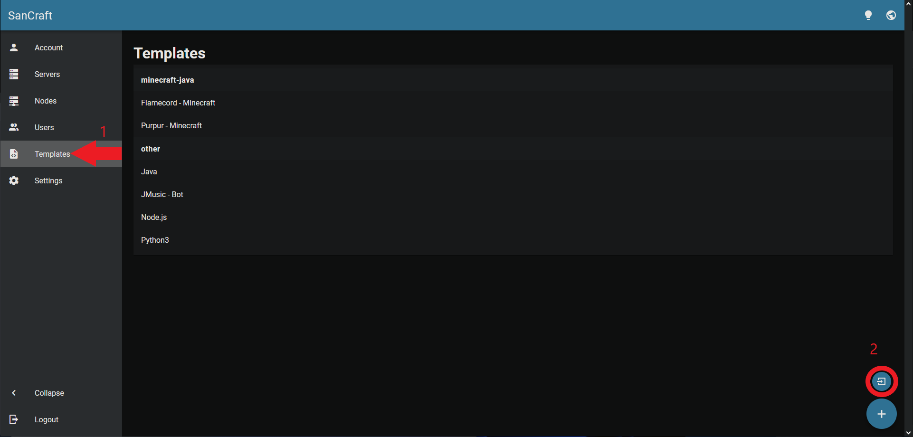
Here you can select the templates you want to use (some default templates are outdated).
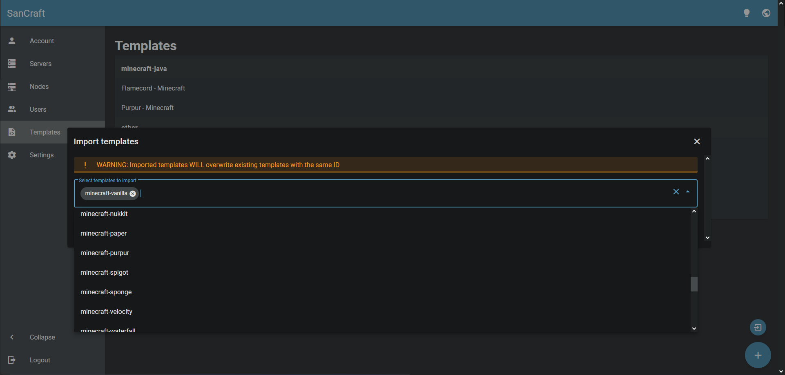

## Add a downloaded template

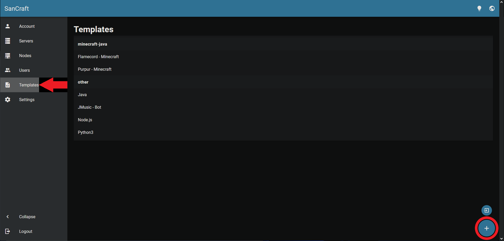
Paste the content of the template in this field:
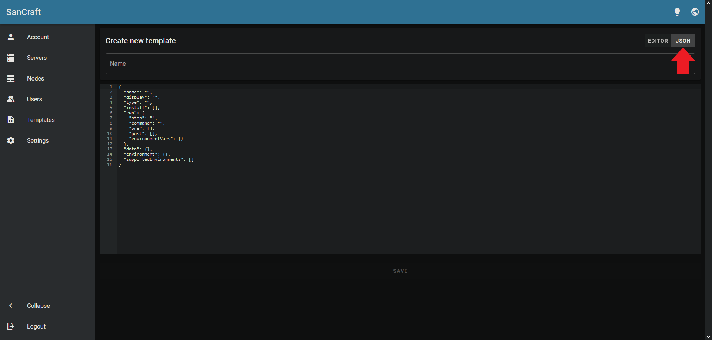

## Create a server

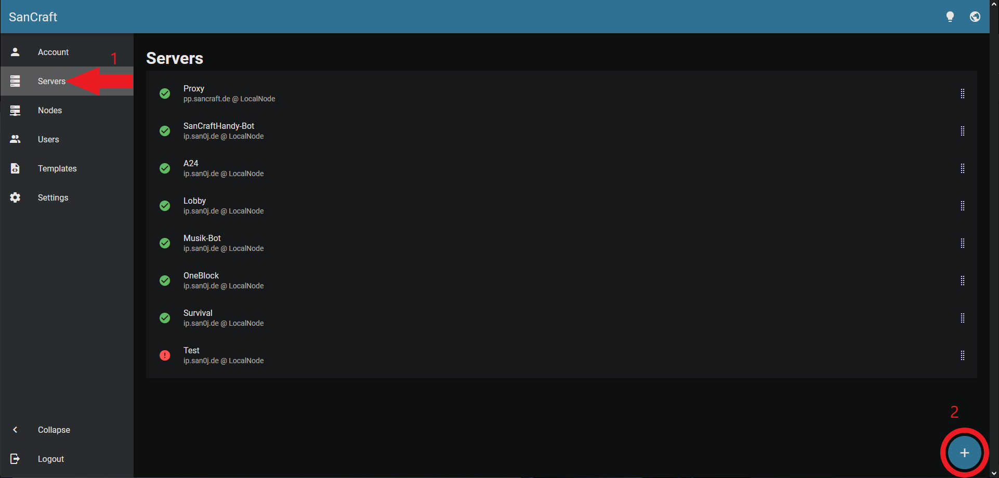
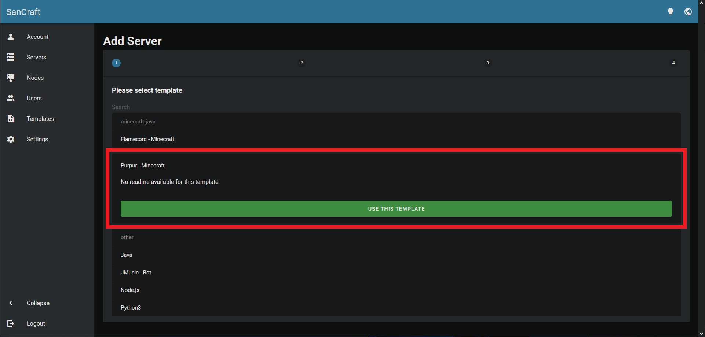
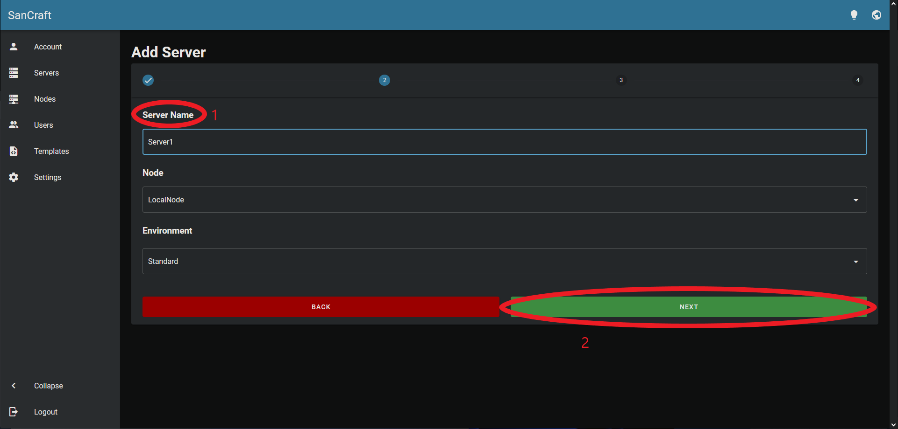
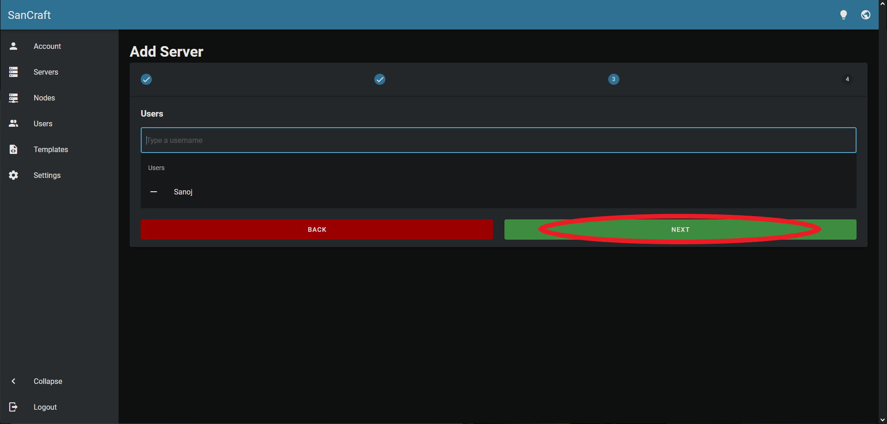
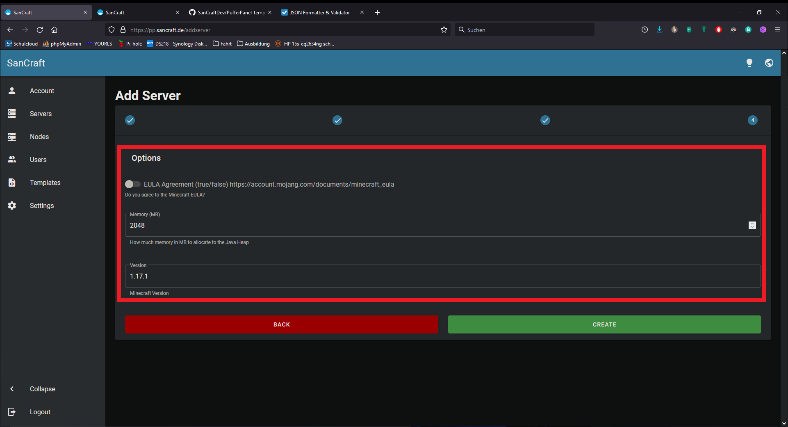
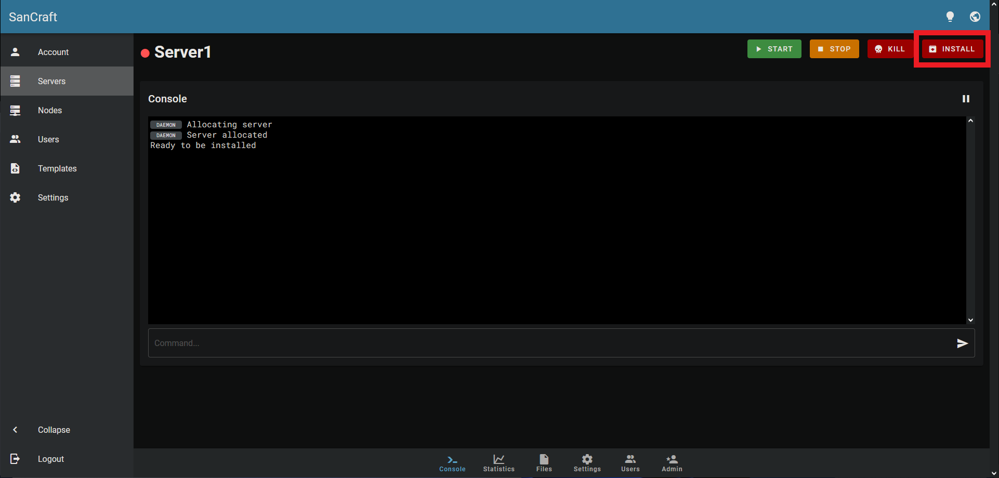
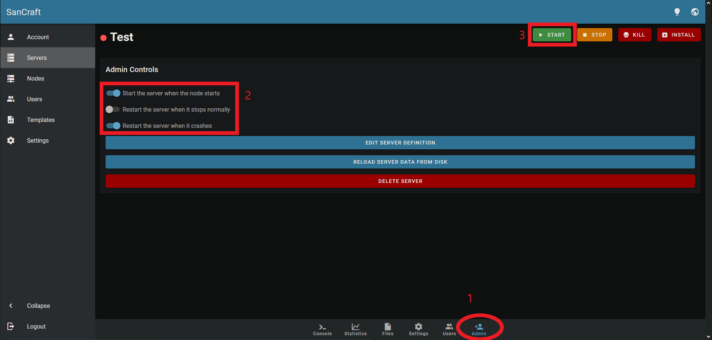

# Step 4 - Run PufferPanel inside of a Docker container (optional)

First we need to install Docker:

```sh
apt remove docker docker-engine docker.io containerd runc docker-compose -y
curl -fsSL https://download.docker.com/linux/debian/gpg | sudo gpg --dearmor -o /usr/share/keyrings/docker-archive-keyring.gpg
echo "deb [arch=$(dpkg --print-architecture) signed-by=/usr/share/keyrings/docker-archive-keyring.gpg] https://download.docker.com/linux/debian $(lsb_release -cs) stable" | sudo tee /etc/apt/sources.list.d/docker.list > /dev/null
apt update && apt install docker-ce docker-ce-cli containerd.io -y
systemctl enable --now docker
```

Now we need to give PufferPanel access to Docker and restart PufferPanel:

```sh
sudo groupadd --force --system docker
sudo usermod -a -G docker pufferpanel
systemctl restart pufferpanel
```

# Conclusion

Following this tutorial, you have installed PufferPanel, set up a reverse proxy for PufferPanel using Apache2 and created your first server. <br>
This tutorial is based on the PufferPanel docs found at https://docs.pufferpanel.com/en/2.x/installing.html, https://github.com/SanCraftDev/Debian-Setup/blob/main/README.md#Snapd and https://github.com/SanCraftDev/Debian-Setup/blob/main/README.md#Apache-and-Certbot.

# License

Permission is hereby granted, free of charge, to any person obtaining a copy
of this software and associated documentation files (the "Software"), to deal
in the Software without restriction, including without limitation the rights
to use, copy, modify, merge, publish, distribute, sublicence, and/or sell
copies of the Software, and to permit persons to whom the Software is
furnished to do so, subject to the following conditions:

The above copyright notice and this permission notice shall be included in all
copies or substantial portions of the Software.

THE SOFTWARE IS PROVIDED "AS IS", WITHOUT WARRANTY OF ANY KIND, EXPRESS OR
IMPLIED, INCLUDING BUT NOT LIMITED TO THE WARRANTIES OF MERCHANTABILITY,
FITNESS FOR A PARTICULAR PURPOSE AND NONINFRINGEMENT. IN NO EVENT SHALL THE
AUTHORS OR COPYRIGHT HOLDERS BE LIABLE FOR ANY CLAIM, DAMAGES OR OTHER
LIABILITY, WHETHER IN AN ACTION OF CONTRACT, TORT OR OTHERWISE, ARISING FROM,
OUT OF OR IN CONNECTION WITH THE SOFTWARE OR THE USE OR OTHER DEALINGS IN THE
SOFTWARE.

# Contributor's Certificate of Origin

By making a contribution to this project, I certify that:

1.  The contribution was created in whole or in part by me and I have the right to submit it under the license indicated in the file; or

2.  The contribution is based upon previous work that, to the best of my knowledge, is covered under an appropriate license and I have the right under that license to submit that work with modifications, whether created in whole or in part by me, under the same license (unless I am permitted to submit under a different license), as indicated in the file; or

3.  The contribution was provided directly to me by some other person who certified (a), (b) or (c) and I have not modified it.

4.  I understand and agree that this project and the contribution are public and that a record of the contribution (including all personal information I submit with it, including my sign-off) is maintained indefinitely and may be redistributed consistent with this project or the license(s) involved.
