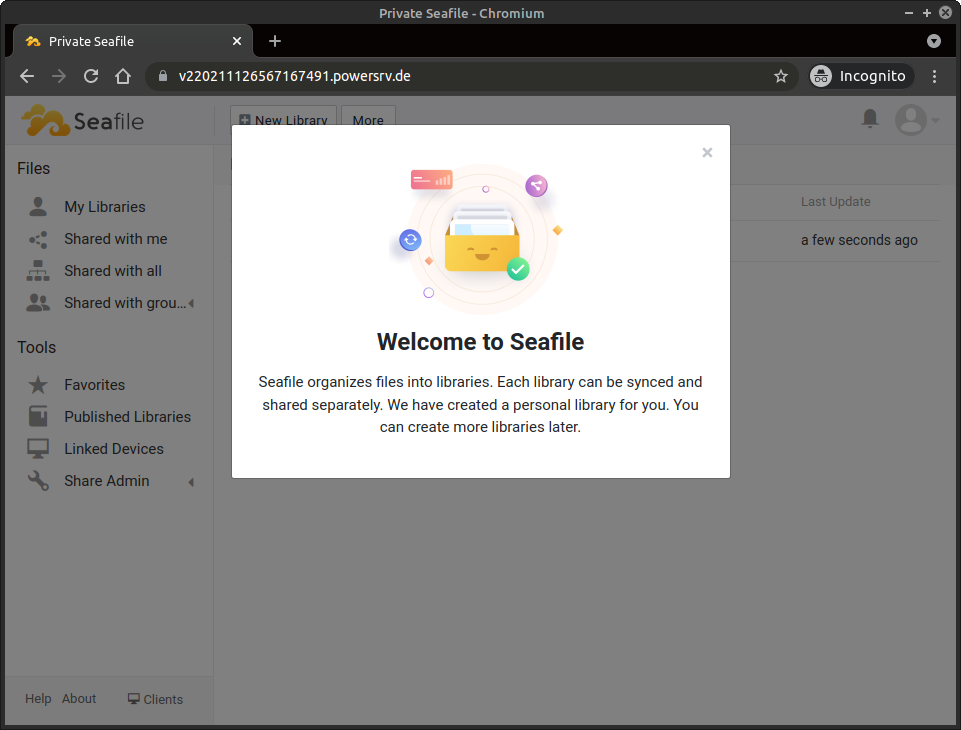
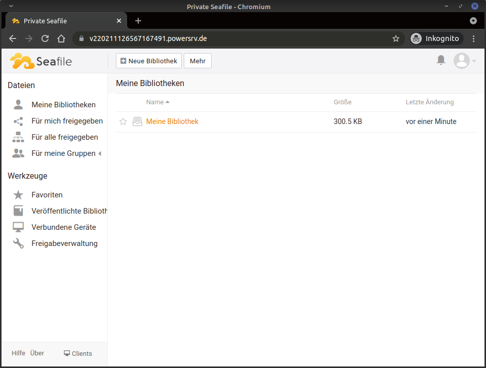
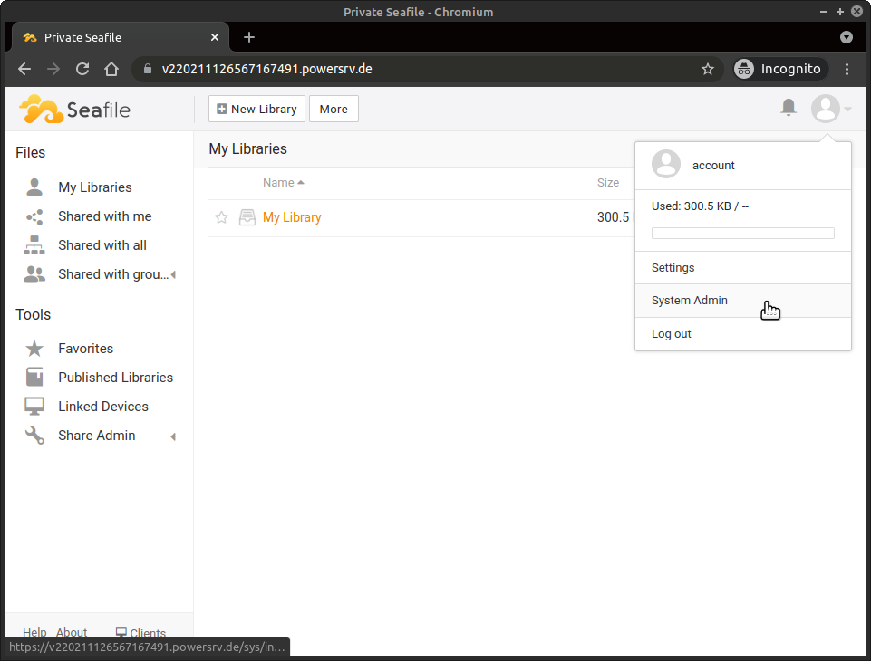
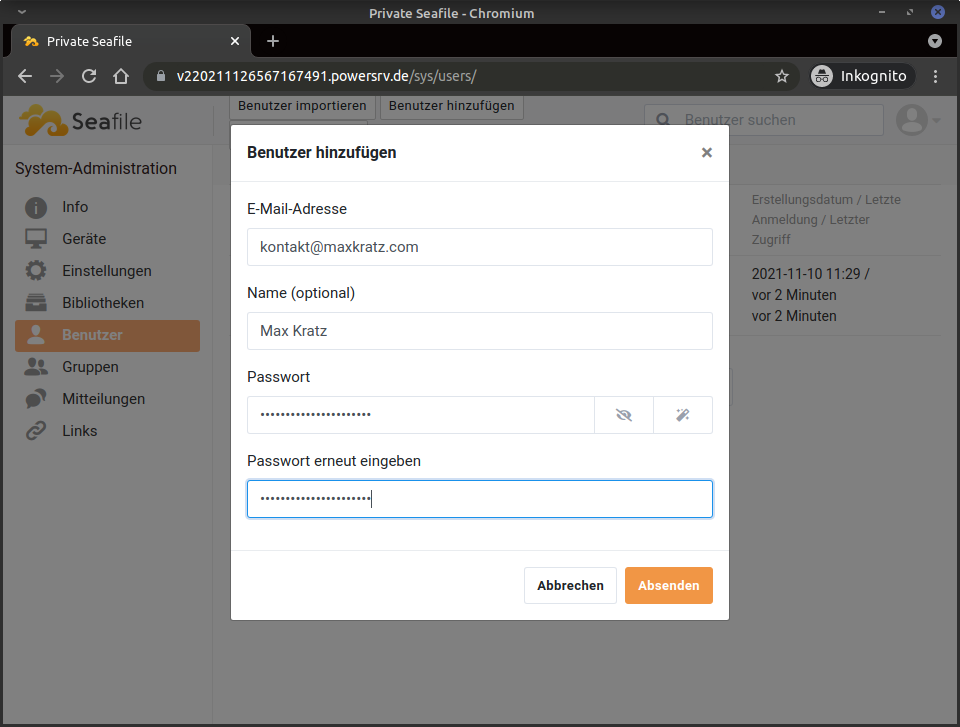

# Introduction

This tutorial explains how to install a [Seafile](https://www.seafile.com/en/home/) server on a virtual server (vServer or root server).
After following these steps, the user will have a complete Seafile server installed, including its database with [Docker](https://www.docker.com/) and [Docker Compose](https://docs.docker.com/compose/).
Furthermore, the Seafile service will be secured with a free Let's Encrypt certificate to be reachable via HTTPS (SSL/TLS).

Please keep in mind that the Seafile server installation in this tutorial uses ports `80` and `443` exclusively. This means that you cannot run any other web services on the system.

# Requirements

- A virtual server like the **VPS200G8** in my example. Be sure to choose a product with the necessary size for your storage needs (the 20 GB of the VPS200G8 used in this tutorial might be insufficient for your cloud).
- [Debian](https://www.debian.org/) 10 or newer installed on your vServer. Other Linux distributions like [Ubuntu](https://ubuntu.com/) will also fulfill the requirements for this tutorial.
- Docker and Docker Compose installed on your system. For the installation you can use e.g. these instructions: https://github.com/netcup-community/community-tutorials/community-tutorials/install-docker/01-en.md
  - You can check your Docker installation by running these commands:

```bash
$ docker --version
Docker version 20.10.10, build b485636
$ docker-compose --version
docker-compose version 1.29.2, build 5becea4c
```

The version numbers do not have to match exactly but the commands must not return any errors.

# Step 1 - Create a working environment

To use Docker Compose files, you need to create a working environment which usually consists of a dedicated directory and a Docker Compose file (`docker-compose.yml`). One way to organize different Docker Compose "projects" is to create folders in `/srv`.

- Create Seafile Docker Compose folder: `$ mkdir -p /srv/docker-compose/seafile`
- Create the data directory: `$ mkdir -p /srv/docker-compose/seafile/data`
- Move directory into the new folder: `$ cd /srv/docker-compose/seafile`
- Create an empty `docker-compose.yml` file: `$ touch docker-compose.yml`

# Step 2 - Configure the Seafile service

- Start your favorite editor to open the file `docker-compose.yml`. One of the easiest editors is `nano` which can be used like this: `$ nano docker-compose.yml`
- Paste the following template into the file:

```bash
version: '2.0'
services:
  # Database
  db:
    image: mariadb:10.5
    container_name: seafile-mysql
    environment:
      # TODO: Choose a root password for the MySQL database
      - MYSQL_ROOT_PASSWORD=db_dev
      - MYSQL_LOG_CONSOLE=true
    volumes:
      # Defines the mount path for the persistant data of the database
      - ./data/db:/var/lib/mysql
    networks:
      - seafile-network
    restart: unless-stopped

  # Memory Cache
  memcached:
    image: memcached:1.5.6
    container_name: seafile-memcached
    entrypoint: memcached -m 256
    networks:
      - seafile-network
    restart: unless-stopped

  # Seafile server itself
  seafile:
    image: seafileltd/seafile-mc:latest
    container_name: seafile
    ports:
      # Port 80 = HTTP, Port 443 = HTTPS
      - "80:80"
      - "443:443"
    volumes:
      - ./data/seafile:/shared
    environment:
      - DB_HOST=db
      # TODO: Paste the matching root password of the database here
      - DB_ROOT_PASSWD=db_dev
      # Defines the timezone. This example is for Germany
      - TIME_ZONE=Europe/Berlin
      # TODO: Define the email address of the root user
      - SEAFILE_ADMIN_EMAIL=your-email@address.com
      # TODO: Define the password of the root user
      - SEAFILE_ADMIN_PASSWORD=your-super-secret-password
      - SEAFILE_SERVER_LETSENCRYPT=true
      # TODO: Change the URL of your Seafile server according to your domain
      - SEAFILE_SERVER_HOSTNAME=seafile.example.com
    depends_on:
      - db
      - memcached
    networks:
      - seafile-network
    restart: unless-stopped

networks:
  seafile-network:
```

- Adjust all variables marked with `# TODO: ` according to your needs. Feel free to dig a little deeper and understand all the other variables as well!

Please notice:
`restart: unless-stopped` ensures that your Seafile server will automatically start after you've (re-)booted your server.

# Step 3 - Deployment

- Download the Docker images for your Seafile containers: `$ docker-compose pull`
- Start your stack: `$ docker-compose up -d`
- You can check the live logs of your Seafile containers with this command: `$ docker-compose -tf logs`

All data will be saved in these subfolders:

- `/srv/docker-compose/seafile/data/db`
- `/srv/docker-compose/seafile/data/seafile`

# Step 4 - Using the web interface and creating user accounts

- After starting (deploying) your Seafile instance, you can use your favorite web browser to navigate to the URL previously specified in the `docker-compose.yml` file. In my example this is https://v220211126567167491.powersrv.de.
  Note the valid TLS/SSL certificate visible in the screenshots!


- You can now log in with the administrator/root credentials provided in your `docker-compose.yml` file. Seafile will welcome you!



- After closing the welcome page, the service displays its normal file browser:



- Normally, you want to create unprivileged user accounts for the users. This can be easily done from the administration panel in the web interface. Click on the image of the user avatar in the upper right corner and on _System Administration_:



- Under the menu item _Users_ you can create new user accounts by clicking on _Add users_:



# Conclusion

By using Docker and Docker Compose, an administrator can deploy a new Seafile instance with a valid TLS/SSL certificate within minutes.
In this tutorial, we showed how to install Seafile along with its caching mechanism and the required MySQL database using Docker Compose.
Moreover, the Seafile service was configured to allow TLS/SSL secured HTTPS requests.

## Future considerations

1. You may be interested in using the official Seafile clients, e.g. for Windows or Linux desktop systems. Check them out [here](https://www.seafile.com/en/download/).
1. You may be interested in providing the credentials, such as the administrator/root password, outside your `docker-compose.yml` file. This can be achieved by using `.env` files.
1. You may be interested in combining the Seafile Docker Compose stack with another reverse proxy to allow a parallel installation of Seafile with, e.g. other web services like a website.
1. Backups are important! Therefore, you should back up the data in `/srv/docker-compose/seafile` regularly. Keep in mind that you have to shut down the Docker Compose stack (e.g. with `$ docker-compose down`) beforehand to create consistent backups.

# License

Permission is hereby granted, free of charge, to any person obtaining a copy
of this software and associated documentation files (the "Software"), to deal
in the Software without restriction, including without limitation the rights
to use, copy, modify, merge, publish, distribute, sublicence, and/or sell
copies of the Software, and to permit persons to whom the Software is
furnished to do so, subject to the following conditions:

The above copyright notice and this permission notice shall be included in all
copies or substantial portions of the Software.

THE SOFTWARE IS PROVIDED "AS IS", WITHOUT WARRANTY OF ANY KIND, EXPRESS OR
IMPLIED, INCLUDING BUT NOT LIMITED TO THE WARRANTIES OF MERCHANTABILITY,
FITNESS FOR A PARTICULAR PURPOSE AND NONINFRINGEMENT. IN NO EVENT SHALL THE
AUTHORS OR COPYRIGHT HOLDERS BE LIABLE FOR ANY CLAIM, DAMAGES OR OTHER
LIABILITY, WHETHER IN AN ACTION OF CONTRACT, TORT OR OTHERWISE, ARISING FROM,
OUT OF OR IN CONNECTION WITH THE SOFTWARE OR THE USE OR OTHER DEALINGS IN THE
SOFTWARE.

# Contributor's Certificate of Origin

By making a contribution to this project, I certify that:

1.  The contribution was created in whole or in part by me and I have the right to submit it under the license indicated in the file; or

2.  The contribution is based upon previous work that, to the best of my knowledge, is covered under an appropriate license and I have the right under that license to submit that work with modifications, whether created in whole or in part by me, under the same license (unless I am permitted to submit under a different license), as indicated in the file; or

3.  The contribution was provided directly to me by some other person who certified (a), (b) or (c) and I have not modified it.

4.  I understand and agree that this project and the contribution are public and that a record of the contribution (including all personal information I submit with it, including my sign-off) is maintained indefinitely and may be redistributed consistent with this project or the license(s) involved.
