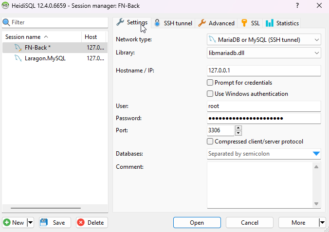
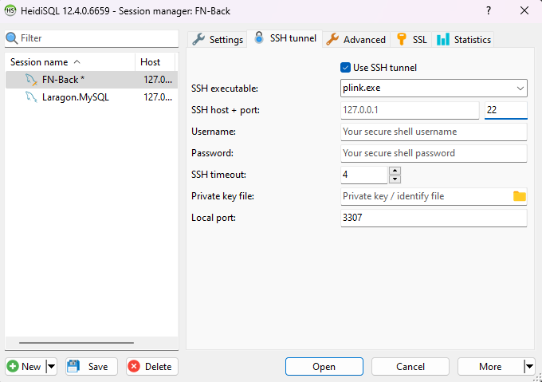

# Introduction
In this tutorial you will learn how to connect to a remote MySQL server (on a netcup vServer) through an SSH tunnel. The SSH tunnel allows up to do port-forwarding. In our scenario, we link the database port to us, which means that after the successful connection with the tunnel we access the database server through `127.0.0.1` and not the public IP.

But why should we do that?

Connecting through the SSH tunnel has two advantages:
1. We don't have to open a server port on the server. If we opened a port, it would be accessible to the entire internet.
2. The data is encrypted end-to-end through the SSH tunnel.

Both advantages clearly show that we are dealing with security issues here.

# Requirements 
We need the following:
* SSH access to the netcup server (vServer or Root-Server). 
* [HeidiSQL](https://www.heidisql.com/). HeidiSQL is a free MySQL client that supports connecting through an SSH tunnel.
* A MySQL user with password. You can either use the root user or a previously set up new user.

### Why don't we use phpMyAdmin?

A good point. We don't use phpMyAdmin because phpMyAdmin runs on the server and we would have to open a port. This is exactly what we don't want.

# Step 1 - Change the network type

After starting HeidiSQL for the first time, you will see a screen similar to the one above, but probably without any entries. In the lower left corner above "new", you can add a new entry.

After creating a new session, you can set the following options on the right side in the "Settings" tab:

* Network type: `MariaDB or MySQL (SSH tunnel)`
* Library: Library that matches your server. libmariadb.dll for a MariaDB server or libmysql.dll for an MySQL server.
* Hostname / IP: `127.0.0.1`
* User: `root` or your newly created user
* Password: Password for that user
* Port: `3306`

Next we go to the 'SSH-tunnel' tab.

# Step 2 - SSH settings

In this tab we set the SSH configuration.

* First select the "Use SSH tunnel" checkbox.
* SSH executable: `plink.exe`
* SSH host + port: Here you set the public ip/hostname of your server and your SSH port.
* Username: your username for SSH login
* Password: your SSH password, skip this if you use a private key/public key method
* SSH timeout: 4 (default value)
* Private key file: Path to your private key, leave empty if not used
* Local port: `3307` (default value)

At the bottom left you can now save your changes via "Save".

# Conclusion 

You can now access your MySQL server through the SSH tunnel without opening any ports.   

# License

[MIT](https://github.com/netcup-community/community-tutorials/blob/main/LICENSE)

Copyright (c) 2021 netcup

Permission is hereby granted, free of charge, to any person obtaining a copy of this software and associated documentation files (the "Software"), to deal in the Software without restriction, including without limitation the rights to use, copy, modify, merge, publish, distribute, sublicense, and/or sell copies of the Software, and to permit persons to whom the Software is furnished to do so, subject to the following conditions:

The above copyright notice and this permission notice shall be included in all copies or substantial portions of the Software.

THE SOFTWARE IS PROVIDED "AS IS", WITHOUT WARRANTY OF ANY KIND, EXPRESS OR IMPLIED, INCLUDING BUT NOT LIMITED TO THE WARRANTIES OF MERCHANTABILITY, FITNESS FOR A PARTICULAR PURPOSE AND NONINFRINGEMENT. IN NO EVENT SHALL THE AUTHORS OR COPYRIGHT HOLDERS BE LIABLE FOR ANY CLAIM, DAMAGES OR OTHER LIABILITY, WHETHER IN AN ACTION OF CONTRACT, TORT OR OTHERWISE, ARISING FROM, OUT OF OR IN CONNECTION WITH THE SOFTWARE OR THE USE OR OTHER DEALINGS IN THE SOFTWARE.

# Contributor's Certificate of Origin
By making a contribution to this project, I certify that:

 1) The contribution was created in whole or in part by me and I have the right to submit it under the license indicated in the file; or

 2) The contribution is based upon previous work that, to the best of my knowledge, is covered under an appropriate license and I have the right under that license to submit that work with modifications, whether created in whole or in part by me, under the same license (unless I am permitted to submit under a different license), as indicated in the file; or

 3) The contribution was provided directly to me by some other person who certified (a), (b) or (c) and I have not modified it.

 4) I understand and agree that this project and the contribution are public and that a record of the contribution (including all personal information I submit with it, including my sign-off) is maintained indefinitely and may be redistributed consistent with this project or the license(s) involved.
