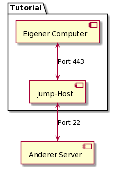

# Introduction
Dieses Tutorial beschreibt die Einrichtung und Nutzung eines einfachen SSH-Proxys,
der es erlaubt, in Umgebungen mit gesperrten Port 22 eine SSH-Verbindung zu
eigenen Servern zu nutzen. Dies hilft z. B. auf Reisen, falls der Internetzugang
in Hotels oder Ferienwohnungen beschränkt ist. Die Lesezeit beträgt etwa fünf
Minuten; die Durchführung wird etwa 45 Minuten benötigen.

Grundvoraussetzung für die Umsetzung ist ein grundlegendes Verständnis der
Unix-Kommandozeile und der Nutzung von SSH-Diensten und Proxyservern. Alle
Beispiele wurden auf einem aktuellen Debian/Ubuntu getestet. Sie sind leicht an
andere Distributionen anzupassen.

Die Nutzung des Proxys ist ebenfalls aus Sicht des Unix-Nutzers beschrieben.
Unter macOS funktioniert sie ähnlich. Für die Nutzung unter Windows sind weitere
Anpassungen notwendig, die nicht Bestandteil dieses Tutorials sind.

Das Tutorial verwendet den beispielhaften Hostnamen `v111111111111.quicksrv.de`.
Dieser ist bei der Durchführung durch den eigenen Servernamen zu ersetzen.

# Requirements
Da die vorgestellte Technik auf kurze Einsatzzeiten von Tagen bis wenigen Wochen
optimiert ist, sollte der entsprechende Server:

* Günstig sein.
* Ausreichend CPU-Leistung besitzen.
* Eine deutsche IP-Adresse haben.

Nicht relevant ist hingegen die Festplattenkapazität.

Der einfachste VPS von Netcup erfüllt diese Bedingungen komplett und ist dank
der stundenweisen Abrechnung günstig im Preis.

# Step 1 - (Buchung des VPS)
Zum Zeitpunkt der Erstellung des Tutorials ist der [VPS 200 G8][vps200g8] das
empfohlene Produkt für die Nutzung als SSH-Proxy.

Bestandskunden können das Produkt einfach und schnell hinzubuchen, Neukunden
sollten aufgrund der teilweise manuellen Überprüfungen im Prozess ein paar
Stunden Geduld mitbringen.

# Step 2 - (Grundkonfiguration des Servers)
Nach der Bereitstellung des und dem ersten Login mit dem Nutzernamen `root` und
dem per Mail übermittelten Passwort muss zuerst die Grundkonfiguration des
Servers aktualisiert werden.

1. Mittels `passwd` wird das Root-Passwort geändert.
2. Mit `apt-get update && apt-get upgrade -y` werden die aktuellen
   Sicherheitsupdates eingespielt.
3. Es ist empfehlenswert, an dieser Stelle einen SSH-Schlüssel einzurichten und
   das passwortbehaftete Login für den Nutzer root zu verbieten. Diese Vorgänge
   sind nicht Bestandteils dieses Tutorials. Informationen dazu findet man z. B.
   bei [Heise.de][heisessh]. Die spätere Funktionalität benötigt
   root-Fähigkeiten, deshalb wird an dieser Stelle auf die Einrichtung eines
   unpriveligierten Benutzers verzichtet.

# Step 3 (Konfiguration des SSH-Dämons)
Der SSH-Dämon lauscht für gewöhnlich am Port 22. Um ihn auch aus restriktiven
Netzen zugänglich zu machen, wird er so konfiguriert, dass er auch über die
Ports 443 (HTTPS) und 80 (HTTP) erreichbar wird. Diese sind für gewöhnlich nicht
oder weniger stark reglementiert, sodass eine gute Chance besteht, über diese
Ports freien Zugang zum Proxy und folglich zum Internet zu haben.

1. Die Datei `/etc/ssh/sshd_config` in einem Editor wie `vi` oder `nano` öffnen.
2. Die Zeile `Port 22` suchen. Vermutlich beginnt sie mit einem `#`, um
   anzuzeigen, dass dies die Grundkonfiguration ist.
3. Die Datei so ändern, dass an dieser Stelle steht:

    ```
    Port 22
    Port 80
    Port 443
    ```

4. Speichern und den Editor beenden.
5. Mit `systemctl restart ssh` den SSH-Dämon neu starten. Die aktuelle Sitzung
   sollte dabei bestehen bleiben.
6. Mit `ssh -p 443 root@v111111111111.quicksrv.de` kann der Erfolg der
   Konfiguration getestet werden. v111111111111.quicksrv.de bitte durch den
   eigenen Hostnamen ersetzen.

Der SSH-Dämon ist jetzt erfolgreich konfiguriert und kann über die Ports 22, 80
und 443 erreicht werden.

# Step 4 (Nutzung als SOCKS-Server)
Um Chrome oder einen anderen Browser so zu nutzen, dass er jeden
Datenverkehr über den SSH-Proxy leitet, benutzt man ihn als SOCKS-Proxy. So kann
man zum Beispiel Streaming-Diensten zeigen, dass man sich tatsächlich in
Deutschland befindet, falls die Geo-Lokalisierung der eigenen IP nicht korrekt
funktioniert. Technisch gesehen ist der eigene Rechner dabei der SOCKS-Proxy,
der den SSH-Proxy zur Weiterleitung benutzt. Deswegen wird als
(SOCKS-)Proxy-Server `localhost` angegeben (siehe Abbildung).

Man startet auf dem eigenen Rechner eine SSH-Sitzung mit dem Befehl:
`ssh -p 443 -D8080 -N root@v111111111111.quicksrv.de`. Statt
v111111111111.quicksrv.de ist der korrekte Servername einzutragen.

Anschließend startet man Chrome in einem zweiten Fenster mit dem Befehl
`google-chrome --proxy-server="socks5://localhost:8080" --host-resolver-rules="MAP * ~NOTFOUND , EXCLUDE localhost"`.
Dies führt dazu, dass Chrome den SOCKS-Proxy auch als Nameserver für die
Namensauflösung benutzt, was die Privatsphäre schützt.


# Step 5 (Nutzung als Jump-Server)
Um auf weitere Server zuzugreifen, deren SSH-Dämon nur an Port 22 (oder einem
anderen) gebunden ist, dient der Befehl
`ssh -J root@v111111111111.quicksrv.de:443 root@meinserver.de` Statt
v111111111111.quicksrv.de ist der korrekte Proxy-Servername einzutragen; statt
meinserver.de gibt man den gewünschten Server an, zu dem man sich über den Proxy
verbinden möchte.




# Conclusion
Der SSH-Proxy kann jetzt genutzt werden.  Es empfiehlt sich, beides vor der produktiven Nutzung zu testen.

# License
MIT

# Contributor's Certificate of Origin
Contributor's Certificate of Origin By making a contribution to this project, I certify that:

 1) The contribution was created in whole or in part by me and I have the right to submit it under the license indicated in the file; or

 2) The contribution is based upon previous work that, to the best of my knowledge, is covered under an appropriate license and I have the right under that license to submit that work with modifications, whether created in whole or in part by me, under the same license (unless I am permitted to submit under a different license), as indicated in the file; or

 3) The contribution was provided directly to me by some other person who certified (a), (b) or (c) and I have not modified it.

 4) I understand and agree that this project and the contribution are public and that a record of the contribution (including all personal information I submit with it, including my sign-off) is maintained indefinitely and may be redistributed consistent with this project or the license(s) involved.

Signed-off-by: Niki Hansche <mf-developing@hansche.de>
