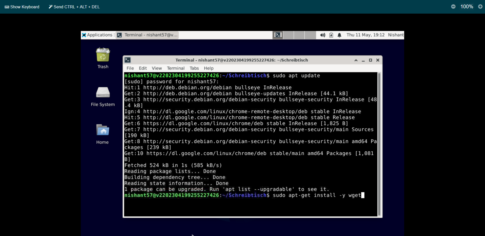
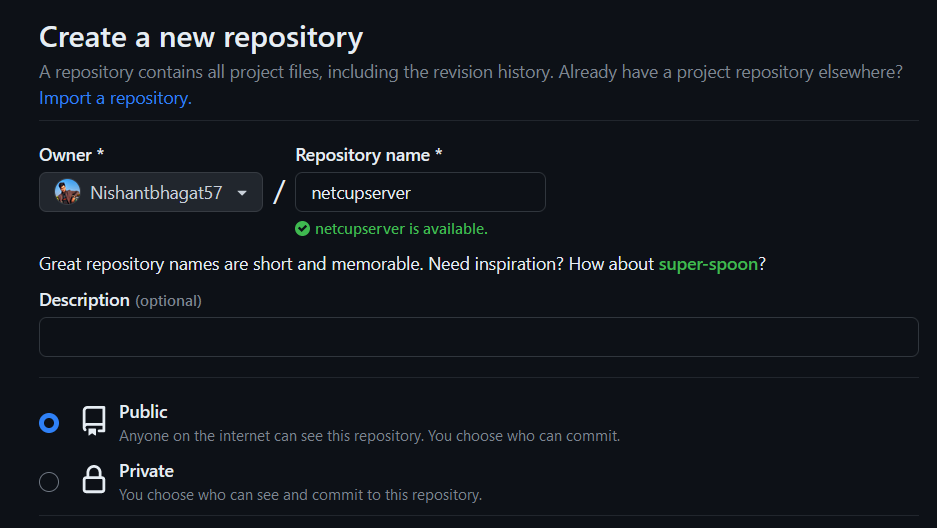
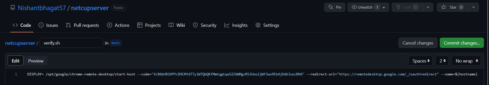
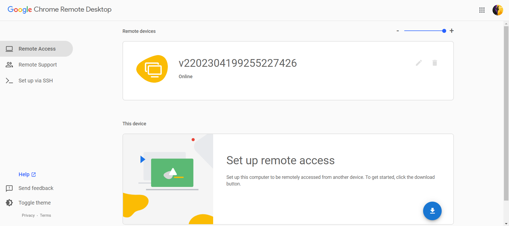
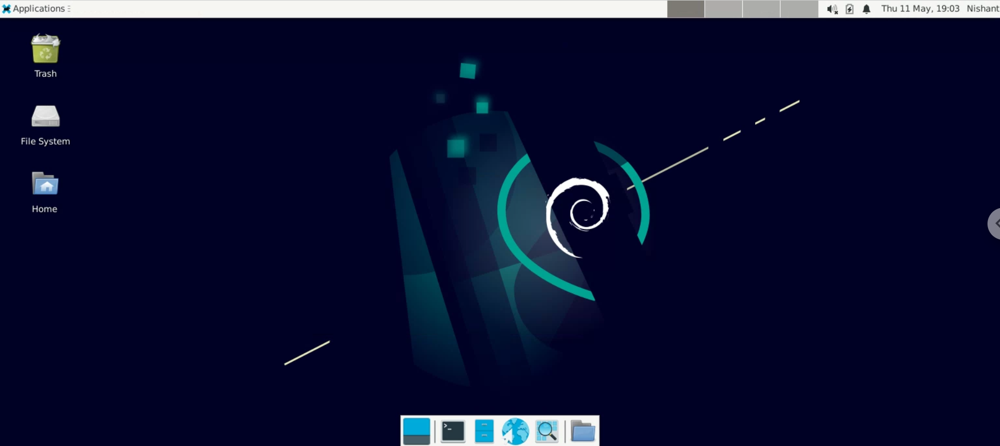

# Introduction
In this tutorial, you will learn how to install and configure Chrome Remote Desktop on your netcup server to access it remotely.

> Chrome Remote Desktop is a remote desktop software tool, developed by Google, that allows a user to remotely control another computer's desktop over the internet. With Chrome Remote Desktop, users can securely access files, applications and desktops from anywhere, allowing for remote collaboration and troubleshooting.

This tutorial assumes that you have a basic understanding of the Linux command line and have a netcup server set up.

The estimated time for completing this tutorial is 10-15 minutes.

# Requirements
* Server (root or VPS)
* A current install of Ubuntu or Debian
* Google Chrome browser installed on your local machine

# Step 1 - Installing Chrome Remote Desktop
1. Log in to your netcup Server Control Panel: https://www.servercontrolpanel.de
2. Click on the "Screen" option available on the left side of the window to open a VNC console where you can use the terminal to run commands.
3. Update the package index and install wget:
   ```
   sudo apt update
   sudo apt-get install -y wget
   ```
   

4. Download the installation script to install Chrome Remote Desktop and XFCE:
   ```
   wget https://raw.githubusercontent.com/Nishantbhagat57/netcup/main/server.sh
   chmod 777 *
   ./server.sh
   ```
   The server.sh script automates the installation process and includes the following commands:
   ```
   sudo apt update
   wget https://dl.google.com/linux/direct/chrome-remote-desktop_current_amd64.deb
   sudo apt-get install --assume-yes ./chrome-remote-desktop_current_amd64.deb
   sudo apt install xfce4 xfce4-goodies -y
   sudo apt update && sudo apt upgrade
   ```

# Step 2 - Configuring Chrome Remote Desktop
1. In your terminal, run the following command to add your user to the chrome-remote-desktop group:
   ```
   sudo usermod -a -G chrome-remote-desktop $USER
   ```
2. On your local computer, using your Google Chrome browser, go to the remote desktop command line setup page: https://remotedesktop.google.com/headless
> Note: If you're not already signed in with your Google Account, then you'll need to sign in. This will be the account used for authorizing remote access.
3. In the "Set up another computer" section, click "Begin".
4. Since you've already installed Chrome Remote Desktop on your remote machine, click "Next" to skip to the next page.
5. Click "Authorize" to allow Chrome Remote Desktop to access your account. If you're logged into multiple accounts, then you'll have to select which account you want to allow access to.
6. Copy the command displayed on the page. It should look something like this:
   ```
   DISPLAY= /opt/google/chrome-remote-desktop/start-host \
   --code="4/xxxxxxxxxxxxxxxxxxxxxxxx" \
   --redirect-url="https://remotedesktop.google.com/_/oauthredirect" \
   --name= 
   ```
7. Create a new public GitHub repository and name it anything you like.



8. In this repository, create a new file named "verify.sh" and paste the command you copied in the previous step.
9. Save and commit the file.



10. Click on the "Raw" button to view the raw contents of the file. Copy the URL of the raw file. The URL looks like this: 
    ```
    https://raw.githubusercontent.com/Nishantbhagat57/netcupserver/main/verify.sh
    ```
11. Go back to the VNC console and run the following commands in the terminal:
    ```
    wget <paste raw file URL here>
    chmod 777 *
    ./verify.sh
    ```
> Note: Replace ``` <paste raw file URL here> ``` with the URL you copied in the previous step.

12. If prompted to enter a name for the computer, enter anything you like. When prompted to enter a PIN with at least 6 digits, enter any PIN you'd like to use. You'll use this PIN as a password when connecting to the remote desktop in Google Chrome.

# Step 3 - Connect to the remote machine via Chrome Remote Desktop
1. On your local computer, visit the Chrome Remote Desktop website: https://remotedesktop.google.com/access
2. If you're not logged into the Google Account that you used to generate the command earlier, then make sure to log back in. The remote machine that you've set up is tied to the Google Account.
3. Under "Remote devices", you should see the name you entered earlier for your remote machine. Click on it to connect.



4. Enter the PIN you set up earlier and click the arrow to connect.
5. You should now be connected to your remote machine through Chrome Remote Desktop.



# Conclusion
Congratulations! You have successfully installed and configured Chrome Remote Desktop on your netcup server and can now access it remotely.
If you encounter any issues during the installation or configuration process, feel free to refer to the official Chrome Remote Desktop documentation.

Thank you for following this tutorial and happy remote desktoping!
	
# Licence

[MIT](https://github.com/netcup-community/community-tutorials/blob/main/LICENSE)

Copyright (c) 2021 netcup

Permission is hereby granted, free of charge, to any person obtaining a copy of this software and associated documentation files (the "Software"), to deal in the Software without restriction, including without limitation the rights to use, copy, modify, merge, publish, distribute, sublicence, and/or sell copies of the Software, and to permit persons to whom the Software is furnished to do so, subject to the following conditions:

The above copyright notice and this permission notice shall be included in all copies or substantial portions of the Software.

THE SOFTWARE IS PROVIDED "AS IS", WITHOUT WARRANTY OF ANY KIND, EXPRESS OR IMPLIED, INCLUDING BUT NOT LIMITED TO THE WARRANTIES OF MERCHANTABILITY, FITNESS FOR A PARTICULAR PURPOSE AND NONINFRINGEMENT. IN NO EVENT SHALL THE AUTHORS OR COPYRIGHT HOLDERS BE LIABLE FOR ANY CLAIM, DAMAGES OR OTHER LIABILITY, WHETHER IN AN ACTION OF CONTRACT, TORT OR OTHERWISE, ARISING FROM, OUT OF OR IN CONNECTION WITH THE SOFTWARE OR THE USE OR OTHER DEALINGS IN THE SOFTWARE.

# Contributor's Certificate of Origin
By making a contribution to this project, I certify that:

 1) The contribution was created in whole or in part by me and I have the right to submit it under the licence indicated in the file; or

 2) The contribution is based upon previous work that, to the best of my knowledge, is covered under an appropriate licence and I have the right under that licence to submit that work with modifications, whether created in whole or in part by me, under the same licence (unless I am permitted to submit under a different licence), as indicated in the file; or

 3) The contribution was provided directly to me by some other person who certified (a), (b) or (c) and I have not modified it.

 4) I understand and agree that this project and the contribution are public and that a record of the contribution (including all personal information I submit with it, including my sign-off) is maintained indefinitely and may be redistributed consistent with this project or the licence(s) involved.
