# Introduction

In this tutorial you will learn how to set up and run your own mail server using mailcow.  
We use [mailcow dockerized](https://github.com/mailcow/mailcow-dockerized) for this.

This tutorial is based on the [mailcow Documentation](https://mailcow.github.io/mailcow-dockerized-docs/i_u_m_install/).

# Requirements

- VPS with at least 6 GB RAM and 20 GB disk space _(without emails)_
- Debian 11 _(any distribution supported by Docker CE)_
- An own domain _(in our example `example.com`)._

# Step 1 - Preparation: Packages and Docker

First, we update the package lists and install `git` and `curl`:

```
apt update && apt upgrade
apt install git curl
```

Then, we install Docker and docker-compose:

```
curl -sSL https://get.docker.com/ | CHANNEL=stable sh
systemctl enable --now docker
```

```
curl -L https://github.com/docker/compose/releases/download/$(curl -Ls https://www.servercow.de/docker-compose/latest.php)/docker-compose-$(uname -s)-$(uname -m) > /usr/local/bin/docker-compose
chmod +x /usr/local/bin/docker-compose
```

# Step 1.1 - Preparation: Domain and hostname

Now we open the DNS management of our domain (in this example we use Cloudflare and create a new `A` record.

As type we choose `A`,  
for name (subdomain) we write `mail`,  
and for IPv4 address we specify the IPv4 address of our server,  
we set the proxy status to `DNS only` (disabled).

_If you want to use IPv6, repeat this procedure choosing an `AAAA` Record Type and point it to your IPv6 address._

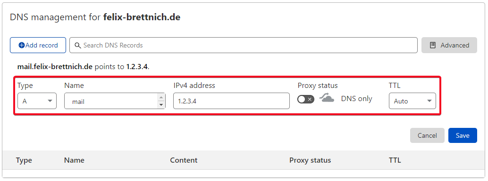

On our server, we set our domain as the hostname:

```
hostname mail.example.com
echo "mail.example.com" > /etc/hostname
```

Next, we have to set an rDNS/PTR record for our server IP address in the [netcup customer control panel](https://www.customercontrolpanel.de/?login_language=GB):

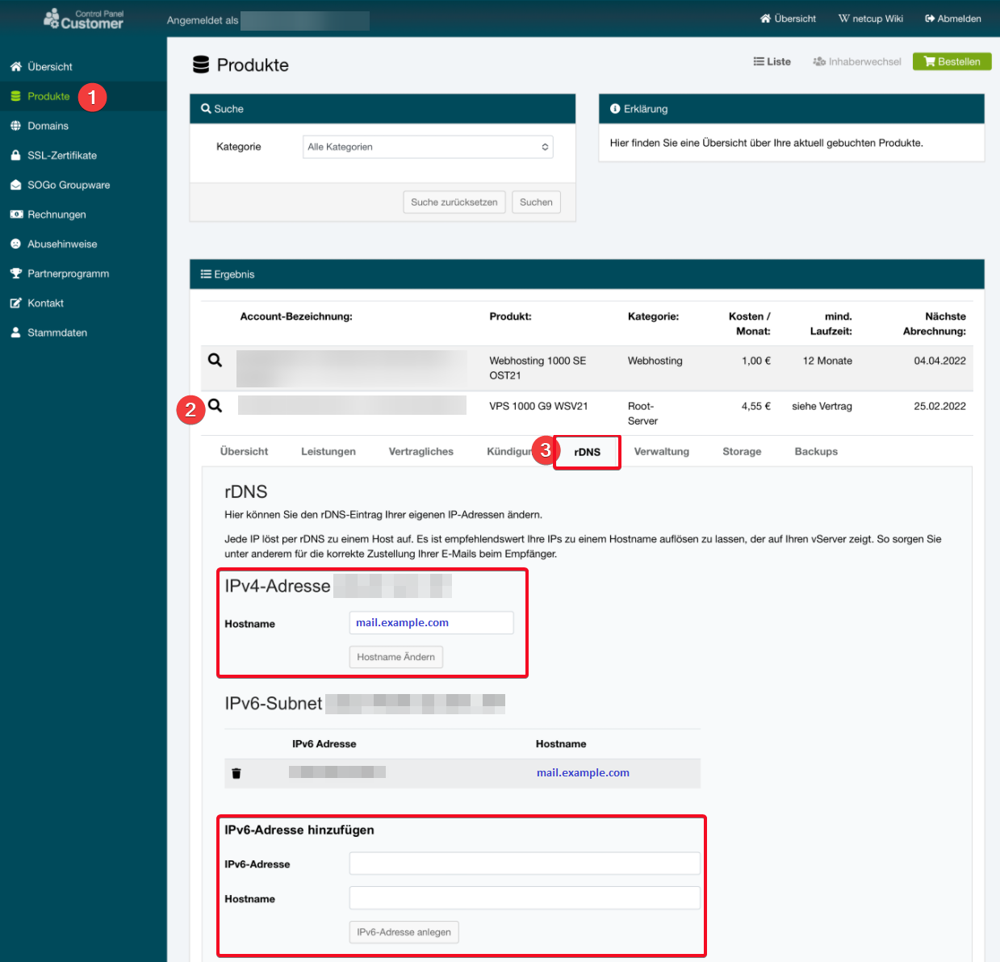

# Step 2 - Clone the mailcow repository

We switch to the folder `/opt`

```
cd /opt
```

and clone the latest version of mailcow:

```
git clone https://github.com/mailcow/mailcow-dockerized
```

# Step 3 - Configure mailcow

To configure mailcow, we change to the mailcow directory and generate the `mailcow.conf`:

```
cd mailcow-dockerized
./generate_config.sh
```

We are asked for our `mail server hostname (FQDN)`, here we enter our hostname from [step 1.1](#step-11---preparation-domain-and-hostname).

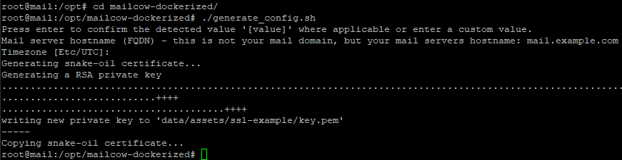

# Step 4 - Start mailcow the first time

Now we have all the basics configured and can start mailcow for the first time:

```
docker-compose pull
docker-compose up -d
```

After a few seconds, we find the mailcow webinterface at `https://mail.example.com`.  
To log in, we use `admin` _(username)_ and `moohoo` _(password)_.

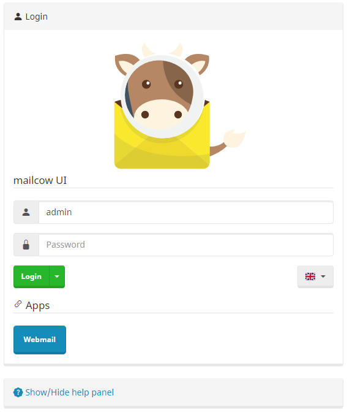

# Step 4.1 - Change mailcow admin password

It is important that you change the admin password as soon as possible!  
Go to `Access` and click on `Edit` for your admin user, there you can set a new password:

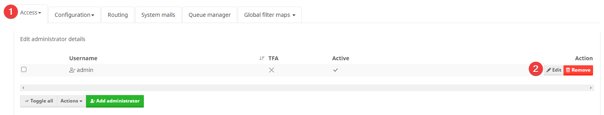

# Step 5 - Setting up a new domain: mailcow

To be able to send and receive emails, we need to add the domain in mailcow.  
For this we go to the webinterface and navigate to `Configuration` => `Email Setup` and click `Add domain`:

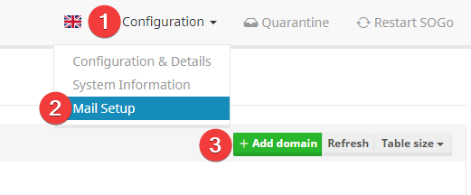

There we enter our domain `example.com` and click `Add domain and restart SOGo`.

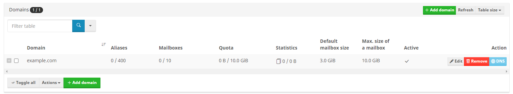

To create a new mailbox, we go to `Mailboxes` and click `Add mailbox`:

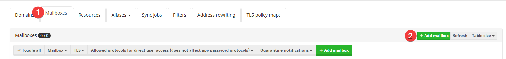

Here we enter a `Username` (left part of the email address) and set a password:

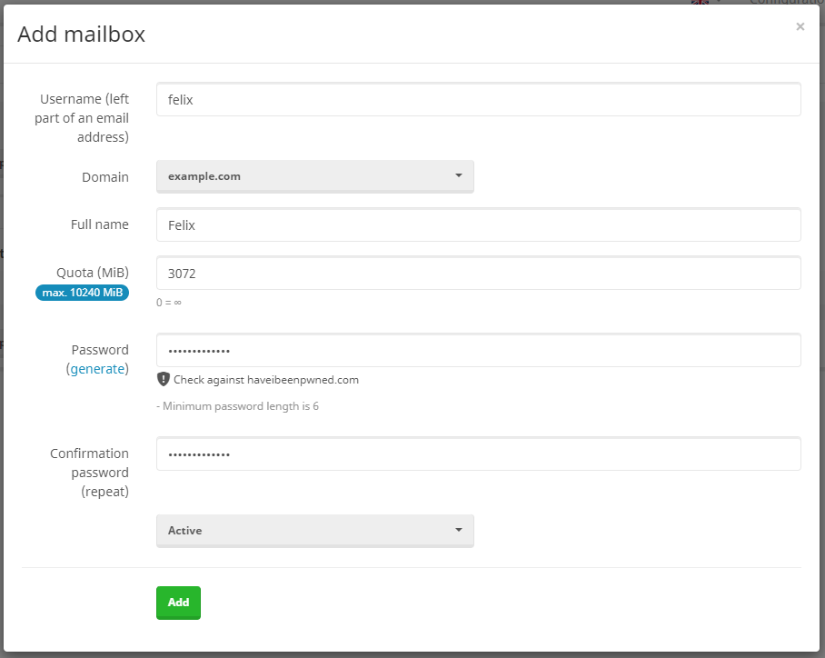

# Step 5.1 - Setting up a new domain: DNS

In order to be able to receive and send emails, we also have to create some DNS records for the domain.  
For this we switch back to the DNS management of our domain and create the following records:

**MX Record**  
Type: `MX`  
Name: `@` / `example.com`  
Mailserver / Target: `mail.example.com`  
Priority: `10`

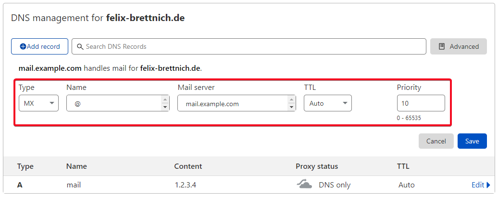

---

**TXT Record (SPF)**  
Type: `TXT`  
Name: `@` / `example.com`  
Content: `v=spf1 +a +mx +a:mail.example.com -all`

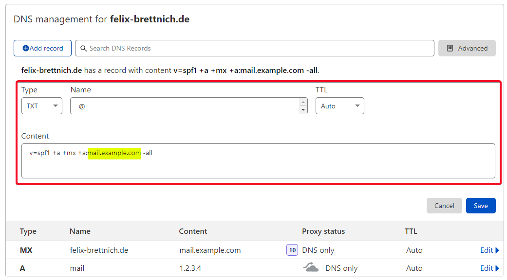

---

**TXT Record (dmarc)**  
Type: `TXT`  
Name: `_dmarc`  
Content: `v=DMARC1; p=none`

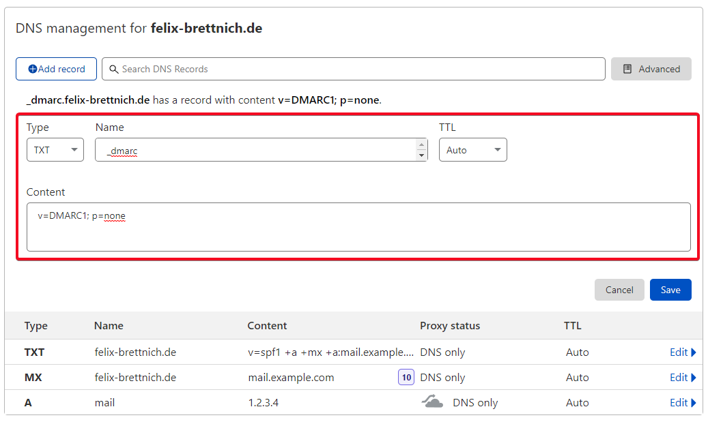

---

For the next DNS entry we need further information from the mailcow webinterface.  
For this we navigate to `Configuration` => `Server Configuration` => `Configuration` => `ARC/DKIM-Keys`.  
There we copy the DKIM public key of our domain:

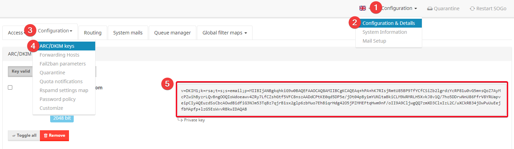

**TXT Record (dkim)**  
Type: `TXT`  
Name: `dkim._domainkey`  
Content: `<Our DKIM public key from the mailcow webinterface>`

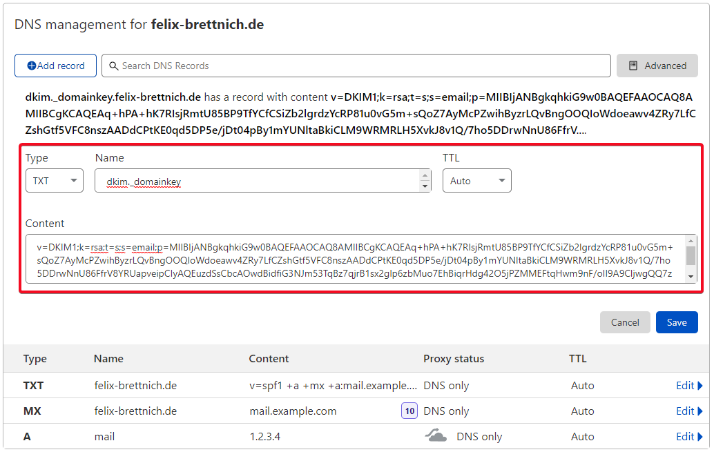

# Conclusion

Great! You have successfully set up and configured your own mail server with mailcow.  
You can now send and receive emails with your own domain.

The best way to test this is to open the webmail client in mailcow:

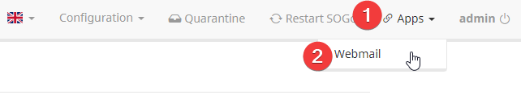

To log in, use your username / email and the password you defined.

For example, you can send an email to [mail-tester.com](https://www.mail-tester.com/) and see what score you get. Ideal would be 10/10.

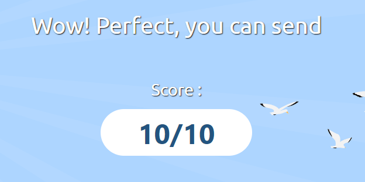

# License

MIT

# Contributor's Certificate of Origin

By making a contribution to this project, I certify that:

1.  The contribution was created in whole or in part by me and I have the right to submit it under the license indicated in the file; or

2.  The contribution is based upon previous work that, to the best of my knowledge, is covered under an appropriate license and I have the right under that license to submit that work with modifications, whether created in whole or in part by me, under the same license (unless I am permitted to submit under a different license), as indicated in the file; or

3.  The contribution was provided directly to me by some other person who certified (a), (b) or (c) and I have not modified it.

4.  I understand and agree that this project and the contribution are public and that a record of the contribution (including all personal information I submit with it, including my sign-off) is maintained indefinitely and may be redistributed consistent with this project or the license(s) involved.

Signed off by: fbrettnich <github@fbrettnich.de>
