# Einführung

In diesem Tutorial erfährst du, wie du deinen eigenen Mailserver mithilfe von mailcow aufsetzen und betreiben kannst.  
Wir verwenden hierfür [mailcow dockerized](https://github.com/mailcow/mailcow-dockerized).

Dieses Tutorial basiert auf der [mailcow Dokumentation](https://mailcow.github.io/mailcow-dockerized-docs/i_u_m_install/).

# Anforderungen

- VPS mit mindestens 6 GB RAM und 20 GB Speicherplatz _(ohne E-Mails)_
- Debian 11 _(jede von Docker CE unterstützte Distribution)_
- Eine eigene Domain _(in unserem Beispiel `example.com`)_

# Schritt 1 - Vorbereitung: Pakete und Docker

Zu Beginn aktualisieren wir die Paketlisten und installieren `git` und `curl` mit:

```
apt update && apt upgrade
apt install git curl
```

Anschließend installieren wir Docker und Docker Compose:

```
curl -sSL https://get.docker.com/ | CHANNEL=stable sh
systemctl enable --now docker
```

```
curl -L https://github.com/docker/compose/releases/download/$(curl -Ls https://www.servercow.de/docker-compose/latest.php)/docker-compose-$(uname -s)-$(uname -m) > /usr/local/bin/docker-compose
chmod +x /usr/local/bin/docker-compose
```

# Schritt 1.1 - Vorbereitung: Domain und Hostname

Nun öffnen wir die DNS-Verwaltung unserer Domain (in diesem Beispiel verwenden wir [Cloudflare](https://www.cloudflare.com/de-de/)) und legen einen neuen `A`-Eintrag an.

Als `Type` wählen wir `A`,  
bei `Name` (Subdomain) schreiben wir `mail`,  
und bei `IPv4 adress` geben wir die IPv4-Adresse unseres Servers an,  
den `Proxy status` setzen wir auf `DNS only` (deaktiviert).  

_Bei Bedarf können wir diesen Eintrag auch für unsere IPv6-Adresse wiederholen. Dafür verwenden wir Type `AAAA` und unsere IPv6-Adresse._  

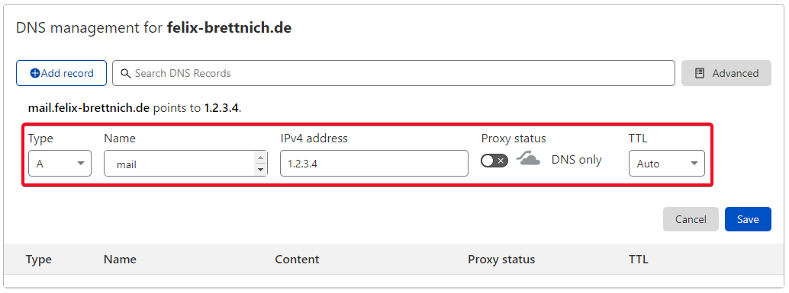

Auf unserem Server setzen wir unsere Domain als Hostname:

```
hostname mail.example.com
echo "mail.example.com" > /etc/hostname
```

Anschließend müssen wir für unsere Server-IP-Adresse noch einen rDNS/PTR-Eintrag im [netcup Customer Control Panel](https://www.customercontrolpanel.de/?login_language=DE) setzen:  

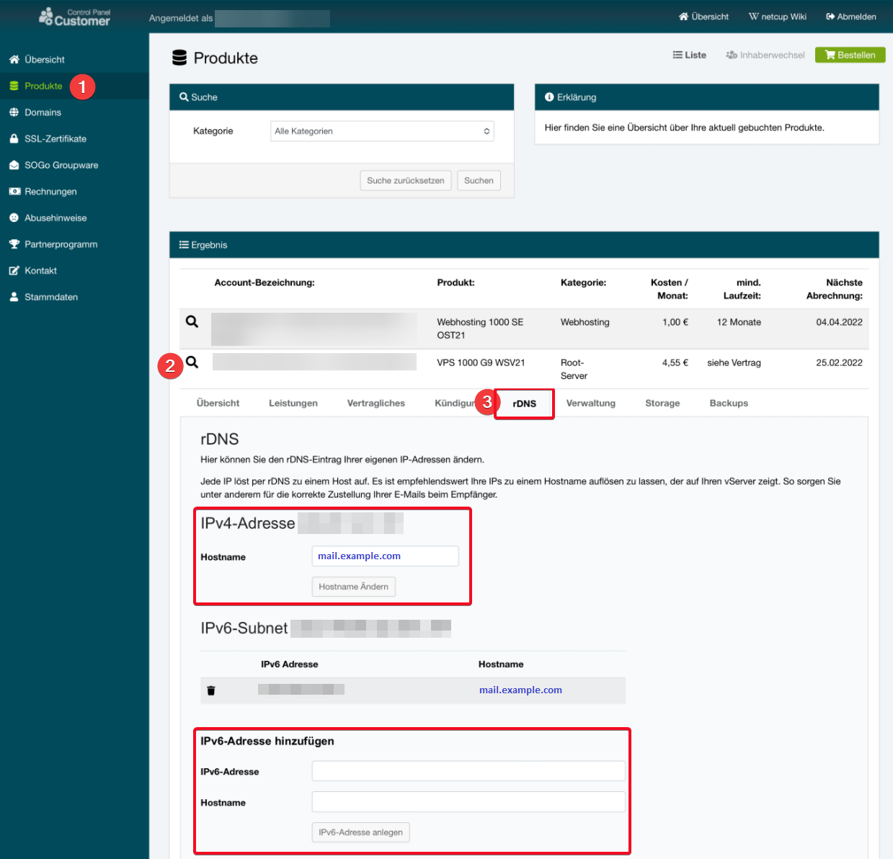

# Schritt 2 - Klonen des mailcow Repository

Wir wechseln in den Ordner `/opt`

```
cd /opt
```

und klonen uns hier die neueste Version von mailcow:

```
git clone https://github.com/mailcow/mailcow-dockerized
```

# Schritt 3 - Mailcow konfigurieren

Um mailcow zu konfigurieren, wechseln wir in das mailcow-Verzeichnis und generieren uns die `mailcow.conf`:

```
cd mailcow-dockerized
./generate_config.sh
```

Wir werden nach unserem `mail server hostname (FQDN)` gefragt, hier geben wir unseren Hostnamen aus [Schritt 1.1](#schritt-11---vorbereitung-domain-und-hostname) an.


# Schritt 4 - Mailcow das erste Mal starten

Jetzt haben wir alle Basics konfiguriert und können mailcow das erste Mal starten:

```
docker-compose pull
docker-compose up -d
```

Wir finden das mailcow-Webinterface jetzt unter `https://mail.example.com`.  
Zum Anmelden verwenden wir `admin` _(Benutzername)_ und `moohoo` _(Passwort)_.

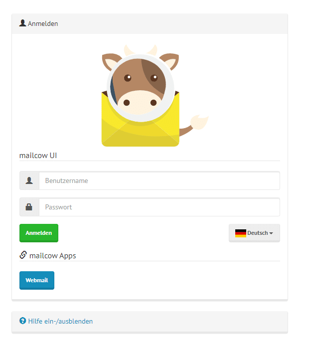

# Schritt 4.1 - Mailcow Admin-Passwort ändern

Es ist wichtig, dass du das Admin-Passwort schnellstmöglich änderst!  
Gehe dafür auf `Zugang` und klicke bei deinem Admin-Benutzer auf `Bearbeiten`, dort kannst du ein neues Passwort festlegen:

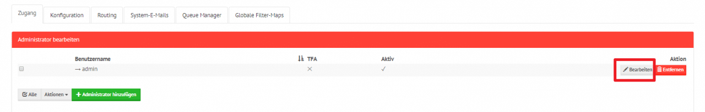

# Schritt 5 - Einrichten einer neuen Domain: mailcow

Um E-Mails versenden und empfangen zu können, müssen wir die Domain in mailcow hinzufügen.  
Dafür gehen wir im Webinterface auf `Konfiguration` => `E-Mail-Setup` und klicken `Domain hinzufügen`:  

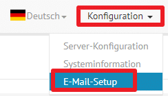

Dort tragen wir unsere Domain `example.com` ein und klicken `Domain hinzufügen und SOGo neustarten`.  

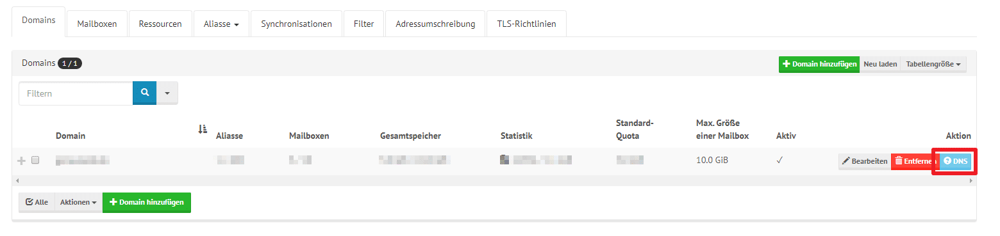

Um eine neue Mailbox anzulegen, gehen wir auf `Mailboxen` und klicken `Mailbox hinzufügen`:  

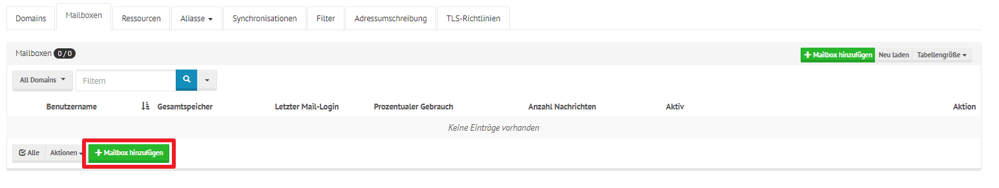

Hier geben wir einen `Benutzername` (linker Teil der E-Mail-Adresse) ein und setzen ein Passwort:  

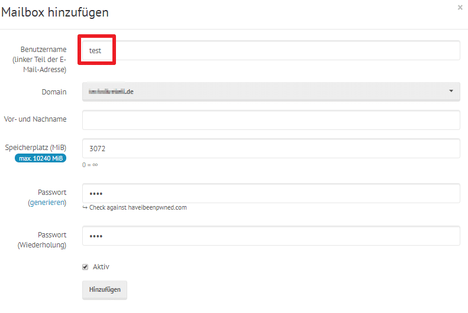

# Schritt 5.1 - Einrichten einer neuen Domain: DNS

Damit wir E-Mails auch empfangen und richtig versenden können, müssen wir noch einige DNS-Einträge für die Domain anlegen.  
Dafür wechseln wir wieder in die DNS-Verwaltung unserer Domain und legen folgende Einträge an:  

**MX-Eintrag**  
Type: `MX`  
Name: `@` / `example.com`  
Mail server / target: `mail.example.com`  
Priority: `10`  

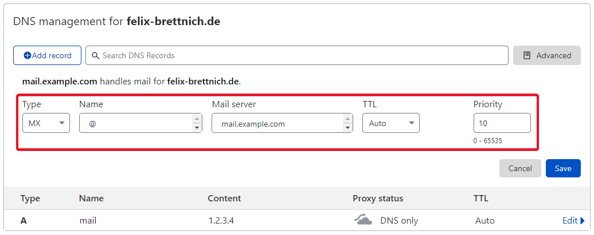

---

**TXT-Eintrag (SPF)**  
Type: `TXT`  
Name: `@` / `example.com`  
Content: `v=spf1 +a +mx +a:mail.example.com -all`  

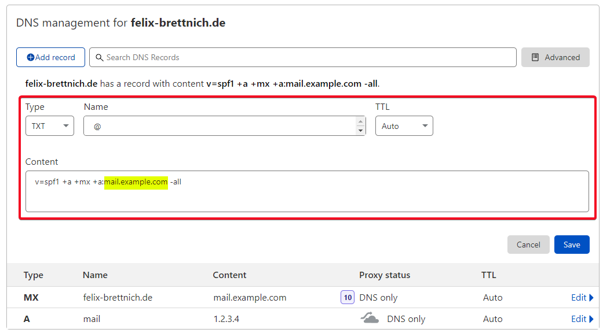

---

**TXT-Eintrag (dmarc)**  
Type: `TXT`  
Name: `_dmarc`  
Content: `v=DMARC1; p=none`  

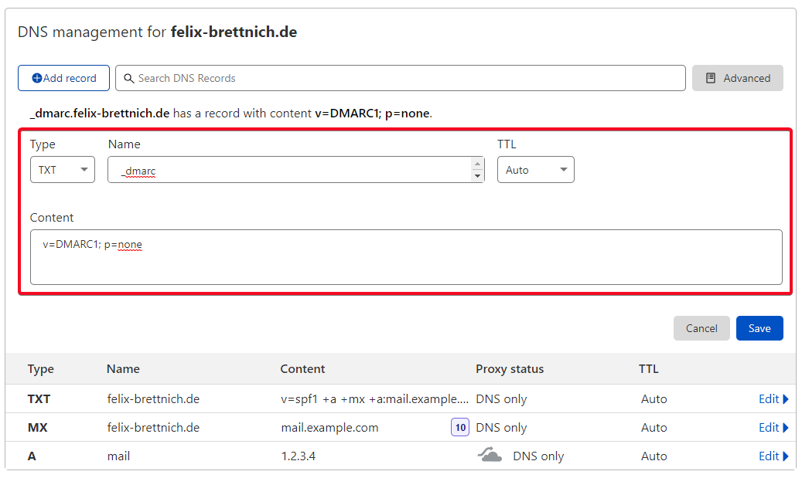

---

Für den nächsten DNS-Eintrag brauchen wir weitere Informationen aus dem mailcow-Webinterface.  
Dafür gehen wir unter `Konfiguration` => `Server Konfiguration` => `Konfiguration` auf `ARC/DKIM-Keys`.  
Dort kopieren wir uns den DKIM-Public-Key unserer Domain:  

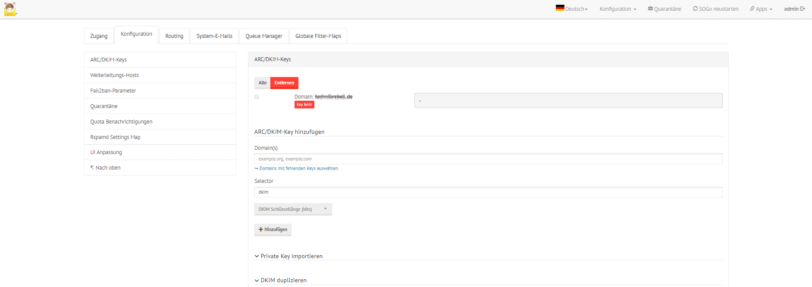

**TXT-Eintrag (dkim)**  
Type: `TXT`  
Name: `dkim._domainkey`  
Content: `<Unser DKIM Public Key aus dem mailcow-Webinterface>`  

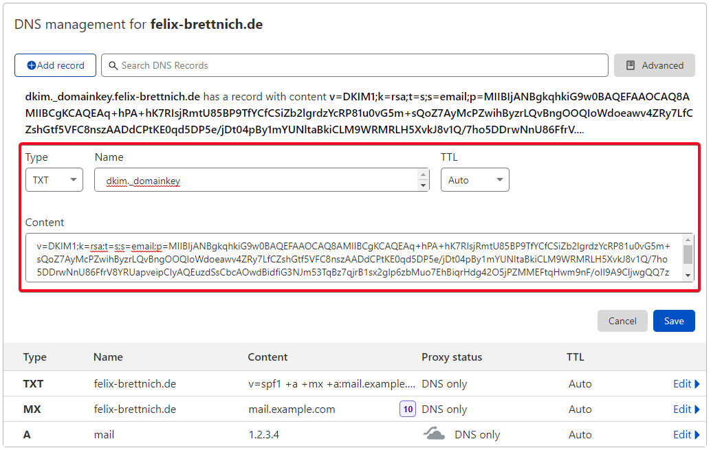

# Fazit

Super! Du hast erfolgreich deinen eigenen Mailserver mit mailcow aufgesetzt und konfiguriert.  
Du kannst jetzt mit deiner eigenen Domain E-Mails versenden und empfangen.  

Am besten testest du das ganze einmal aus und öffnest dafür in mailcow den Webmail-Client:  

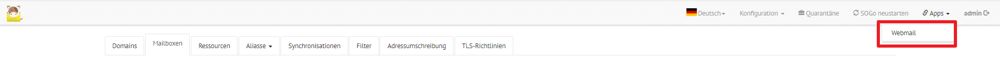  

Zum Anmelden verwendest du deinen Benutzernamen / deine E-Mail-Adresse und das festgelegte Passwort.  

Du kannst zum Beispiel eine E-Mail an [mail-tester.com](https://www.mail-tester.com/) senden und schauen, welche Punktzahl du erreichst. Ideal wäre hier 10/10.  


# License

Permission is hereby granted, free of charge, to any person obtaining a copy of this software and associated documentation files (the "Software"), to deal in the Software without restriction, including without limitation the rights to use, copy, modify, merge, publish, distribute, sublicence, and/or sell copies of the Software, and to permit persons to whom the Software is furnished to do so, subject to the following conditions:

The above copyright notice and this permission notice shall be included in all copies or substantial portions of the Software.

THE SOFTWARE IS PROVIDED "AS IS", WITHOUT WARRANTY OF ANY KIND, EXPRESS OR IMPLIED, INCLUDING BUT NOT LIMITED TO THE WARRANTIES OF MERCHANTABILITY, FITNESS FOR A PARTICULAR PURPOSE AND NONINFRINGEMENT. IN NO EVENT SHALL THE AUTHORS OR COPYRIGHT HOLDERS BE LIABLE FOR ANY CLAIM, DAMAGES OR OTHER LIABILITY, WHETHER IN AN ACTION OF CONTRACT, TORT OR OTHERWISE, ARISING FROM, OUT OF OR IN CONNECTION WITH THE SOFTWARE OR THE USE OR OTHER DEALINGS IN THE SOFTWARE.

# Contributor's Certificate of Origin

Contributor's Certificate of Origin By making a contribution to this project, I certify that:

 1) The contribution was created in whole or in part by me and I have the right to submit it under the license indicated in the file; or

 2) The contribution is based upon previous work that, to the best of my knowledge, is covered under an appropriate license and I have the right under that license to submit that work with modifications, whether created in whole or in part by me, under the same license (unless I am permitted to submit under a different license), as indicated in the file; or

 3) The contribution was provided directly to me by some other person who certified (a), (b) or (c) and I have not modified it.

 4) I understand and agree that this project and the contribution are public and that a record of the contribution (including all personal information I submit with it, including my sign-off) is maintained indefinitely and may be redistributed consistent with this project or the license(s) involved.
