# Introduction

In this tutorial you will learn how to set up your own Node.JS web server. For this we use Netcup's hosting package: [EiWoMiSau](https://www.netcup.eu/bestellen/produkt.php?produkt=2042).

# Requirements

- Netcup hosting package: [EiWoMiSau](https://www.netcup.eu/bestellen/produkt.php?produkt=2042)
- An own domain already linked to the hosting package incl. [set up SSL certificate](https://helpcenter.netcup.com/en/wiki/web-hosting/enabling-ssl-tls) _(in our example `pentagame-online.de`)_

# Step 1 - Prepare: Host name

In order to be able to use the domain `pentagame-online.de` for various purposes, we first set up the following subdomain: `nodejs-tutorial.pentagame-online.de`.

To do this, we open the Plesk overview of our hosting package and press the [Add Subdomain] button in the dialog for [Websites & Domains].

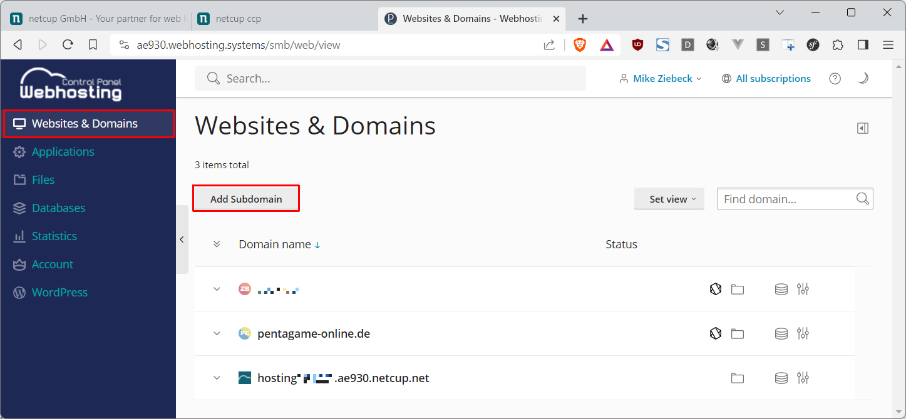

After we have defined `nodejs-tutorial` and `pentagame-online.de` for the name of the subdomain, we make sure, under document root that it matches the subdomain exactly with `/nodejs-tutorial.pentagame-online.de/drop.me`.

**Attention:** 
- In addition, the subdirectory `drop.me` refers to the location where Netcup will store the default welcome page, which we **must delete later**.  

- This setting can **only be defined once here**.

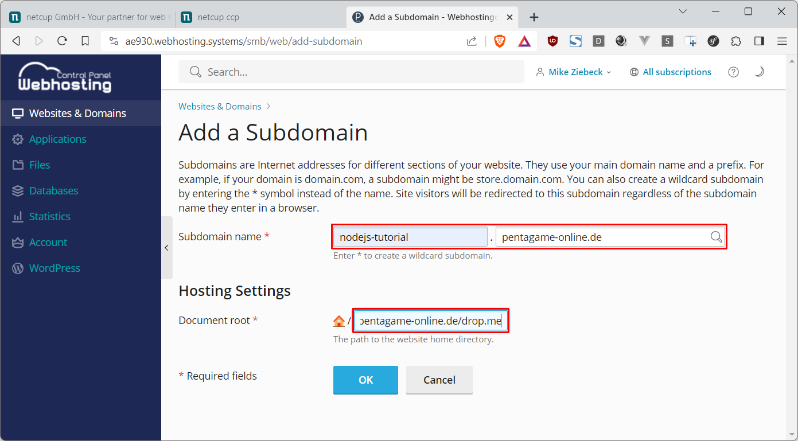

Below we are redirected to the Plesk overview of our new subdomain.

# Step 2 - Prepare: SSL Certificate

Then we continue by clicking on [SSL/TLS Certificates].

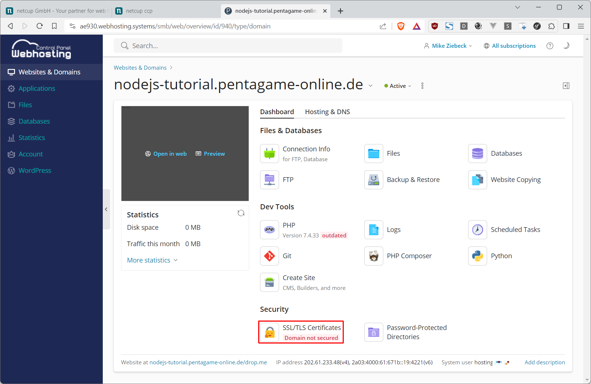

In the following, I assume that a [Let's Encrypt certificate has already been set up for the domain `pentagame-online.de` as described here.](https://helpcenter.netcup.com/en/wiki/web-hosting/enabling-ssl-tls)

Therefore, continue immediately with [Manage].


Here we can save our certificate **temporarily** in *.pem format locally using the download button on the right-hand side.


And then make it available for the subdomain with [Upload .pem file].

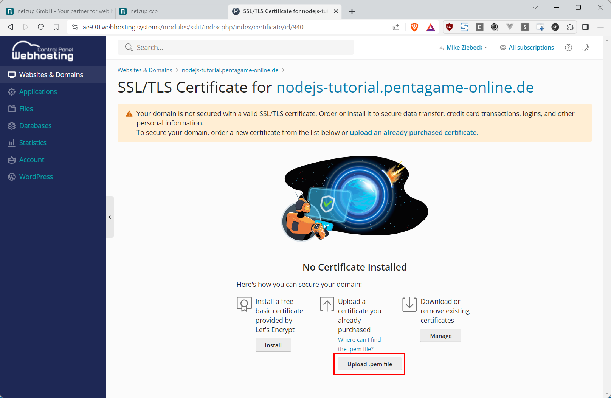

With the set certificate, incoming requests can now also be successfully [Redirect(ed) from http to https]. And by clicking on the domain name, we can quickly return to the overview.


# Step 3 - Set up: Node.JS
Here we add with [Create Site] ...


... [Node.JS] to our website.

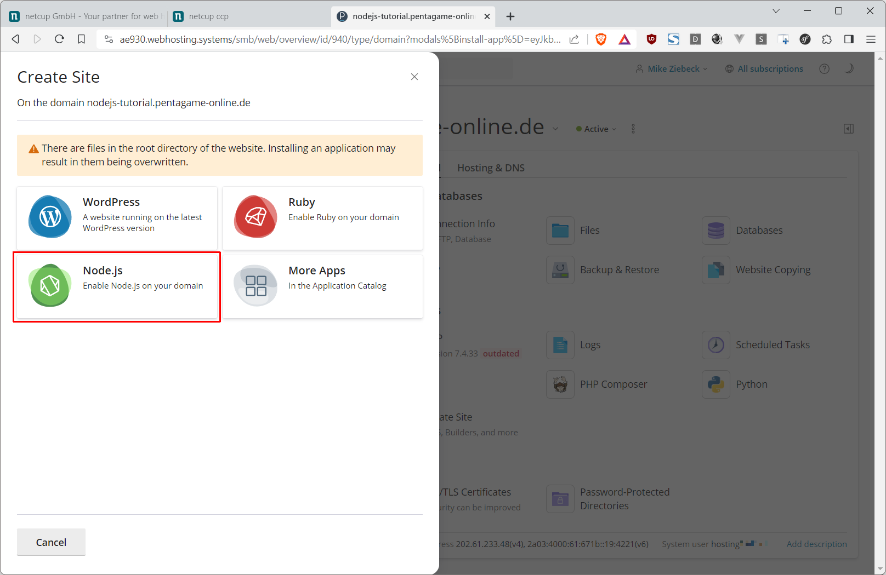

In order to receive more helpful debugger messages later in the event of runtime errors, we set the application mode to [development] and then click on [Enable Node.js].


# Step 4 - Troubleshooting
### Error: app.js not found

The error message that now appears was actually the same in [production] mode. ;-) Regardless of this, it tells us that now is the time to create a Node.JS app first.

And for this we open the [File Manager].

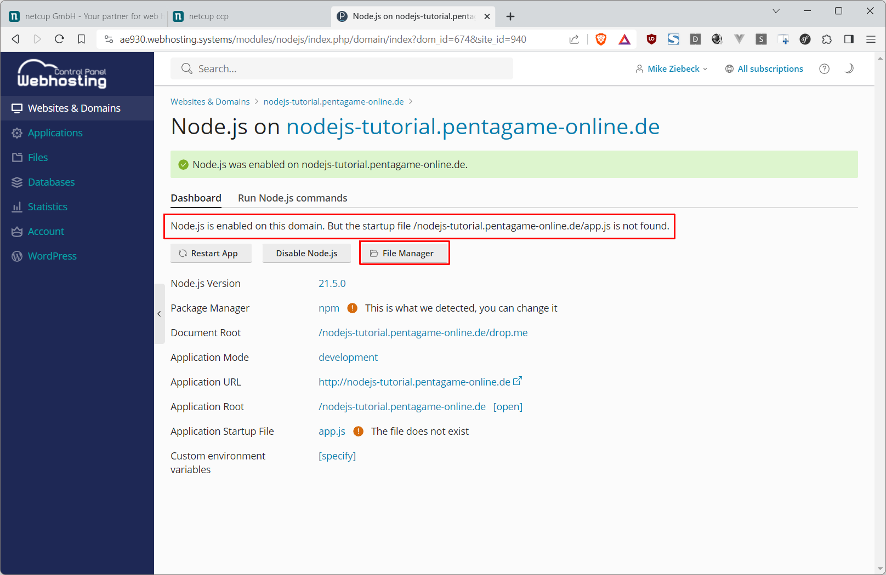

Then we navigate to the parent directory of `drop.me`.

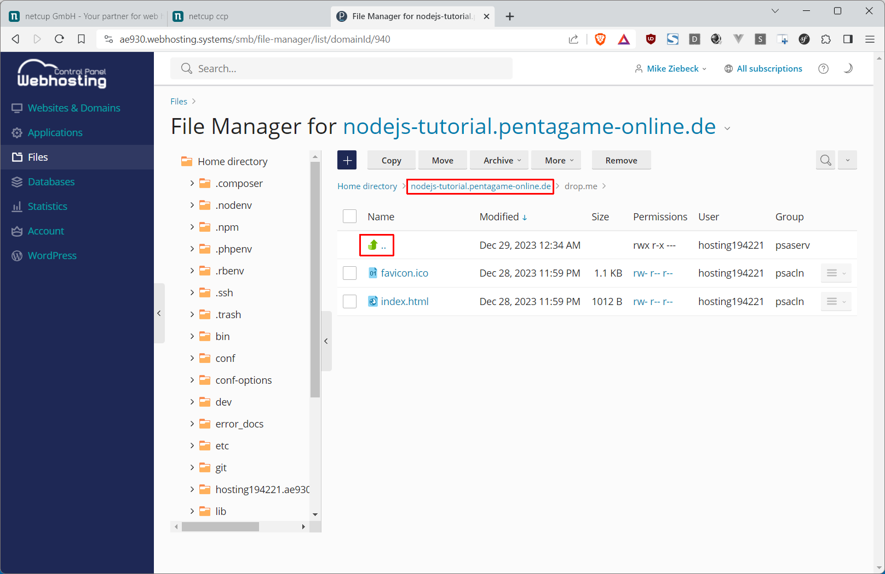

And create the new file `app.js` there.

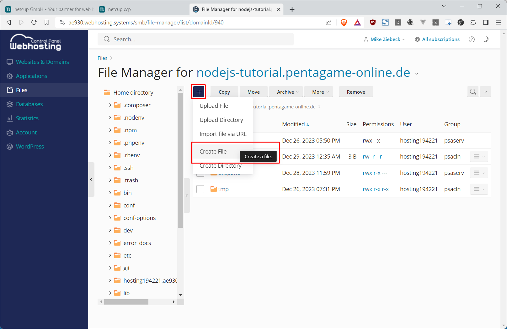


We open the code editor for the newly created `app.js` file.

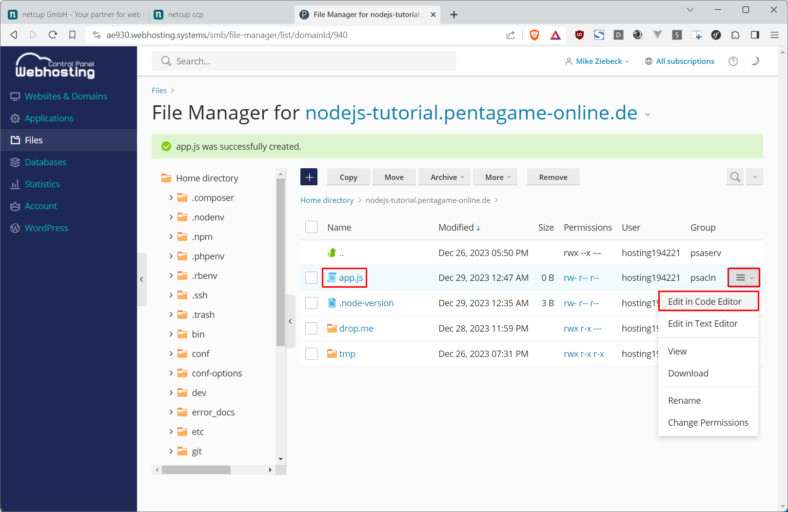

And enter the following example source code.
```js
const http = require('http');

const port = process.env.PORT || 3000;

http.createServer(function(request, response) {
  response.writeHead(200, {'Content-Type': 'text/plain'});
  response.end("Hello, World!\n");
}).listen(port);

console.log(`App is running... (port: ${port})`);
```

In terms of content, we create an HTTP web server that responds to all browser requests on port `3000` with status code `200` (OK) and the message: `Hello, World!` of mime type: `text/plain`. However, the port can be freely selected, as it will later be used automatically by NGINX for forwarding HTTP/HTTPS requests.  

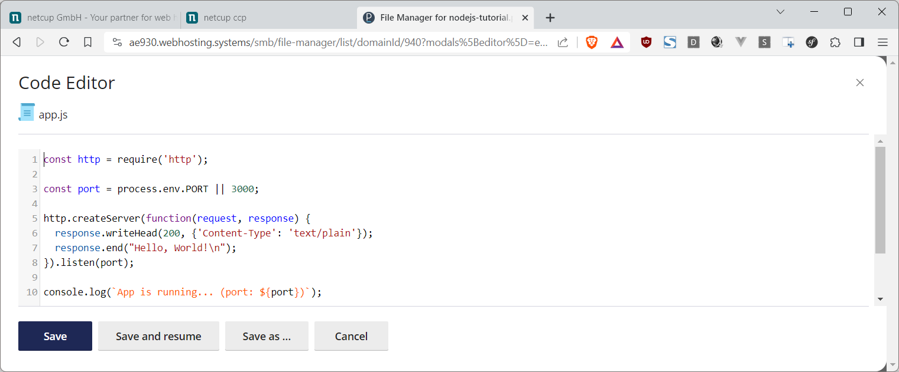

Back in the Node.js settings for our subdomain, we try out the "Application URL" with one click.


### Error: "Hier (still) entsteht eine neue Webseite"

But the default welcome page of our hosting package appears.


This is because the primary NGINX server still passes **all** requests to the Apache web server (which can also interpret PHP). So next we disconnect the two.

To do this, we go back to [Websites & Domains] and to our subdomain `nodejs-tutorial.pentagame-online.de`, where we click on the [Hosting & DNS] tab.

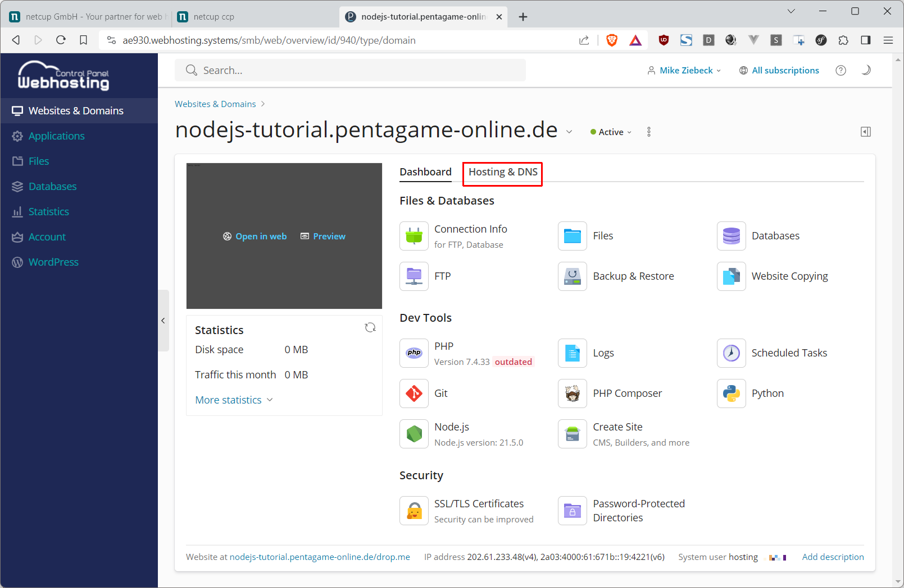

Then we call up the setup for [Apache & nginx],


... scroll down to nginx settings,

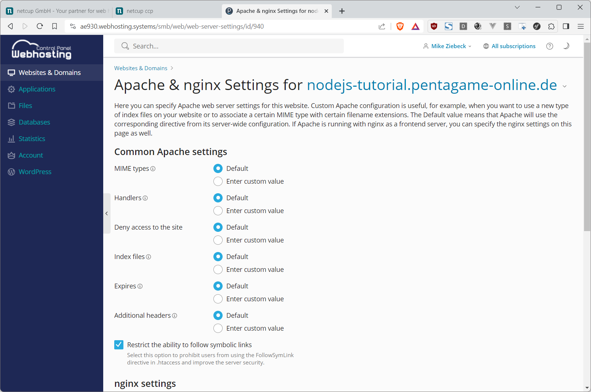

and deactivate the [Proxy mode].

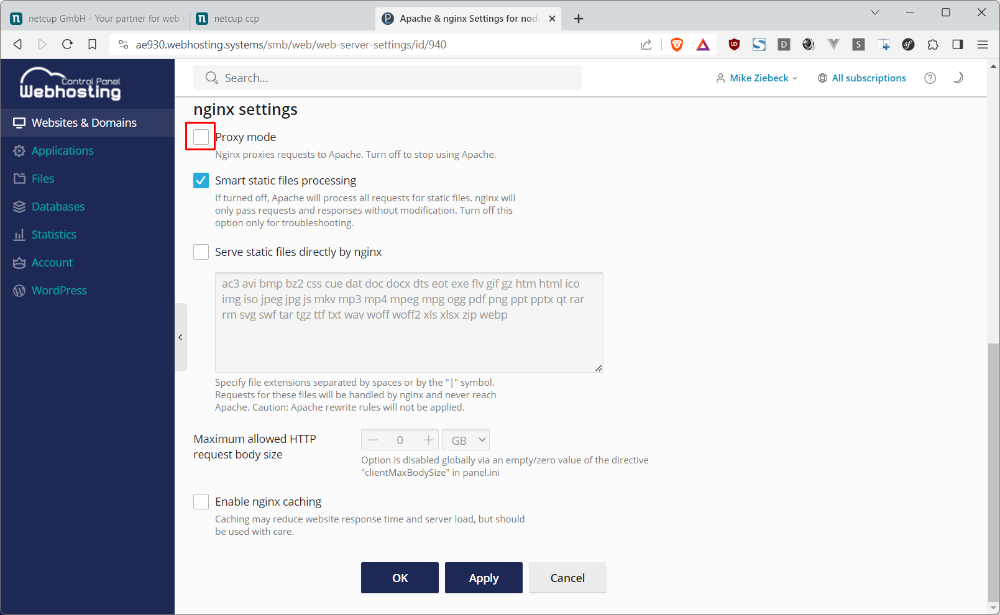

Back in the [Dashboard] tab, we open the file manager with [Files].

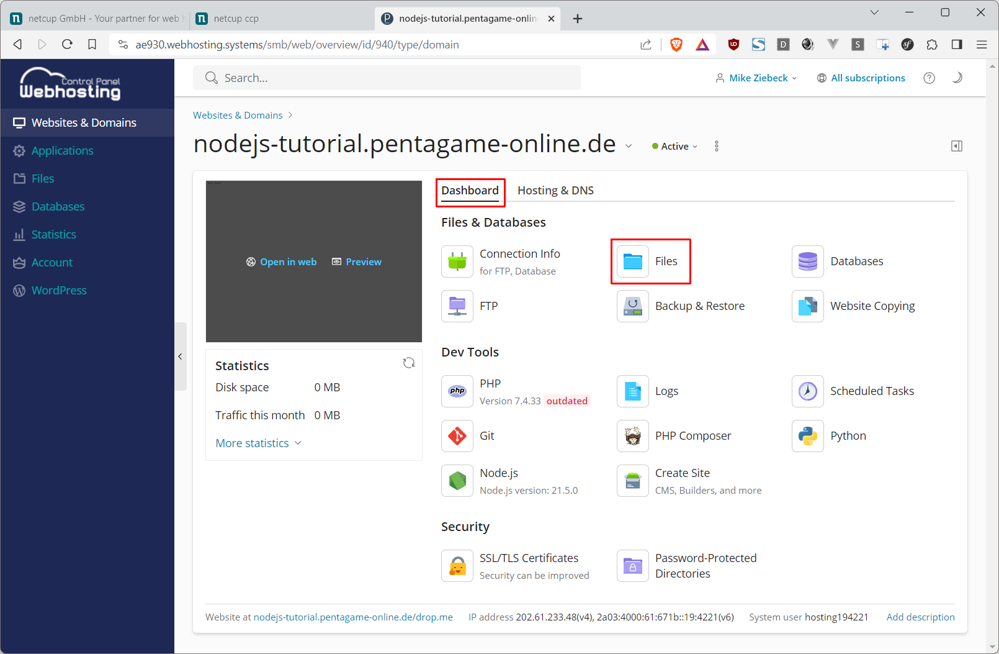

Then we navigate again to the document root directory of our subdomain. And remove the folder `drop.me` from it, as mentioned at the beginning.


Back in the Plesk overview of our subdomain, we can once again see the result of the Node.JS app [Open in web].

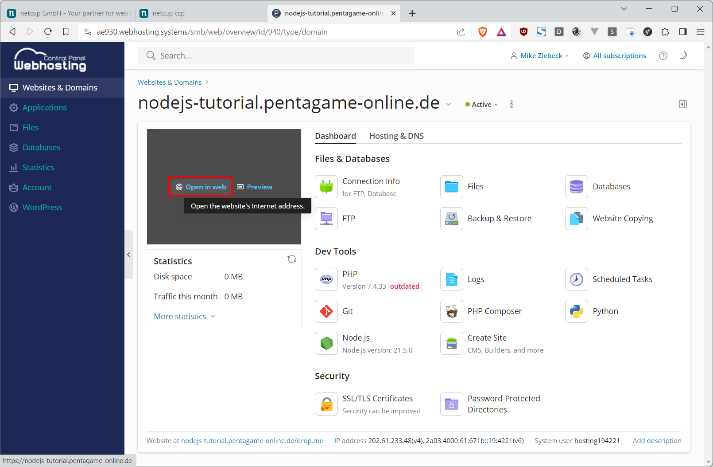

You are probably still seeing the standard welcome page, just like me. But a reload in the browser...


... then delivers as expected:


# Conclusion

Great! You have now successfully made your subdomain fit for the use of your own Node.JS web server.

It's best to test the server's limits, which are still quite narrow at the moment, and
- extend it via package management, e.g. with the [Express Server Framework for Node.JS](https://expressjs.com/en)
- and/or add a MySQL database connection
- or use the Git repository feature of Plesk

# License

Permission is hereby granted, free of charge, to any person obtaining a copy of this software and associated documentation files (the "Software"), to deal in the Software without restriction, including without limitation the rights to use, copy, modify, merge, publish, distribute, sublicence, and/or sell copies of the Software, and to permit persons to whom the Software is furnished to do so, subject to the following conditions:

The above copyright notice and this permission notice shall be included in all copies or substantial portions of the Software.

THE SOFTWARE IS PROVIDED "AS IS", WITHOUT WARRANTY OF ANY KIND, EXPRESS OR IMPLIED, INCLUDING BUT NOT LIMITED TO THE WARRANTIES OF MERCHANTABILITY, FITNESS FOR A PARTICULAR PURPOSE AND NONINFRINGEMENT. IN NO EVENT SHALL THE AUTHORS OR COPYRIGHT HOLDERS BE LIABLE FOR ANY CLAIM, DAMAGES OR OTHER LIABILITY, WHETHER IN AN ACTION OF CONTRACT, TORT OR OTHERWISE, ARISING FROM, OUT OF OR IN CONNECTION WITH THE SOFTWARE OR THE USE OR OTHER DEALINGS IN THE SOFTWARE.

# Contributor's Certificate of Origin

Contributor's Certificate of Origin By making a contribution to this project, I certify that:

 1) The contribution was created in whole or in part by me and I have the right to submit it under the license indicated in the file; or

 2) The contribution is based upon previous work that, to the best of my knowledge, is covered under an appropriate license and I have the right under that license to submit that work with modifications, whether created in whole or in part by me, under the same license (unless I am permitted to submit under a different license), as indicated in the file; or

 3) The contribution was provided directly to me by some other person who certified (a), (b) or (c) and I have not modified it.

 4) I understand and agree that this project and the contribution are public and that a record of the contribution (including all personal information I submit with it, including my sign-off) is maintained indefinitely and may be redistributed consistent with this project or the license(s) involved.
