# Einführung

In diesem Tutorial erfährst Du, wie Du Deinen eigenen Node.js Webserver aufsetzen kannst.  
Hierfür verwenden wir netcup's Hosting Paket: [EiWoMiSau](https://www.netcup.de/bestellen/produkt.php?produkt=2042).

# Anforderungen

- netcup Hosting Paket: [EiWoMiSau](https://www.netcup.de/bestellen/produkt.php?produkt=2042)
- Eine bereits mit dem Hosting Paket verknüpfte eigene Domain incl. [eingerichtetem SSL-Zertifikat](https://helpcenter.netcup.com/de/wiki/webhosting/ssl-verschluesselung-webhosting) _(in unserem Beispiel `pentagame-online.de`)_

# Schritt 1 - Vorbereitung: Hostname

Um die Domain `pentagame-online.de` für verschiedene Zwecke nutzen zu können, richten wir zuerst folgende Subdomain ein: `nodejs-tutorial.pentagame-online.de`.

Hierfür öffnen wir die Plesk Übersicht unseres Hosting Paketes und drücken im Dialog für [Websites & Domains] den Button [Subdomain hinzufügen].

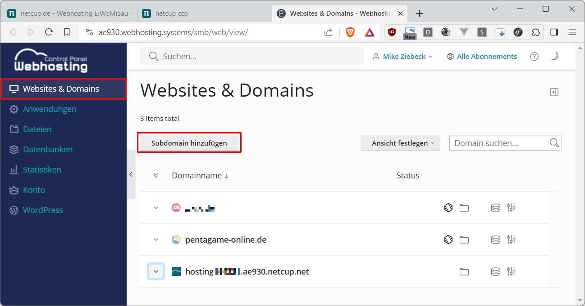

Nachdem wir für den Namen der Subdomain `nodejs-tutorial` und `pentagame-online.de` festgelegt haben, stellen wir unter Dokumentstamm sicher, dass dieser mit `/nodejs-tutorial.pentagame-online.de/drop.me` genau zur Subdomain passt.

**Achtung:** 
- Darüber hinaus verweist das Unterverzeichnis `drop.me` auf den Ort, an dem netcup die Standard Begrüßungsseite ablegen wird, welche wir **später aber löschen müssen**.  
- Diese Einstellung ist **nur einmal hier** festlegbar.


Nachfolgend werden wir zur Plesk Übersicht unserer neuen Subdomain weitergeleitet.

# Schritt 2 - Vorbereitung: SSL-Zertifikat
Dann fahren wir mit Klick auf [SSL/TLS-Zertifikate] fort.

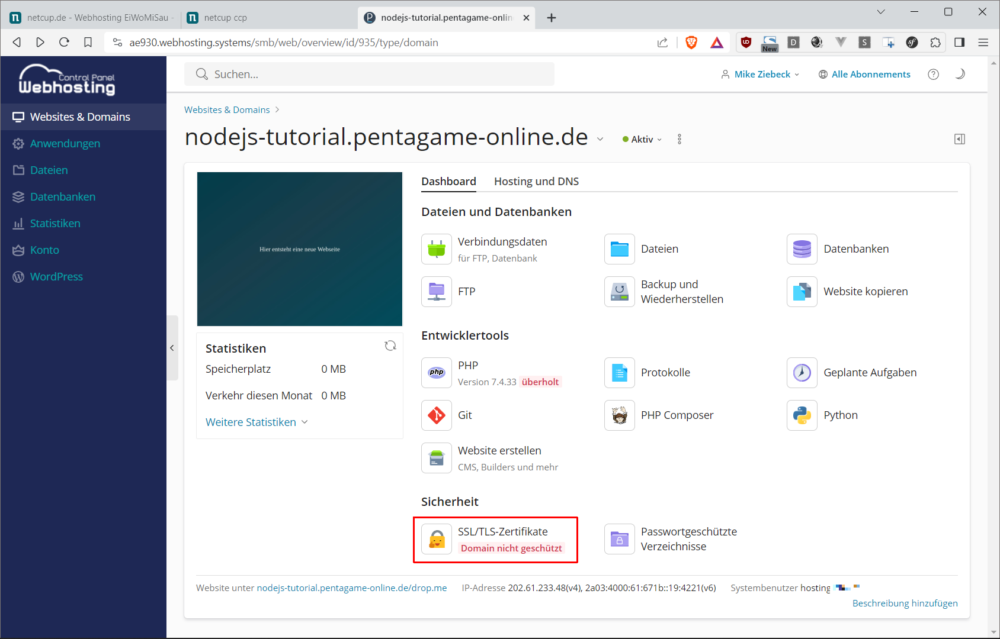

Nachfolgend gehe ich davon aus, dass für die Domain `pentagame-online.de` bereits ein [Let's Encrypt Zertifikat wie hier nach Anleitung eingerichtet worden ist.](https://helpcenter.netcup.com/de/wiki/webhosting/ssl-verschluesselung-webhosting)

Daher geht es sofort weiter mit [verwalten].


Hier können wir mit dem Download Button am rechten Rand unser Zertifikat **temporär** im *.pem Format lokal abspeichern.

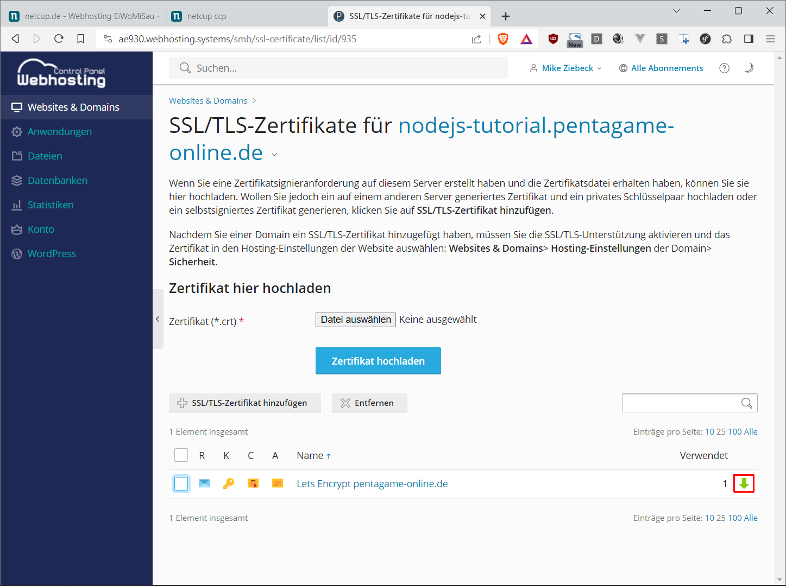

Und machen es dann mit [PEM-Datei hochladen] für die Subdomain verfügbar.


Mit dem eingestellten Zertifikat, lassen sich jetzt auch erfolgreich eingehende Anfragen [Von HTTP auf HTTPS umleiten]. Und mit Klick auf den Domainnamen kommen wir auch schnell wieder zurück zur Übersicht.

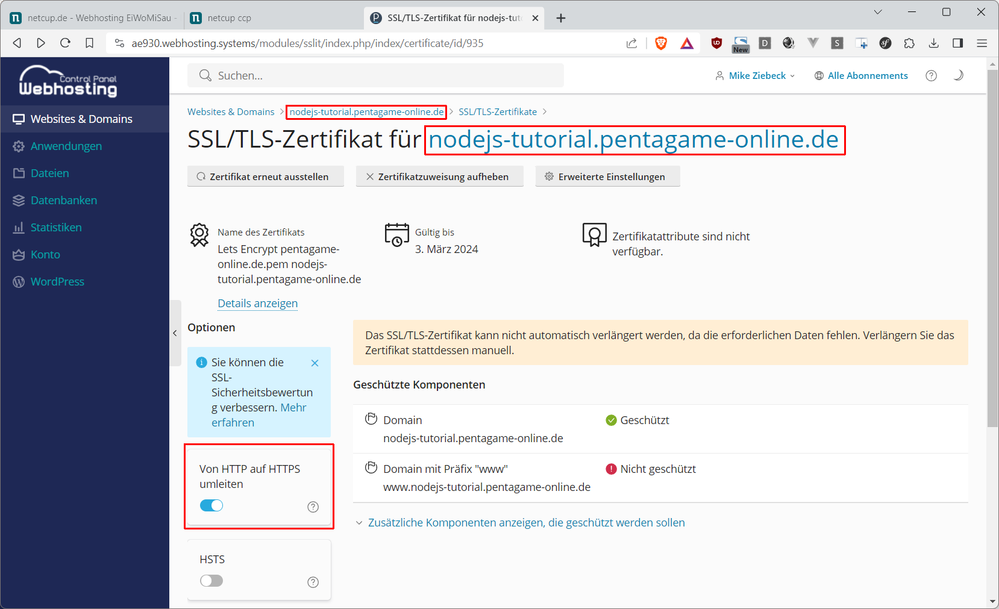

# Schritt 3 - Einrichtung: Node.js
Hier fügen wir mit [Website erstellen] ...

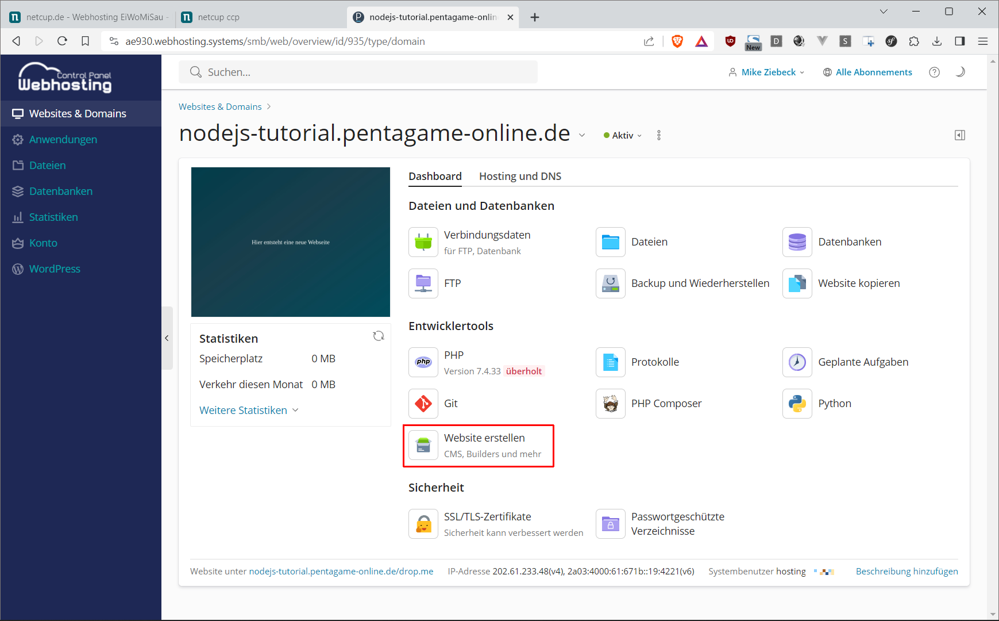

... [Node.js] unserer Webseite hinzu.

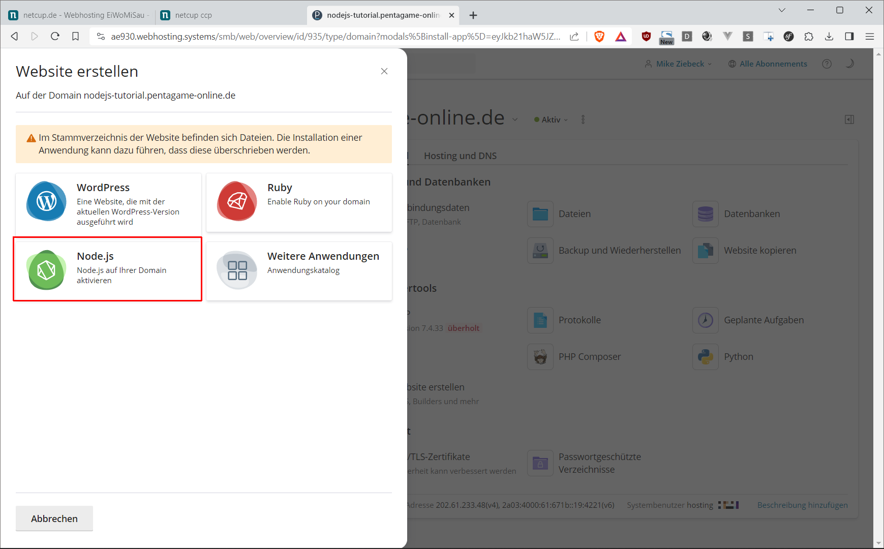

Um später bei Laufzeitfehlern hilfreichere Debugger Meldungen zu erhalten, stellen wir den Anwendungsmodus schon mal auf [development] und klicken dann auf [Node.js aktivieren].


# Schritt 4 - Fehlerbehebung
### Fehler: app.js nicht gefunden

Die nun kommende Fehlermeldung lautete tatsächlich auch im [production] Modus so. ;-) Unabhängig davon sagt sie uns aber, dass jetzt der Zeitpunkt gekommen ist, erst einmal eine Node.js App zu erstellen.

Und hierfür öffnen wir den [Dateimanager].

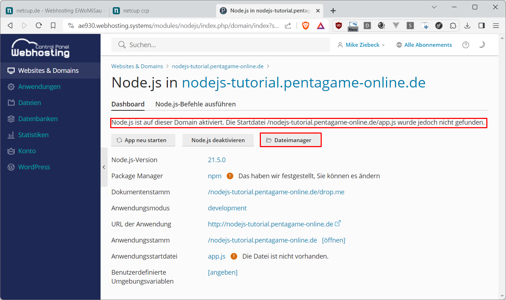

Dann navigieren wir zum Elternverzeichnis von `drop.me`.

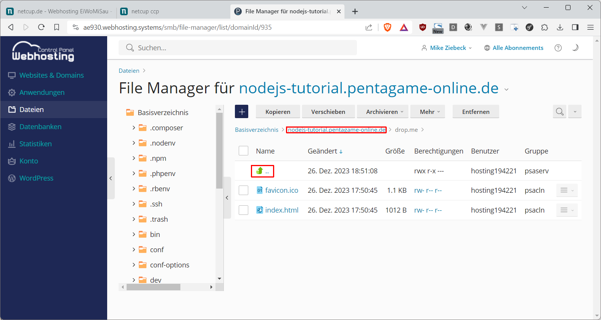

Und erstellen dort die neue Datei `app.js`.


Wir öffnen den Code Editor für die neu erstellte Datei `app.js`.


Und geben folgenden Beispiel Quellcode ein.
```js
const http = require('http');

const port = process.env.PORT || 3000;

http.createServer(function(request, response) {
  response.writeHead(200, {'Content-Type': 'text/plain'});
  response.end("Hello, World!\n");
}).listen(port);

console.log(`App is running... (port: ${port})`);
```

Inhaltlich erzeugen wir damit einen HTTP Web Server, der auf dem Port `3000` alle Browser Anfragen mit Status Code `200` (OK) und der Nachricht: `Hello, World!` vom Mime Typ: `text/plain` beantwortet. Der Port kann dabei aber frei gewählt werden, denn er wird später von NGINX automatisch für die Weiterleitung der HTTP/HTTPS Anfragen genutzt.  

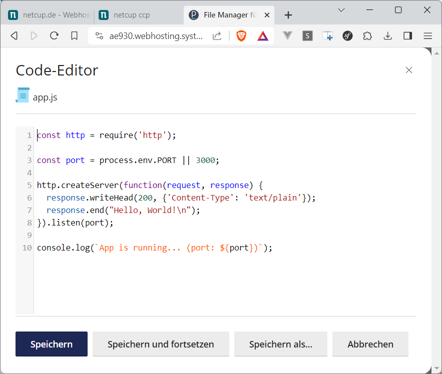

Zurück in den Node.js Einstellungen für unsere Subdomain probieren wir die "URL der Anwendung" mit einem Klick aus.


### Fehler: "Hier entsteht (immernoch) eine neue Webseite"

Aber es erscheint die Standard Willkommen Seite unseres Hosting Paketes.

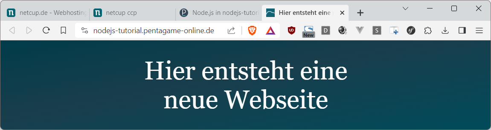

Was daran liegt, dass der primäre NGINX Server noch **alle** Anfragen an den Apache Webserver (der auch PHP interpretieren kann) weiterreicht. Also trennen wir als nächstes die Verbindung zwischen beiden.

Hierfür wechseln wir zurück zu [Websites & Domains] und auf unsere Subdomain `nodejs-tutorial.pentagame-online.de`, wo wir in den Tab [Hosting und DNS] klicken.


Dann rufen wir das Setup für [Apache und nginx] auf,

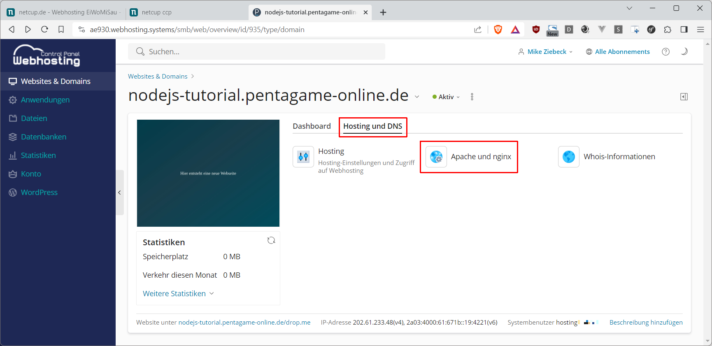

... scrollen bis zu nginx-Einstellungen,


und deaktivieren den [Proxymodus].

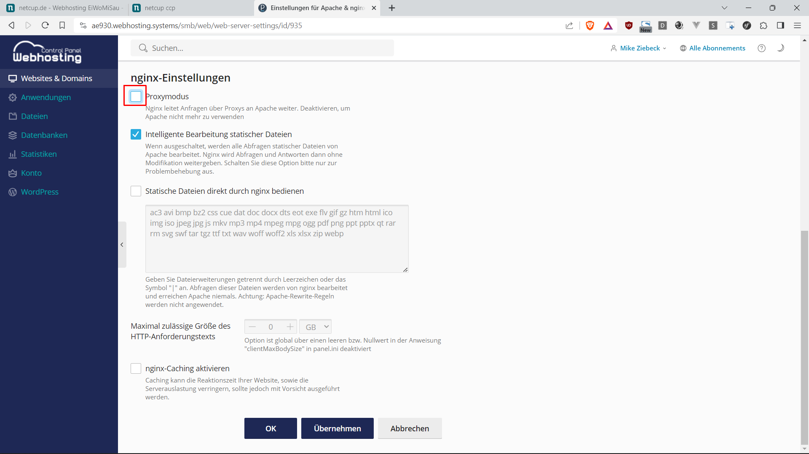

Zurück im Tab [Dashboard] öffnen wir mit [Dateien] den Dateimanager.


Dann navigieren wir erneut in das Dokument Root Verzeichnis unserer Subdomain. Und entfernen daraus, wie eingangs erwähnt, den Ordner `drop.me`.

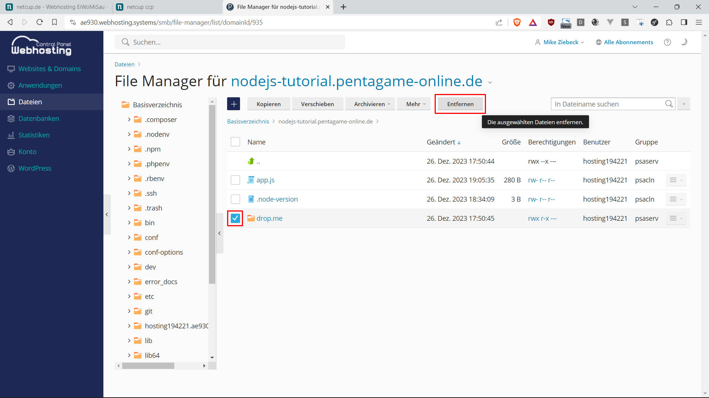
 
Zurück in der Plesk Übersicht unserer Subdomain können wir abermals das Ergebnis der Node.js App [Im Browser öffnen].


Vermutlich wird bei Dir genau wie bei mir immer noch die Standard Willkommen Seite angezeigt. Aber ein Neuladen im Browser...


... liefert dann wie erwartet:

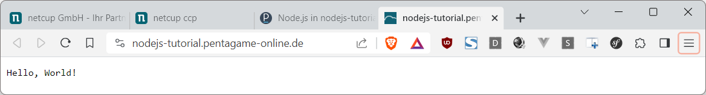

# Fazit

Super! Du hast jetzt erfolgreich Deine Subdomain für den Einsatz eines eigenen Node.js Webservers fit gemacht.

Am besten Du testest gleich die im Moment noch recht engen Grenzen des Servers aus und:
- erweiterst ihn via Paket Management z.B. mit dem [Express Server Framework für Node.js](https://expressjs.com/de)
- und/oder fügst eine MySQL Datenbank Verbindung hinzu
- oder nutzt das Git Repository Feature von Plesk

# License

Permission is hereby granted, free of charge, to any person obtaining a copy of this software and associated documentation files (the "Software"), to deal in the Software without restriction, including without limitation the rights to use, copy, modify, merge, publish, distribute, sublicence, and/or sell copies of the Software, and to permit persons to whom the Software is furnished to do so, subject to the following conditions:

The above copyright notice and this permission notice shall be included in all copies or substantial portions of the Software.

THE SOFTWARE IS PROVIDED "AS IS", WITHOUT WARRANTY OF ANY KIND, EXPRESS OR IMPLIED, INCLUDING BUT NOT LIMITED TO THE WARRANTIES OF MERCHANTABILITY, FITNESS FOR A PARTICULAR PURPOSE AND NONINFRINGEMENT. IN NO EVENT SHALL THE AUTHORS OR COPYRIGHT HOLDERS BE LIABLE FOR ANY CLAIM, DAMAGES OR OTHER LIABILITY, WHETHER IN AN ACTION OF CONTRACT, TORT OR OTHERWISE, ARISING FROM, OUT OF OR IN CONNECTION WITH THE SOFTWARE OR THE USE OR OTHER DEALINGS IN THE SOFTWARE.

# Contributor's Certificate of Origin

Contributor's Certificate of Origin By making a contribution to this project, I certify that:

 1) The contribution was created in whole or in part by me and I have the right to submit it under the license indicated in the file; or

 2) The contribution is based upon previous work that, to the best of my knowledge, is covered under an appropriate license and I have the right under that license to submit that work with modifications, whether created in whole or in part by me, under the same license (unless I am permitted to submit under a different license), as indicated in the file; or

 3) The contribution was provided directly to me by some other person who certified (a), (b) or (c) and I have not modified it.

 4) I understand and agree that this project and the contribution are public and that a record of the contribution (including all personal information I submit with it, including my sign-off) is maintained indefinitely and may be redistributed consistent with this project or the license(s) involved.
