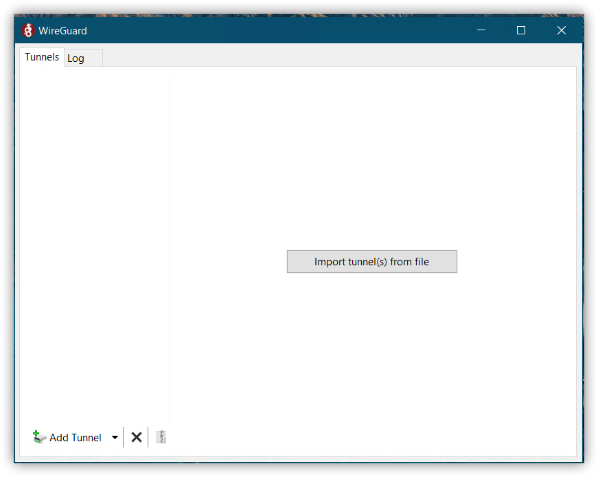
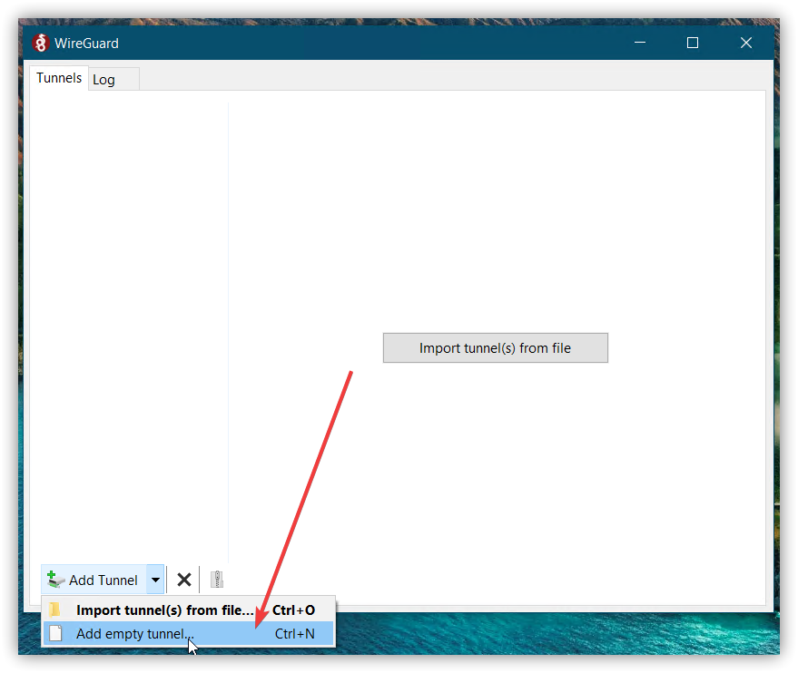
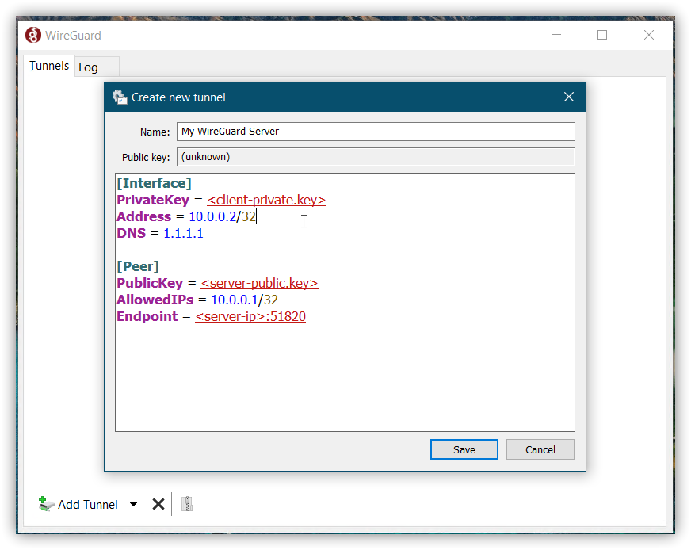
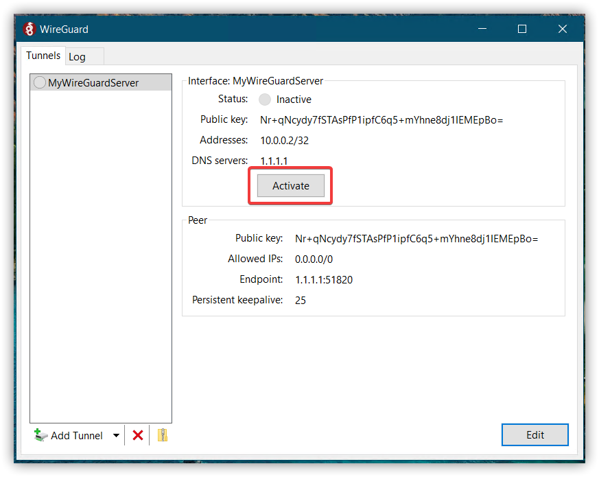

# Introduction

In this tutorial, we'll have a look at how to set up WireGuard® on a freshly installed Ubuntu server. In this case, we use the smallest available netcup VPS, as it has more than enough power for our small WireGuard® server.
But first let's clarify what WireGuard® is (quote from the WireGuard® website):

> WireGuard® is an extremely simple yet fast and modern VPN that utilizes state-of-the-art cryptography.

In this tutorial, we focus on a simple setup with one server and one client peer.

# Requirements

- Server (root or VPS)
- Ubuntu as operating system (Debian would also work).

# Step 1 - Install WireGuard®

First we need to install WireGuard® on our new server. For Ubuntu this is quite easy:

```bash
sudo apt install wireguard
```

# Step 2 - Generate keys

WireGuard® works with private and public keys. For every client, we need one private and one public key. WireGuard® treats the server itself as a client too, so we also need private/public keys for the server.

To generate these keys, we can use the following commands:

```bash
wg genkey | tee server-private.key | wg pubkey > server-public.key
wg genkey | tee client-private.key | wg pubkey > client-public.key
```

We now have a private/public key for the server and a private/public key for one client.

# Step 3 - Configuration of the WireGuard® server

To configure the WireGuard® server, we need to edit the following file:

```bash
sudo nano /etc/wireguard/wg0.conf
```

The content of this file should look like this:

```conf
[Interface]
Address = 10.0.0.1/24
PrivateKey = <server-private.key>
ListenPort = 51820
SaveConfig = true
PostUp = iptables -A FORWARD -i wg0 -j ACCEPT; iptables -t nat -A POSTROUTING -o eth0 -j MASQUERADE; ip6tables -A FORWARD -i wg0 -j ACCEPT; ip6tables -t nat -A POSTROUTING -o eth0 -j MASQUERADE
PostDown = iptables -D FORWARD -i wg0 -j ACCEPT; iptables -t nat -D POSTROUTING -o eth0 -j MASQUERADE; ip6tables -D FORWARD -i wg0 -j ACCEPT; ip6tables -t nat -D POSTROUTING -o eth0 -j MASQUERADE

[Peer]
PublicKey = <client-public.key>
AllowedIPs = 10.0.0.2/32
```

- `Address` will set the internal IP address range of the WireGuard® network.
- `PrivateKey` should be the previously generated `server-private.key`.
- `ListenPort` defines the port of the WireGuard® server.
- `SaveConfig` defines whether the current config should be saved when the service is stopped.
- `PostUp` ensures that the firewall doesn't block the connection when the WireGuard® server is started.
- `PostDown` removes the firewall rules once the WireGuard® service is stopped.
- For every client in the network one `[Peer]` element should be created within this file (therefore there is only one element in our example).
- `PublicKey` should contain the previously generated `client-public.key`.
- `AllowedIPs` defines all IPs that this peer is allowed to have when connected to the network.

## Step 3.1 - Define IP forwarding

We also need to define IP V4 forwarding to make WireGuard® work on our Ubuntu netcup server:

```diff
sudo nano /etc/sysctl.conf
- #net.ipv4.ip_forward=1
+ net.ipv4.ip_forward=1
```

# Step 4 - Configure client

Besides the server, we also need to configure our client.
As in WireGuard® client and server are just peers in the network and therefore treated equally, the config file for the client looks very similar to that of the server, but some specific server options are missing:

```conf
[Interface]
PrivateKey = <client-private.key>
Address = 10.0.0.2/32
DNS = 1.1.1.1

[Peer]
PublicKey = <server-public.key>
AllowedIPs = 10.0.0.1/32
Endpoint = <server-ip>:51820
```

- `PrivateKey` should be the previously generated `client-private.key`.
- `Address` is the address of this peer within the network. Should be unique.
- `DNS` sets a custom DNS server (in this example the Cloudflare server).
- `Peer` should contain the information of the WireGuard® server.
- `PublicKey` should be the previously generated `server-public.key`.
- `AllowedIPs` should be the internal IP of the server.
- `Endpoint` is the IP and the port to where the client should connect.

## Step 4.1 - Via GUI

If you are running the client on Windows or macOS, you can use the graphical user interface (GUI) to connect to your WireGuard® server.
The GUI should look like this:


To set up the connection to the server, click on the dropdown arrow next to "Add Tunnel" and select "Add empty tunnel":


Now copy the above configuration into the panel and click "Save":


Connect to the server using the "Activate" button:


## Step 4.2 - Via config file

If you want to connect to your server via the command line, you need to add the above configuration to the following file:

```bash
sudo nano /etc/wireguard/wg0.conf
```

Now you can connect to the server by using the following command:

```bash
sudo wg-quick up wg0
```

# Step 5 - Delete the previously generated keys

Since we've already inserted our generated keys into the config files, we can safely delete them:

```bash
rm server-public.key server-private.key client-public.key client-private.key
```

# Step 6 - Autostart WireGuard®

Normally we want to start WireGuard® automatically when our server is started.
For this purpose, run the following commands:

```bash
sudo wg-quick up wg0
sudo systemctl enable wg-quick@wg0
```

# Conclusion

Compared to other services like OpenVPN, WireGuard® is much smaller, cleaner and therefore also faster.
No wonder even Linux founder Linus Torvalds is [very supportive](https://lists.openwall.net/netdev/2018/08/02/124) of this project.
It's a great way to secure a connection when you're connected to a public WIFI, for example.

For more information, please visit the [WireGuard® website](https://www.wireguard.com/).

# License

Permission is hereby granted, free of charge, to any person obtaining a copy
of this software and associated documentation files (the "Software"), to deal
in the Software without restriction, including without limitation the rights
to use, copy, modify, merge, publish, distribute, sublicence, and/or sell
copies of the Software, and to permit persons to whom the Software is
furnished to do so, subject to the following conditions:

The above copyright notice and this permission notice shall be included in all
copies or substantial portions of the Software.

THE SOFTWARE IS PROVIDED "AS IS", WITHOUT WARRANTY OF ANY KIND, EXPRESS OR
IMPLIED, INCLUDING BUT NOT LIMITED TO THE WARRANTIES OF MERCHANTABILITY,
FITNESS FOR A PARTICULAR PURPOSE AND NONINFRINGEMENT. IN NO EVENT SHALL THE
AUTHORS OR COPYRIGHT HOLDERS BE LIABLE FOR ANY CLAIM, DAMAGES OR OTHER
LIABILITY, WHETHER IN AN ACTION OF CONTRACT, TORT OR OTHERWISE, ARISING FROM,
OUT OF OR IN CONNECTION WITH THE SOFTWARE OR THE USE OR OTHER DEALINGS IN THE
SOFTWARE.

# Contributor's Certificate of Origin

By making a contribution to this project, I certify that:

1.  The contribution was created in whole or in part by me and I have the right to submit it under the license indicated in the file; or

2.  The contribution is based upon previous work that, to the best of my knowledge, is covered under an appropriate license and I have the right under that license to submit that work with modifications, whether created in whole or in part by me, under the same license (unless I am permitted to submit under a different license), as indicated in the file; or

3.  The contribution was provided directly to me by some other person who certified (a), (b) or (c) and I have not modified it.

4.  I understand and agree that this project and the contribution are public and that a record of the contribution (including all personal information I submit with it, including my sign-off) is maintained indefinitely and may be redistributed consistent with this project or the license(s) involved.
