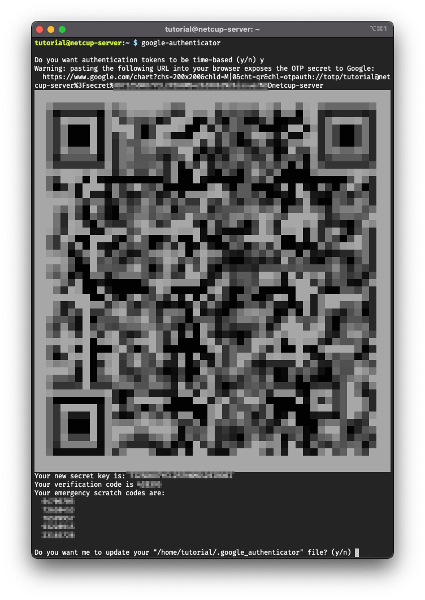
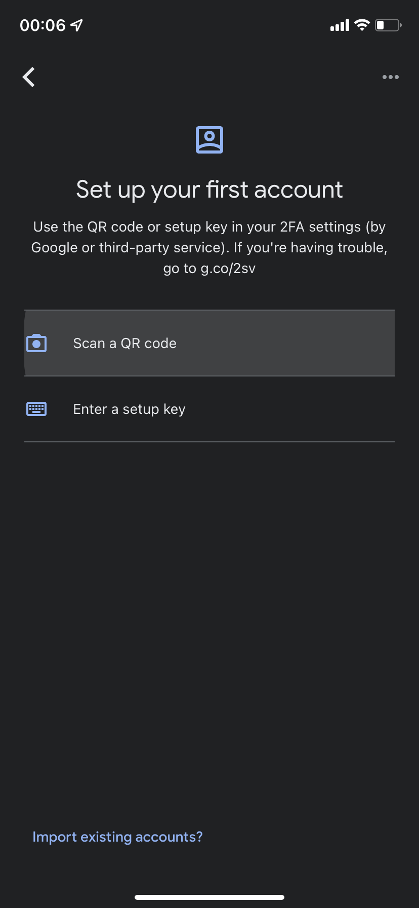
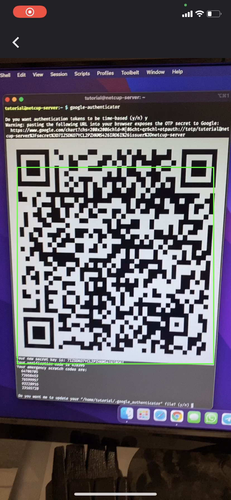
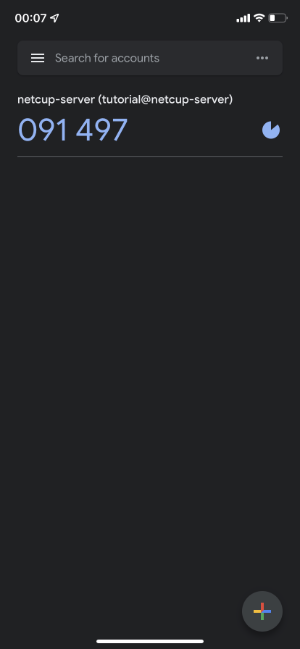

# Introduction
In this tutorial you will learn how to easily secure your SSH login with Two-Factor Authentication (2FA) using `google-authenticator`.

# Requirements
- netcup vServer or Root Server
- An authenticator app installed on your smartphone (e.g. Google Authenticator)

# Step 1 - Install Google Authenticator PAM module
After logging into your server via SSH you need to install the google authenticator PAM module.

Run the following commands
```
sudo apt update
sudo apt install libpam-google-authenticator -y
```


# Step 2 - Setup 2FA for your user
Next you'll need to create a secret key and some settings and emergency codes for your user.

**This step needs to be repeated for every user that should login with 2FA.**

Run this command to start the configuration for your user
```
google-authenticator
```
The program will ask you some questions. Next you'll see the questions asked at the time of writing this tutorial and the given answers by the writer.

## Step 2.1 - Setup time-based tokens
```
Do you want authentication tokens to be time-based (y/n) y
```

This will generate the secret key and some output for you.


## Step 2.2 - Scan the QR Code
Now it's time to take out your phone, start the authenticator app and to add a new account. The easiest way is to scan the QR Code.

This step shows how to add the account to the Google Authenticator app.

Select `Scan a QR Code`.



Scan the QR Code.



That's it! Now you see your newly added account.



## Step 2.3 - Write down your emergency codes
Please make sure to write down your emergency scratch codes. If you've lost your phone or something, then you can use these emergency codes to log into your account.

🚨  **Every code can only be used once!**  🚨

## Step 2.4 - Finish the `google-authenticator` configuration
Let the program update its file inside your home directory.
```
Do you want me to update your "/home/tutorial/.google_authenticator" file? (y/n) y
```

Disallow multiple uses of the same token.
```
Do you want to disallow multiple uses of the same authentication
token? This restricts you to one login about every 30s, but it increases
your chances to notice or even prevent man-in-the-middle attacks (y/n) y
```

Disallow extra tokens for time-skew compensation.
```
By default, a new token is generated every 30 seconds by the mobile app.
In order to compensate for possible time-skew between the client and the server,
we allow an extra token before and after the current time. This allows for a
time skew of up to 30 seconds between authentication server and client. If you
experience problems with poor time synchronization, you can increase the window
from its default size of 3 permitted codes (one previous code, the current
code, the next code) to 17 permitted codes (the 8 previous codes, the current
code, and the 8 next codes). This will permit for a time skew of up to 4 minutes
between client and server.
Do you want to do so? (y/n) n
```

Enable rate limiting.
```
If the computer that you are logging into isn't hardened against brute-force
login attempts, you can enable rate-limiting for the authentication module.
By default, this limits attackers to no more than 3 login attempts every 30s.
Do you want to enable rate-limiting? (y/n) y
```


# Step 3 - Configure SSH to use Google Authenticator PAM module 
To require the authenticator app's generated 6-digit-numbers (time-based one-time password, TOTP) for logging in via SSH, the previously installed PAM module (Step 1) needs to be activated.

## Step 3.1 - Edit `/etc/pam.d/sshd`
Open the file `/etc/pam.d/sshd` with `nano` editor using the following command
```
sudo nano /etc/pam.d/sshd
```

Add the following line at the bottom of the file
```
auth required pam_google_authenticator.so
```

Press `Ctrl + X` and then press `Y` followed by the `Enter` key to save changes.

## Step 3.2 - Edit `/etc/ssh/sshd_config`
Open the file `/etc/ssh/sshd_config` with `nano` editor using the following command
```
sudo nano /etc/ssh/sshd_config
```

Now search for the line with `ChallengeResponseAuthentication` at the beginning and make sure it looks like this
```
ChallengeResponseAuthentication yes
```

Press `Ctrl + X` and then press `Y` followed by the `Enter` key to save changes.

## Step 3.3 - Reload SSH server configuration
Make the SSH server reloading its configuration with this command
```
sudo systemctl reload sshd.service
```

# Step 4 - Logout and login again
Now logout and log into your server via `ssh` again.

Now you'll be prompted for both your password and your Authenticator app's code.
```
Password:
Verification code:
```

Enter your password and the code from your Authenticator app.

Et voilà, you just logged in successfully using 2FA. 🥳


# Conclusion
You've secured your SSH logins by setting up Two-Factor Authentication ***and*** you've written down your emergency codes to a safe place.

# License
MIT

# Contributor's Certificate of Origin
Contributor's Certificate of Origin By making a contribution to this project, I certify that:

 1) The contribution was created in whole or in part by me and I have the right to submit it under the license indicated in the file; or

 2) The contribution is based upon previous work that, to the best of my knowledge, is covered under an appropriate license and I have the right under that license to submit that work with modifications, whether created in whole or in part by me, under the same license (unless I am permitted to submit under a different license), as indicated in the file; or

 3) The contribution was provided directly to me by some other person who certified (a), (b) or (c) and I have not modified it.

 4) I understand and agree that this project and the contribution are public and that a record of the contribution (including all personal information I submit with it, including my sign-off) is maintained indefinitely and may be redistributed consistent with this project or the license(s) involved.

Signed-off-by: Michael Heinrich (michi.heinrich@gmail.com)
