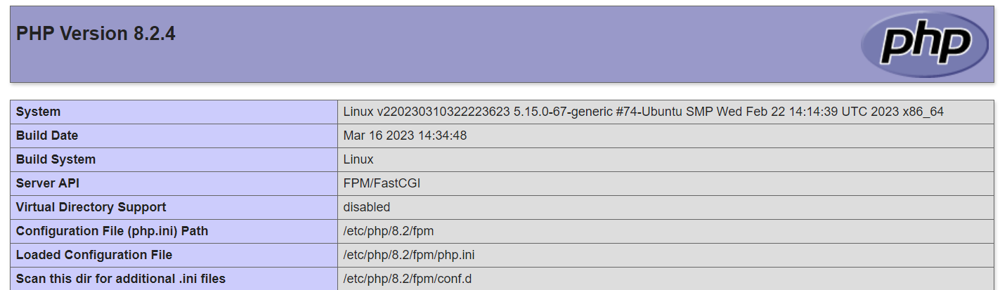

# Introduction
This tutorial describes how to Install Apache2 with php8.2-fpm on a Ubuntu Server.
The tutorial is only testet on Ubuntu 22.04, but should also work on Ubuntu 18.04 and 20.04.

# Requirements

* Server (root or vps) with Ubuntu Server 22.04

# Step 1 - Check for System updates
Check your System for updates and install them before.
```
apt-get update && sudo apt-get -y upgrade
```
# Step 2 - Install Apache2
```
apt-get install apache2
```

# Step 3 - Install PHP8.2-FPM
Because PHP8.2 is not yet included in the Ubuntu repository, we need to add the PPA repository
```
add-apt-repository ppa:ondrej/php
```
Then update package sources.
```
apt-get update
```
Install PHP8.2 with commonly used modules (bz2,curl,mbstring,intl,bcmath,xml,mysql,zip,gd,mbstring,imagick). Here you can add modules or remove some.
```
apt-get install php8.2-{fpm,cli,bz2,curl,mbstring,intl,bcmath,xml,mysql,zip,gd,mbstring,imagick}
```
Enable the config of Apache2 php8.2-fpm.\
In the config the mods proxy_fcgi and setenvif are used, so enable them too.
```
a2enmod proxy_fcgi setenvif
a2enconf php8.2-fpm 

```
Restart apache
```
systemctl reload apache2
```
Check the installation 
```
nano /var/www/html/test.php
```
Add following:
```
<?php
    phpinfo();
?>
```
Use a Browser and go to http://ip_of_your_server/test.php \
Server API Should be FPM/FastCGI.

Now you have succesfully installed Apache2 with php8.2-fpm.
The Path of the php.ini is /etc/php/8.2/fpm/php.ini \
If you need, we can increase memory-limit and maximum of upload filesize. (Other values can changed too)
```
nano /etc/php/8.2/fpm/php.ini
```
```diff
- memory_limit = 128M
+ memory_limit = 256M
- upload_max_filesize = 2M
+ upload_max_filesize = 16M
- post_max_size = 8M
+ post_max_size = 16M
```
Restart php-fpm.
```
/etc/init.d/php8.2-fpm restart
```
Then verify the values with the test.php Script.

# Step 4 - (Optional) Add a new V-Host
The Server is only Listening by IP. If you have a Domain we can add a new V-Host.
```
mkdir /var/www/vhostname
nano /etc/apache2/sites-available/vhostname.conf
```
Insert the following content and replace vhost and yourdomain.de with your names.
```
<VirtualHost *:80>
        ServerName www.yourdomain.de
        ServerAlias yourdomain.de #Optional Alias the Server is listen too
        ServerAdmin webmaster@yourdomain.de
        DocumentRoot /var/www/vhostname

        ErrorLog ${APACHE_LOG_DIR}/vhostname_error.log
        CustomLog ${APACHE_LOG_DIR}/vhostname_access.log combined

        <Directory "/var/www/vhostname">
            AllowOverride All
        </Directory>
</VirtualHost>
```
Enable V-Host and restart Apache
```
a2ensite vhostname
systemctl reload apache2
```

# Step 4.1 - (Optional) Install SSL Certificate from Let's Encrypt
Install Certbot
```
apt-get install certbot python3-certbot-apache
```
Generate and install SSL-Certificate
```
certbot --apache -d yourDomain.de,www.yourAlais.de
```
# Step 5 - (Optional) Enable Http/2 Protocol
Enable the apache http2 Module and restart apache
```
a2enmod http2
systemctl restart apache2
```
# Conclusion

You have installed Apache2 with PHP8.2-FPM. Optional SSL installed with http/2 Protocol.\
If you have multiple Domains you can repeat step 4 to add more domains.
The server is not yet secured and should still be secured. This Tutorial are only basic steps for installation of Apache2 with php8.2-fpm.

# Licence

[MIT](https://github.com/netcup-community/community-tutorials/blob/main/LICENSE)

Copyright (c) 2021 netcup

Permission is hereby granted, free of charge, to any person obtaining a copy of this software and associated documentation files (the "Software"), to deal in the Software without restriction, including without limitation the rights to use, copy, modify, merge, publish, distribute, sublicence, and/or sell copies of the Software, and to permit persons to whom the Software is furnished to do so, subject to the following conditions:

The above copyright notice and this permission notice shall be included in all copies or substantial portions of the Software.

THE SOFTWARE IS PROVIDED "AS IS", WITHOUT WARRANTY OF ANY KIND, EXPRESS OR IMPLIED, INCLUDING BUT NOT LIMITED TO THE WARRANTIES OF MERCHANTABILITY, FITNESS FOR A PARTICULAR PURPOSE AND NONINFRINGEMENT. IN NO EVENT SHALL THE AUTHORS OR COPYRIGHT HOLDERS BE LIABLE FOR ANY CLAIM, DAMAGES OR OTHER LIABILITY, WHETHER IN AN ACTION OF CONTRACT, TORT OR OTHERWISE, ARISING FROM, OUT OF OR IN CONNECTION WITH THE SOFTWARE OR THE USE OR OTHER DEALINGS IN THE SOFTWARE.

# Contributor's Certificate of Origin
By making a contribution to this project, I certify that:

 1) The contribution was created in whole or in part by me and I have the right to submit it under the licence indicated in the file; or

 2) The contribution is based upon previous work that, to the best of my knowledge, is covered under an appropriate licence and I have the right under that licence to submit that work with modifications, whether created in whole or in part by me, under the same licence (unless I am permitted to submit under a different licence), as indicated in the file; or

 3) The contribution was provided directly to me by some other person who certified (a), (b) or (c) and I have not modified it.

 4) I understand and agree that this project and the contribution are public and that a record of the contribution (including all personal information I submit with it, including my sign-off) is maintained indefinitely and may be redistributed consistent with this project or the licence(s) involved.