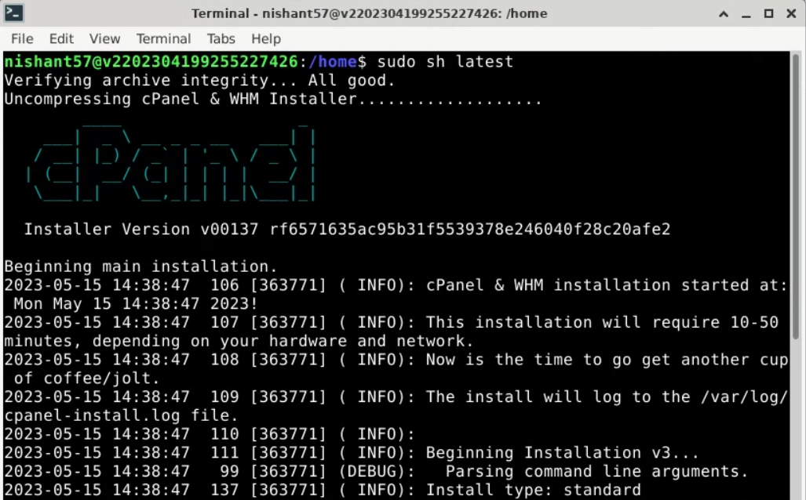
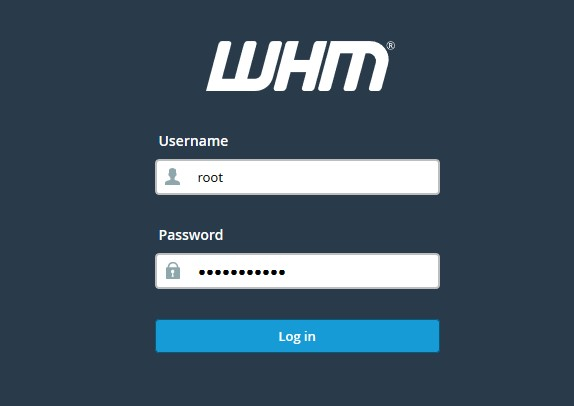
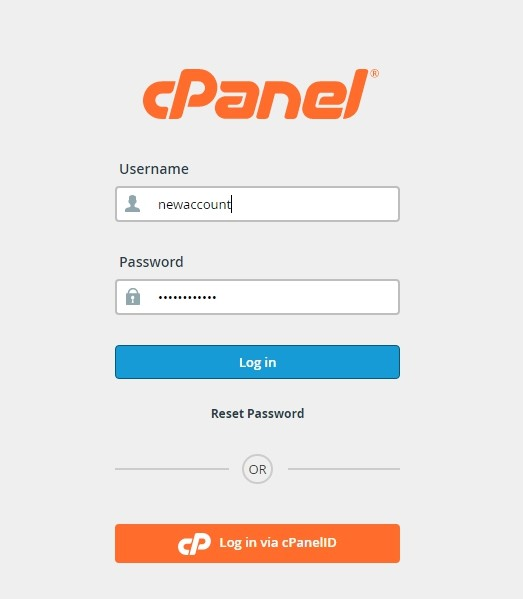

# Introduction

In this tutorial, we will guide you through the process of setting up a Virtual Private Server (VPS) for web hosting using cPanel on Netcup. cPanel is a popular web hosting control panel that simplifies the management of your website, email accounts, databases, and other hosting-related tasks.

The reading time of this tutorial is about 10 minutes; implementation will take approximately 45 minutes.

# Prerequisites

- A VPS from Netcup with CentOS 7 or later or Ubuntu 18.04 or later installed
- A registered domain name (optional)
- Root access to your VPS

# Step 1: Update Your System

Before we begin, it's essential to ensure that your system is up-to-date. Log in to your VPS via SSH as the root user and run the following command:

For CentOS:

```bash
yum update -y
```

For Ubuntu:

```bash
apt update && apt upgrade -y
```

# Step 2: Install cPanel

To install cPanel, you'll first need to install the cPanel & WHM installation script. Run the following commands:

```bash
cd /home
sudo curl -o latest -L https://securedownloads.cpanel.net/latest
```

Now, execute the installation script:

```bash
sudo sh latest
```



The installation process may take some time. Once it's complete, cPanel & WHM will be installed on your VPS.

# Step 3: Configure cPanel

After the installation is complete, you can access the WHM (WebHost Manager) interface via your browser. Open your browser and navigate to:

```
https://your_server_ip:2087
```



Replace "your_server_ip" with the IP address of your VPS. You'll encounter a security warning since the SSL certificate is self-signed. Proceed to the website and log in with your root username and password.

Upon logging in, you'll be prompted to complete the Initial Setup Wizard. Follow the on-screen instructions to configure your server and create a new cPanel account.

# Step 4: Set Up Your Domain

Once you've completed the Initial Setup Wizard, you'll need to set up your domain in WHM. To do this, navigate to "Account Functions" > "Create a New Account" and enter your domain information.

After creating a new account, you'll need to update your domain's nameservers to point to your VPS. This process varies depending on your domain registrar, so consult their documentation for instructions.

# Step 5: Create Email Accounts and Databases

To log in to cPanel, enter "https://your-server-ip:2083" in your web browser and provide your login credentials (username and password).



With your domain set up, you can now create email accounts and databases for your website. To create an email account, navigate to "Email" > "Email Accounts" in cPanel.

To create a database, navigate to "Databases" > "MySQL Databases" in cPanel.

# Step 6: Upload Your Website Files

To upload your website files, you can use the File Manager in cPanel or an FTP client such as FileZilla. If using File Manager, navigate to "Files" > "File Manager" and upload your files to the "public_html" directory.

If using an FTP client, you'll need to create an FTP account in cPanel first. Navigate to "Files" > "FTP Accounts" and create a new account, then use the provided credentials to connect and upload your files.

# Conclusion

Congratulations! You've successfully set up a VPS for web hosting using cPanel on Netcup. You can now manage your website, email, and databases through the user-friendly cPanel interface. Remember to keep your VPS and cPanel updated to ensure the security and performance of your server.
