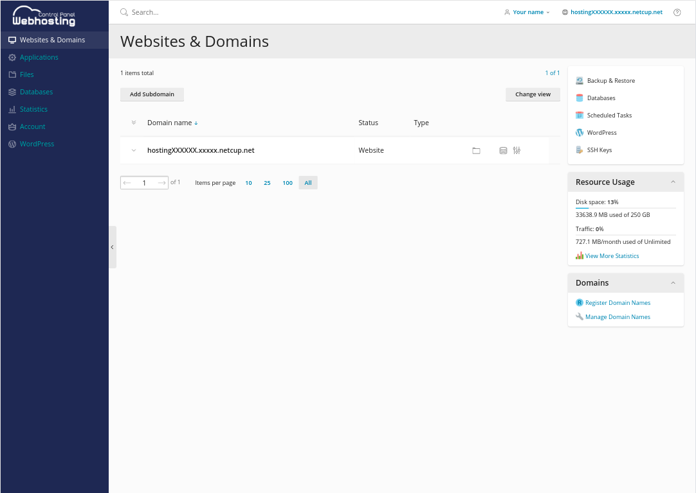
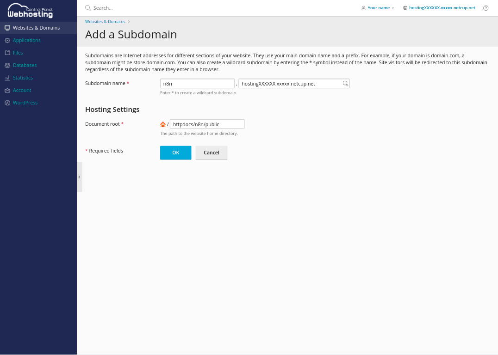
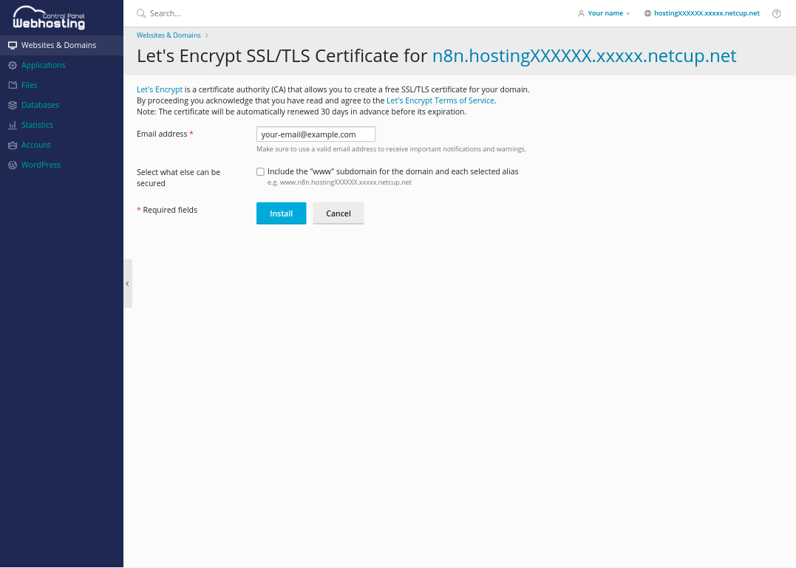
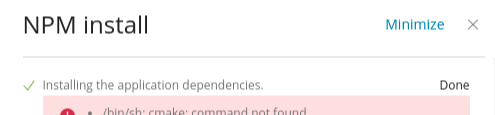
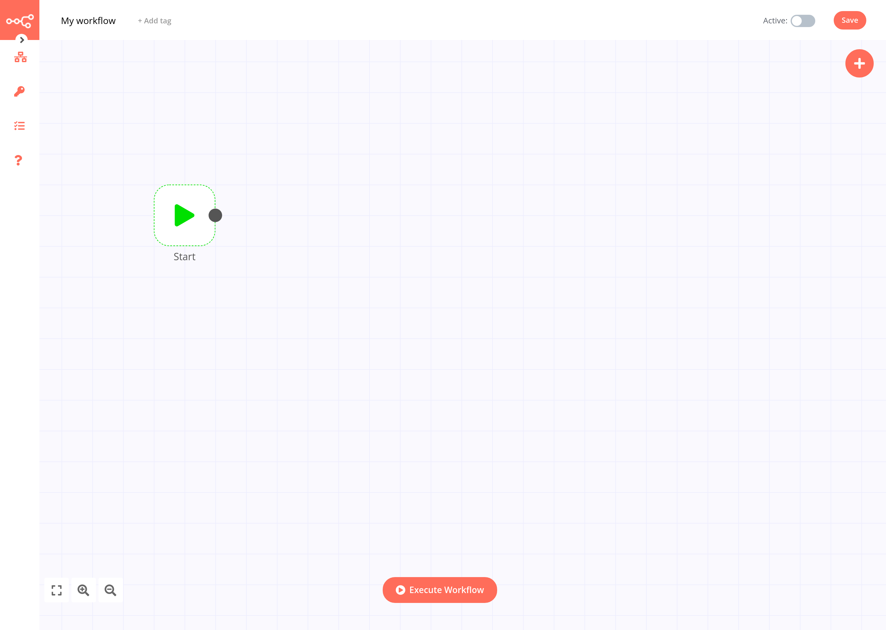

# Introduction

In this tutorial I would like to show you how to install the open source workflow automation tool [n8n](https://n8n.io) on your netcup shared webhosting instance. This is especially useful if you want to automate some tasks, change your Slack status when you are in a meeting, or build your own no-code app.

# Requirements

To get started, all you need is a netcup webhosting instance with NodeJS support ([Webhosting 4000](https://www.netcup.de/bestellen/produkt.php?produkt=2219) and above) and a cup of coffee ☕.

# Step 1 - Log in to your Webhosting Control Panel

First you must log in to your Webhosting Control Panel. To do this, please enter your `xxxxx.webhosting.systems` domain in the address bar of your browser of choice and fill in your credentials.

After that you should see something like the following (of course there may be some small design differences):



# Step 2 - Set up a domain

In this step and in substep 2.1, we are going to create a new subdomain for our n8n instance. On netcup, each Webhosting product gets a free `hostingXXXXXX.xxxxx.netcup.net` domain. In this tutorial we will use this free domain to host n8n. If you want to set up a custom domain, refer to the [official documentation](https://www.netcup-wiki.de/wiki/Domains_CCP).

## Step 2.1 - Create a new subdomain

To create a new subdomain, click <kbd>New Subdomain</kbd> in the upper left corner. This will guide you to a new page where you can select the parent domain and the document root of your subdomain.

In this case, I will add `n8n` to our inclusive domain and define `/httpdocs/n8n/public` as the document root.

> Please make sure to add `/public` to the end of the document root. Otherwise, you will have problems with NodeJS.



## Step 2.2 - Set up HTTPS with Let's Encrypt

After the domain is created, we need to issue a Let's Encrypt certificate for it, so we can access our domain over HTTPS.

To do this, select the domain in the overview and click the <kbd>Let's Encrypt</kbd> button.

In the following window you must enter your email address. After that you can click <kbd>Install</kbd> to issue a new certificate.

> Please note that netcup will renew this certificate for you automatically.



# Step 3 - Add the code

Now that we have our domain ready and set up, let's concentrate on the coding part.

So, let's jump over to our `/httpdocs/n8n` directory (this time without `/public` 😉), you can do this by clicking <kbd>Files</kbd> on the left side or <kbd>File Manager</kbd> in the domain config. Add the following two files:

`package.json`

```json
{
  "name": "n8n",
  "version": "1.0.0",
  "main": "index.js",
  "license": "MIT",
  "dependencies": {
    "n8n": "*",
    "sqlite3": "*"
  }
}
```

and

`.npmrc`

```
scripts-prepend-node-path=true
```

In the first file we define the versions of n8n and sqlite3 (a dependency of n8n) that we want to install (in this case the latest one: `"*"`). The second file just ensures that everything is fine on our shared webhosting.

# Step 4 - Start the app

Now that everything is in place, it is time to set up the final NodeJS configuration.

To do this, go to <kbd>Websites & Domains</kbd> on the left side bar and select your domain. Then click <kbd>Node.js</kbd> and you will see a new page. Here click on the <kbd>Enable Node.js</kbd> button to activate Node.

Now that Node is running you can specify a Node.js version. I recommend using the latest, but you must try which one works with n8n. Currently (November 2021) Node.js version 14 is working well.

## Step 4.1 - Install NPM dependencies

Now that NodeJS is up and running, it's time to install all dependencies. To do so, click the <kbd>NPM install</kbd> button in the top menu.

> **Note!** This section might end up with some warnings or even errors. However, as long as "Done" is displayed in the top right corner, everything should be fine.



## Step 4.2 - Set up the application startup file

Next we need to specify the path of the n8n application script. Enter the following under _Application Startup File_: `node_modules/n8n/bin/n8n`.

## Step 4.3 - Define environment variables

To prevent others from accessing our n8n installation, we will now set up a simple password authentication in combination with some required environment variables. For further setup, please check out [this article](https://docs.n8n.io/reference/environment-variables.html).

To add our variables, click <kbd>specify</kbd> under _Custom environment variables_ and enter the following:
| Variable | Value |
| ----------------------- | ------------------------------------------- |
| N8N*BASIC_AUTH_ACTIVE | true |
| N8N_BASIC_AUTH_USER | your-username |
| N8N*BASIC_AUTH_PASSWORD | your-password |
| N8N_HOST | n8n.hostingXXXXXX.xxxxx.netcup.net |
| N8N_PROTOCOL | https |
| WEBHOOK_TUNNEL_URL | https://n8n.hostingXXXXXX.xxxxx.netcup.net/ |
| VUE_APP_URL_BASE_API | https://n8n.hostingXXXXXX.xxxxx.netcup.net/ |

After you're done, click <kbd>Restart App</kbd> and go to your domain.

# Conclusion



Now, you should have a completely self-hosted version of n8n running on your netcup Webhosting.

For getting started, I recommend [n8n's workflow collection](https://n8n.io/workflows) with many interesting examples.

If you want to learn more about n8n and their mission, visit their website at [n8n.io](https://n8n.io) or read their really good [documentation](https://docs.n8n.io)

# License

MIT Licence

Copyright (c) 2021 netcup

Permission is hereby granted, free of charge, to any person obtaining a copy
of this software and associated documentation files (the "Software"), to deal
in the Software without restriction, including without limitation the rights
to use, copy, modify, merge, publish, distribute, sublicence, and/or sell
copies of the Software, and to permit persons to whom the Software is
furnished to do so, subject to the following conditions:

The above copyright notice and this permission notice shall be included in all
copies or substantial portions of the Software.

THE SOFTWARE IS PROVIDED "AS IS", WITHOUT WARRANTY OF ANY KIND, EXPRESS OR
IMPLIED, INCLUDING BUT NOT LIMITED TO THE WARRANTIES OF MERCHANTABILITY,
FITNESS FOR A PARTICULAR PURPOSE AND NONINFRINGEMENT. IN NO EVENT SHALL THE
AUTHORS OR COPYRIGHT HOLDERS BE LIABLE FOR ANY CLAIM, DAMAGES OR OTHER
LIABILITY, WHETHER IN AN ACTION OF CONTRACT, TORT OR OTHERWISE, ARISING FROM,
OUT OF OR IN CONNECTION WITH THE SOFTWARE OR THE USE OR OTHER DEALINGS IN THE
SOFTWARE.

# Contributor's Certificate of Origin

By making a contribution to this project, I certify that:

1.  The contribution was created in whole or in part by me and I have the right to submit it under the license indicated in the file; or

2.  The contribution is based upon previous work that, to the best of my knowledge, is covered under an appropriate license and I have the right under that license to submit that work with modifications, whether created in whole or in part by me, under the same license (unless I am permitted to submit under a different license), as indicated in the file; or

3.  The contribution was provided directly to me by some other person who certified (a), (b) or (c) and I have not modified it.

4.  I understand and agree that this project and the contribution are public and that a record of the contribution (including all personal information I submit with it, including my sign-off) is maintained indefinitely and may be redistributed consistent with this project or the license(s) involved.
